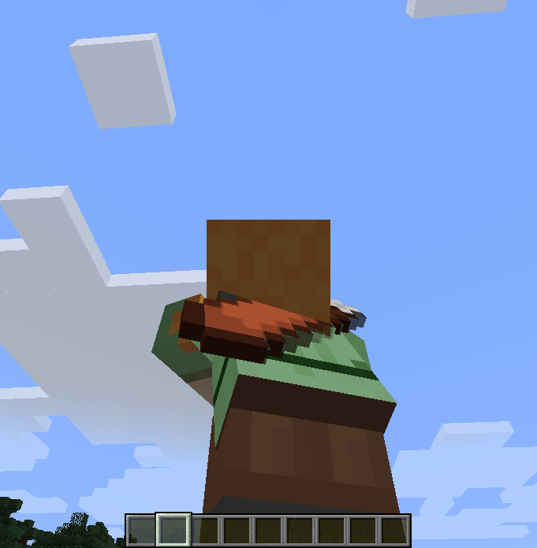

description: Создание собственного слоя.

# Слои

Создадим класс `LayerQuiver`.

```java
public class LayerQuiver implements LayerRenderer<EntityPlayer> {
   @Override
   public void doRenderLayer(EntityPlayer player, float limbSwing, float limbSwingAmount, float partialTicks, float ageInTicks, float netHeadYaw, float headPitch, float scale) {
       GlStateManager.pushMatrix();
       //Позиция предмета
       GlStateManager.translate(0, 0.25F, 0.15F);
       //Вращение предмета
       GlStateManager.rotate(180F, 0, 0, 20);
       //Размеры предмета
       GlStateManager.scale(0.85F, 0.85F, 0.85F);

       //Условие: Если игрок присел, то мы меняем положение нашего колчана.
       if (player.isSneaking()) {
           GlStateManager.rotate(-30F, 1, 0, 0);
           GlStateManager.translate(0, -0.155F, 0.04F);
       }

       //Рендер предмета(обычный из Minecraft)
       Minecraft.getMinecraft().getRenderItem().renderItem(new ItemStack(ItemsRegister.QUIVER), player, ItemCameraTransforms.TransformType.FIXED, false);
       GlStateManager.popMatrix();
   }

   @Override
   public boolean shouldCombineTextures() {
       return false;
   }
}
```

Создадим класс `LayersRegister`.

```java
public class LayersRegister {
    public static void register() {
        setLayer(new LayerQuiver());
    }

    private static void setLayer(final LayerRenderer layer) {
        Minecraft.getMinecraft().getRenderManager().getSkinMap().get("default").addLayer(layer);
        Minecraft.getMinecraft().getRenderManager().getSkinMap().get("slim").addLayer(layer);
    }
}
```

Перейдём в `ClientProxy` и добавим в метод `init` такой код:
```java
LayersRegister.register();
```

Заходим в игру и переключаемся на вид от третьего лица и видим, что за спиной у нас колчан. (Это может быть не только колчан, но и что-то другое, зависит от вашего выбора)

[](images/quiver.png)