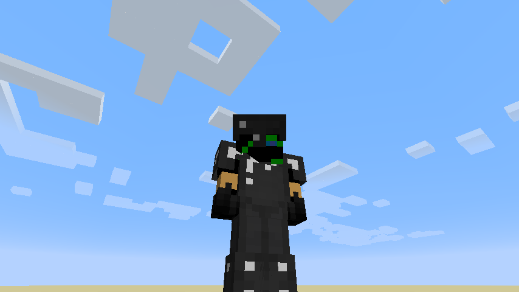

description: Создание собственной брони.

# Создание брони

## Основа

Создадим класс брони ItemMagicArmor.
```java
public class ItemMagicArmor extends ItemArmor
{
    public ItemMagicArmor(String name, ArmorMaterial materialIn, int renderIndexIn, EntityEquipmentSlot equipmentSlotIn)
    {
        super(materialIn, renderIndexIn, equipmentSlotIn);
        this.setRegistryName(name);
        this.setUnlocalizedName(name);
    }
}
```

* `ArmorMaterial` - это то же, что и ToolMaterial, только для брони.
* `renderIndexIn` - это индекс рендера, всего существует два индекса. 1 - Отвечает за шлем, нагрудник, ботинки. 2 - Отвечает за штаны.
* `equipmentSlotIn` - эта переменная задаёт слот в который можно будет положить нашу броню. Всего существует шесть видов слотов и только четыре предназначены исключительно для брони.

Создадим наш ArmorMaterial
```java
public static ItemArmor.ArmorMaterial armorMaterial = EnumHelper.addArmorMaterial("tut:armor", "tut:armor", 9, new int[]{2, 4, 6, 3}, 7, SoundEvents.ITEM_ARMOR_EQUIP_IRON, 2.0F).setRepairItem(new ItemStack(Item.getItemFromBlock(Blocks.OBSIDIAN)));
```

* `tut:armor` - это название нашего материала, лучше указывать ещё modid, чтобы не возникало конфликтов с Minecraft.
* `tut:armor` - это название текстуры которое будет преобразовано в armor_layer_1 и armor_layer_2. Цифра обозначает индекс рендера.
* `9` - это прочность брони.
* `int[]` - это то на сколько будет быстро убавляться прочность одного из элементов брони. С начала идёт шлем = 2, нагрудник = 4, штаны = 6, ботинки = 3. Получается, что при ударе по нашей броне из прочности будет вычитаться для шлема = 2, нагрудника = 4, штанов = 6, ботинок = 3.
* `7` - это уровень который требуется для получения более лучших чар для брони.
* `SoundEvents` - это звуки которые будут проигрываться при надевании брони.
* `2.0F` - это ударопрочность брони. (Сколько сможет броня поглотить в себя урона)

Зарегистрируем нашу броню. Примерно должно выглядить так
```java
public static Item
            BOOTS = new ItemMagicArmor("boots", armorMaterial, 1, EntityEquipmentSlot.FEET),
            LEGGS = new ItemMagicArmor("leggs", armorMaterial, 2, EntityEquipmentSlot.LEGS),
            CHESTPLATE = new ItemMagicArmor("chestplate", armorMaterial, 1, EntityEquipmentSlot.CHEST),
            HEAD = new ItemMagicArmor("head", armorMaterial, 1, EntityEquipmentSlot.HEAD);
```

* `boots` - это название элемента брони
* `armorMaterial` - это материал брони
* `1` - это индекс рендера
* `EntityEquipmentSlot` - это слот в который можно будет положить наш элемент брони.

Нам нужно создать текстуру для брони. Чтобы сделать текстуру как показано ниже, зайдите в корневую папку .minecraft --> version --> файл 1.12.2.jar (открыть с помощью WinRar) и идём по пути:
1.12.2.jar\assets\minecraft\textures\models\armor и выбираем любой слот кроме chainmail_layer_1 и в Photoshop или в Paint перерисовываем по своему вкусу.


Положим наши текстуры по пути:
```md
└── src    
    └── main
        └── resources
            └── assets
                └── tut
                    └── textures
                        └── models
                            └── armor
```

Запускаем игру, выдаём себе броню и надеваем.

[](images/equipped_armor.png)

## Броня с моделью

В данном разделе вы научитесь создавать броню с моделью, т.е. не такую как мы в статье выше делали, а именно с моделью.

Создадим модель брони. Это можно сделать с помощью [CubikStudio](https://cubik.studio/get) (Временно не рекомендуется, так как модели криво экспортируются) | [Qubble](https://mods.curse.com/mc-mods/minecraft/247648-qubble/2344113) | [Tabule](http://ichun.me/mods/tabula-minecraft-modeler/).

Пример моей брони:
```java
public class ArmorModel extends ModelBiped
{
    private ModelRenderer RightArm1;

    private ModelRenderer LeftArm1;

    private ModelRenderer RightLeggs1;
    private ModelRenderer LeftLeggs1;

    private ModelRenderer RightBoots1;
    private ModelRenderer RightBoots2;
    private ModelRenderer RightBoots3;
    private ModelRenderer RightBoots4;

    private ModelRenderer LeftBoots1;
    private ModelRenderer LeftBoots2;
    private ModelRenderer LeftBoots3;
    private ModelRenderer LeftBoots4;

    private ModelRenderer Torso;
    private ModelRenderer TorsoArmor1;
    private ModelRenderer TorsoArmor2;

    public ArmorModel(int type)
    {
        super(0, 0, 128, 128);

        RightArm1 = new ModelRenderer(this, 0, 0);
        RightArm1.addBox(-3.5F, -2F, -2.5F, 5, 9, 5);
        RightArm1.setRotationPoint(0F, 0F, 0F);
        RightArm1.setTextureSize(128, 128);
        RightArm1.mirror = true;
        setRotation(RightArm1, 0F, 0F, 0F);

        LeftArm1 = new ModelRenderer(this, 0, 0);
        LeftArm1.addBox(-1.5F, -2F, -2.5F, 5, 6, 5);
        LeftArm1.setRotationPoint(0F, 0F, 0F);
        LeftArm1.setTextureSize(128, 128);
        LeftArm1.mirror = true;
        setRotation(LeftArm1, 0F, 0F, 0F);

        RightLeggs1 = new ModelRenderer(this, 0, 0);
        RightLeggs1.addBox(-2.5F, -1F, -2.5F, 5, 11, 5);
        RightLeggs1.setRotationPoint(0F, 0F, 0F);
        RightLeggs1.setTextureSize(128, 128);
        RightLeggs1.mirror = true;
        setRotation(RightLeggs1, 0F, 0F, 0F);

        LeftLeggs1 = new ModelRenderer(this, 0, 0);
        LeftLeggs1.addBox(-2.5F, -1F, -2.5F, 5, 11, 5);
        LeftLeggs1.setRotationPoint(0F, 0F, 0F);
        LeftLeggs1.setTextureSize(128, 128);
        LeftLeggs1.mirror = true;
        setRotation(LeftLeggs1, 0F, 0F, 0F);

        RightBoots1 = new ModelRenderer(this, 0, 0);
        RightBoots1.addBox(-3F, 7F, -3F, 6, 5, 6);
        RightBoots1.setRotationPoint(0F, 0F, 0F);
        RightBoots1.setTextureSize(128, 128);
        RightBoots1.mirror = true;
        setRotation(RightBoots1, 0F, 1.570796F, 0F);

        RightBoots2 = new ModelRenderer(this, 0, 0);
        RightBoots2.addBox(-3F, 11.5F, -4F, 6, 1, 2);
        RightBoots2.setRotationPoint(0F, 0F, 0F);
        RightBoots2.setTextureSize(128, 128);
        RightBoots2.mirror = true;
        setRotation(RightBoots2, 0F, 0F, 0F);

        RightBoots3 = new ModelRenderer(this, 0, 0);
        RightBoots3.addBox(-3F, 6.5F, 7.5F, 6, 3, 1);
        RightBoots3.setRotationPoint(0F, 0F, 0F);
        RightBoots3.setTextureSize(128, 128);
        RightBoots3.mirror = true;
        setRotation(RightBoots3, -1.012291F, 0F, 0F);

        RightBoots4 = new ModelRenderer(this, 0, 0);
        RightBoots4.addBox(-3F, 11.5F, -3F, 6, 1, 6);
        RightBoots4.setRotationPoint(0F, 0F, 0F);
        RightBoots4.setTextureSize(128, 128);
        RightBoots4.mirror = true;
        setRotation(RightBoots4, 0F, 0F, 0F);

        LeftBoots1 = new ModelRenderer(this, 0, 0);
        LeftBoots1.addBox(-3F, 7F, -3F, 6, 5, 6);
        LeftBoots1.setRotationPoint(0F, 0F, 0F);
        LeftBoots1.setTextureSize(128, 128);
        LeftBoots1.mirror = true;
        setRotation(LeftBoots1, 0F, 1.570796F, 0F);

        LeftBoots2 = new ModelRenderer(this, 0, 0);
        LeftBoots2.addBox(-3F, 11.5F, -4F, 6, 1, 2);
        LeftBoots2.setRotationPoint(0F, 0F, 0F);
        LeftBoots2.setTextureSize(128, 128);
        LeftBoots2.mirror = true;
        setRotation(LeftBoots2, 0F, 0F, 0F);

        LeftBoots3 = new ModelRenderer(this, 0, 0);
        LeftBoots3.addBox(-3F, 6.5F, 7.5F, 6, 3, 1);
        LeftBoots3.setRotationPoint(0F, 0F, 0F);
        LeftBoots3.setTextureSize(128, 128);
        LeftBoots3.mirror = true;
        setRotation(LeftBoots3, -1.012291F, 0F, 0F);

        LeftBoots4 = new ModelRenderer(this, 0, 0);
        LeftBoots4.addBox(-3F, 11.5F, -3F, 6, 1, 6);
        LeftBoots4.setRotationPoint(0F, 0F, 0F);
        LeftBoots4.setTextureSize(128, 128);
        LeftBoots4.mirror = true;
        setRotation(LeftBoots4, 0F, 0F, 0F);

        Torso = new ModelRenderer(this, 0, 0);
        Torso.addBox(-4.5F, 9F, -2.5F, 9, 3, 5);
        Torso.setRotationPoint(0F, 0F, 0F);
        Torso.setTextureSize(128, 128);
        Torso.mirror = true;
        setRotation(Torso, 0F, 0F, 0F);

        TorsoArmor1 = new ModelRenderer(this, 0, 0);
        TorsoArmor1.addBox(-5F, 5F, -3F, 10, 8, 6);
        TorsoArmor1.setRotationPoint(0F, 0F, 0F);
        TorsoArmor1.setTextureSize(128, 128);
        TorsoArmor1.mirror = true;
        setRotation(TorsoArmor1, 0F, 0F, 0F);

        TorsoArmor2 = new ModelRenderer(this, 0, 0);
        TorsoArmor2.addBox(-5F, -0.5F, -3.5F, 10, 6, 7);
        TorsoArmor2.setRotationPoint(0F, 0F, 0F);
        TorsoArmor2.setTextureSize(128, 128);
        TorsoArmor2.mirror = true;
        setRotation(TorsoArmor2, 0F, 0F, 0F);

        this.bipedHead.cubeList.clear();
        this.bipedBody.cubeList.clear();
        this.bipedLeftArm.cubeList.clear();
        this.bipedRightArm.cubeList.clear();
        this.bipedLeftLeg.cubeList.clear();
        this.bipedRightLeg.cubeList.clear();

        //Тип брони 0 - голова, 1 - нагрудник, 2 - штаны, 3 - ботинки
        switch (type)
        {
            case 0: break;
            case 1:
                this.bipedLeftArm.addChild(LeftArm1);
                this.bipedRightArm.addChild(RightArm1);
                this.bipedBody.addChild(TorsoArmor1);
                this.bipedBody.addChild(TorsoArmor2);
                break;
            case 2:
                this.bipedRightLeg.addChild(RightLeggs1);
                this.bipedLeftLeg.addChild(LeftLeggs1);
                this.bipedBody.addChild(Torso);
                break;
            case 3:
                this.bipedRightLeg.addChild(RightBoots1);
                this.bipedLeftLeg.addChild(LeftBoots1);
                break;
        }
    }

    public void render(Entity entity, float f, float f1, float f2, float f3, float f4, float f5)
    {
        super.render(entity, f, f1, f2, f3, f4, f5);
        setRotationAngles(f, f1, f2, f3, f4, f5, entity);
    }

    private void setRotation(ModelRenderer model, float x, float y, float z)
    {
        model.rotateAngleX = x;
        model.rotateAngleY = y;
        model.rotateAngleZ = z;
    }

    public void setRotationAngles(Entity entity, float f, float f1, float f2, float f3, float f4, float f5)
    {
        super.setRotationAngles(f, f1, f2, f3, f4, f5, entity);
    }
}
```

Если вы хотите, чтобы части брони двигались вместе с игроком, нужно делать привязку к родителю. К примеру мы хотим чтобы наш шлем вращался вместе с головой, значит
```java
this.bipedHead.addChild(Перменная нашего шлема.)
```
Чем больше переменных элемента брони, тем больше привязок к родителю!

Добавим в наш класс ItemMagicArmor метод getArmorModel().
```java
@Override
@SideOnly(Side.CLIENT)
public ModelBiped getArmorModel(EntityLivingBase entityLiving, ItemStack itemStack, EntityEquipmentSlot armorSlot, ModelBiped model)
{
    ModelBiped armorModel = ItemsRegister.armorModels.get(this);

    if (armorModel != null)
    {
        armorModel.bipedHead.showModel = armorSlot == EntityEquipmentSlot.HEAD;
        armorModel.bipedHeadwear.showModel = false;
        armorModel.bipedBody.showModel = armorSlot == EntityEquipmentSlot.CHEST || armorSlot == EntityEquipmentSlot.LEGS;
        armorModel.bipedRightArm.showModel = armorSlot == EntityEquipmentSlot.CHEST;
        armorModel.bipedLeftArm.showModel = armorSlot == EntityEquipmentSlot.CHEST;
        armorModel.bipedRightLeg.showModel = armorSlot == EntityEquipmentSlot.LEGS || armorSlot == EntityEquipmentSlot.FEET;
        armorModel.bipedLeftLeg.showModel = armorSlot == EntityEquipmentSlot.LEGS || armorSlot == EntityEquipmentSlot.FEET;

        armorModel.isSneak = entityLiving.isSneaking();
        armorModel.isRiding = entityLiving.isRiding();
        armorModel.isChild = entityLiving.isChild();
    }
    return armorModel;
}
```

Перейдём в класс ItemsRegister и создадим переменную armorModels.
```java
public static final Map<Item, ModelBiped> armorModels = new HashMap<>();
```

Добавим в метод register() такой код:
```java
ArmorModel
           HeadModel = new ArmorModel(0),
           ArmorModel = new ArmorModel(1),
           LeggsModel = new ArmorModel(2),
           BootsModel = new ArmorModel(3);

armorModels.put(HEAD, HeadModel);
armorModels.put(CHESTPLATE, ArmorModel);
armorModels.put(LEGGS, LeggsModel);
armorModels.put(BOOTS, BootsModel);
```

Если вы хотите добавить текстуру к своей броне, то вам нужно создать метод в ItemMagicArmor:
```java
public String getArmorTexture(ItemStack stack, Entity entity, EntityEquipmentSlot slot, String type)
{
    return "tut:textures/MagicArmor.png";
}
```

Заходим в игру и надеваем нашу броню из прошлого урока.
[](images/model_armor.png)
