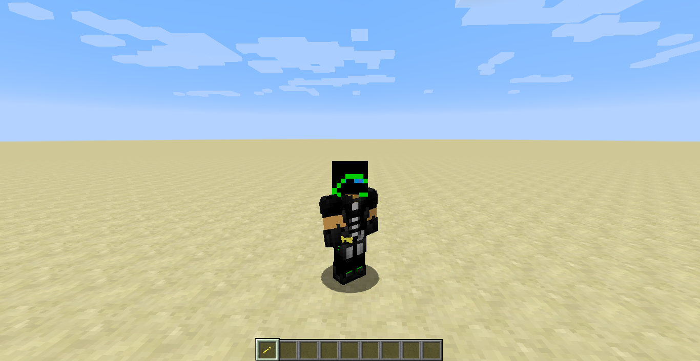

description: Создание собственного предмета.

# Создание предмета

## Основа

Создадим класс для нашего предмета.

```java
public class ItemKey extends Item
{
    public ItemKey(String name)
    {
        this.setRegistryName(name);
        this.setUnlocalizedName(name);
    }
}
```

* `setRegistryName(name)` - задаёт регистрируемое имя для нашего предмета, т.е. данное имя будет зарегистрировано в игре и его нельзя будет уже использовать более. В игре будет отображаться как `modid:*item_name*`. Чтобы это увидеть нажмите сочетание клавиш `F3+H`
* `setUnlocalizedName(name)` - задаёт локализационное имя для нашего предмета, т.е. чтобы нам сделать перевод имени для предмета мы задаём имя которое будет в конечном итоге выглядеть вот так `item.*item_name*.name`.

## Регистрация

Создадим класс ItemsRegister.

```java
public class ItemsRegister
{
    public static Item KEY = new ItemKey("key");

    public static void register()
    {
        setRegister(KEY);
    }

    @SideOnly(Side.CLIENT)
    public static void registerRender()
    {
        setRender(KEY);
    }

    private static void setRegister(Item item)
    {
        ForgeRegistries.ITEMS.register(item);
    }

    @SideOnly(Side.CLIENT)
    private static void setRender(Item item)
    {

    }
}
```

* `setRegister(item)` - данный метод будет регистрировать наш предмет
* `setRender(item)` - данный метод будет регистрировать модель для нашего предмета

Как Вы уже могли заметить, то теперь вместо GameRegistry используется ForgeRegistries, который делит регистрацию предметов, сущностей, блоков и т.д.

Далее нам нужно добавить в CommonProxy, в метод preInit такую строку кода `ItemsRegister.register();`.

Теперь можете запустить Minecraft нажав на кнопку `run` и посмотреть свой предмет в живую. Чтобы получить предмет пропишите `/give @p tut:key`.
Вместо `tut` у Вас должен быть `modid` вашего мода! Вместо `key` у Вас должно быть регистрируемое имя вашего предмета.

[](images/face_first.png)

[](images/face_three.png)

## Модель

Для начала добавим такой код в ItemsRegister, в метод setRender
```java
Minecraft.getMinecraft().getRenderItem().getItemModelMesher().register(item, 0, new ModelResourceLocation(item.getRegistryName(), "inventory"));
```

Теперь Вы должны создать модель предмета, Вы можете создать как плоскую модель, примером может послужить яблоко или объёмную модель. Вот пример плоской модели:

```json
{
  "parent": "item/generated",
  "textures": {
    "layer0": "tut:items/key"
  }
}
```

[Объёмная модель](https://yadi.sk/d/JNFq9Y4h3KcrBv)

Если ваша текстура к модели берётся из самого Minecraft, то `tut:`(modid) прописывать не надо! В примере с объёмной моделью я решил использовать текстуру золотого блока из Minecraft. Текстуру необходимо добавить по пути:
```md
└── src    
    └── main
        └── resources
            └── assets
                └── tut
                    └── textures
                        └── items
```

`tut` - modid нашего мода.
`key` - регистрируемое имя нашего предмета.

Когда ваша модель готово, добавьте её по пути:
```md
└── src    
    └── main
        └── resources
            └── assets
                └── tut
                    └── models
                        └── item
```

Добавим в ClientProxy, в метод init такой код  `ItemsRegister.registerRender();`.

И вот, что в конечном итоге у нас может получится.

[](images/model_face_first.png)

[](images/model_face_three.png)