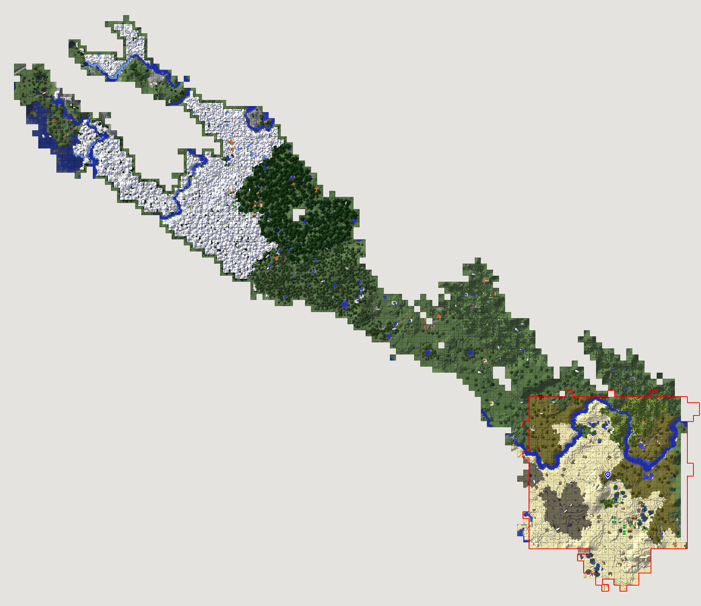
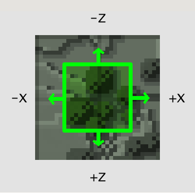

description: С версии 1.11.2, модеры столкнулись с проблемой "каскадной генерации". Что это, чем опасно и как избежать?

# Каскадная генерция

_Перевод статьи сделал пользователь форума [Крокодил](https://forum.mcmodding.ru/members/%D0%9A%D1%80%D0%BE%D0%BA%D0%BE%D0%B4%D0%B8%D0%BB.4289/)._

Генератор мира в моде, может вызывать критические лаги, и ваш мир будет "тормозить". Здесь собраны советы о том, как обнаружить и исправить эти проблемы.

## О проблеме

Несколько передовых разработчиков мод-пакетов столкнулись с сильными подвисаниями майнкрафт-сервера 1.11.2. а также с долгим ожиданием при создании новых миров.
Модпак "All the Mods 2", был выпущен с предупреждением:

> Загрузка новых миров может занять до 5 минут. Я всё ещё работаю над этим.

Вот [пример задержки](https://youtu.be/fXTbAb2Ogeo?t=16s) о которой мы говорили:

Примерно на 15-той секунде Rorax ударяет корову и она просто висит в воздухе, пока сервер работает в темпе замороженной улитки. Что происходит?

## Анализ производительности

Лучший способ выследить сильные подвисания майнкрафт-сервера - открыть Java VisualVM (или любой другой java профайлер) и собрать данные майнкрафта, пока он "тормозит".
Это поможет узнать, что происходит в игре, и понять куда смотреть. Правда, вы также сможете заметить проблемы с некоторыми модами. В этом случае, следует сообщить об этом их создателям.

Но, к сожалению, в этот раз проверка не принесла ожидаемых результатов. Ни один из модов не вызывал тех задержек, которые мы наблюдали в игре. Казалось, что генерация тормозит в целом.

Генерация мира происходит после того, как чанк загружается, ведь его нужно украсить рудами, деревьями и другими декорациями. И профайлер показывал, что многие моды действительно, загружают новые чанки во время генерации своих структур. Эта генерация, в свою очередь вызывала другую генерацию, и весь процесс повторялся в течении длительного времени.

## "Неудержимая" генерация

Многие знают, что когда мы приближаемся к чанку на некоторое расстояние, он загружается. Именно в этом и суть.
Для примера, возьмём дерево. Когда его генерация начинается на краю первого чанка и переходит во второй чанк (соседний), то вызывает полную загрузку второго чанка. Это занимает не очень много времени, так как деревья располагаются случайным образом, и не всегда оказываются на стыке двух чанков. Но если установлено много модов со своей генерацией, то загрузка 1-го чанка может привести к загрузке 10-ти новых, и это очень плохо.
Вот пример нормальной генерации с малым количеством "скачков":

Как видите, на картинке есть большая квадратная площадь, на которой происходила генерация, и некоторые дополнительные куски, на которые эта генерация перескакивала.
И вот тот же самый seed, но с установленным All the Mods 2:

Область первого изображения выделена красным для сравнения.
Как вы можете видеть, сотни далеких чанков были загружены, вызывая огромные лаги.

## Причина

Генерация мира более причудлива, чем считают большинство модеров (но никто не удивляется).
Они ожидают, что после генерации чанка, он передаётся их модам, но это не так.
Вот пример ванильной генерации:

Вы можете увидеть границы вокруг леса, где нет деревьев.

Генерация срабатывает только тогда, когда соседи чанков +X, +Z или +XZ уже загружены. Ваниль смещает свои генераторы мира в центр из 4 загруженных чанков, что значительно уменьшает генерацию в незагруженных чанках.
Вот картинка, которая показывает момент, когда моду вручают координату чанка, для генерации:

Многие моды используют свои собственные классы генерации и просто генерируют в случайной области 16x16, начиная с координаты, которую они получили.
Однако, генерация может перейти в чанки -X и -Z и это вызовет загрузку новых чанков:

Правильная генерация мира смещает все на +8, +8, так что вся декорация происходит в середине загруженных чанков, и вероятность "скачка" уменьшается:

## Решение

Я работал с несколькими модами в течение последних нескольких недель, чтобы исправить эти проблемы генерации.
Решение часто бывает очень простым, нужно просто сделать смещение. Однако объяснение не всегда ясно, поэтому я сделал этот пост.
С некоторыми скоро выходящими исправлениями для нескольких модов, создание нового мира на модпаке "All the Mods 2" занимает около 15 секунд, по сравнению с 5-ю минутами несколькими неделями ранне. Снова, вот до и после!

**Эта проблема появится снова, если модеры не будут об этом знать.**

## Что вы можете сделать?

Если вы **модер**, распространите информацию об этом и убедитесь, что ваши моды не вызывают "каскадную" генерацию. Если вы используете ванильные классы, такие как WorldGenMinable то смещение уже встроенно, но если у вас свой класс генерации - убедитесь, что он генерирует правильно.

Если вы **игрок**, и у ваш мир создаётся чрезвычайно медленно, а во время игры, вы испытываете трудности с производительностью, попробуйте удалить некоторые моды. Если это возымело эффект, сообщите авторам тех модов, которые, по вашему мнению, вызывают проблему.

Спасибо за чтение!