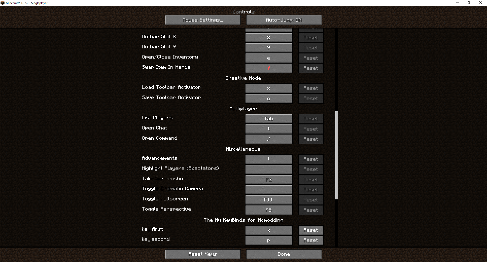

description: Создание собственной привязки клавиш.

# Привязка клавиш

Создадим класс `KeybindsRegister`.

```java
public class KeybindsRegister
{
    private static final String catergory = "The My KeyBinds for Mcmodding";
    public static final KeyBinding
            MY_KEY_FIRST = new KeyBinding("key.first", Keyboard.KEY_0, catergory),
            MY_KEY_SECOND = new KeyBinding("key.second", Keyboard.KEY_DELETE, catergory);

    public static void register()
    {
        setRegister(MY_KEY_FIRST);
        setRegister(MY_KEY_SECOND);
    }

    private static void setRegister(KeyBinding binding)
    {
        ClientRegistry.registerKeyBinding(binding);
    }
}
```

* `catergory` - эта переменная отвечает за название категории в которой, будут находится наши бинды клавиш.
* `KeyBinding()` - в этом классе будет создан бинд с именем `ket.*name*`, клавишей `Keyboard.*KEY*` в категории `catergory`.

Так как бинд клавиш относится к клиентской части, нам нужно будет прописать в `ClientProxy`, в методе `preInit` такой код:
```java
KeybindsRegister.register();
```

Переходим в игру и заходим в настройки -> управление.

[](images/keybinds.png) 