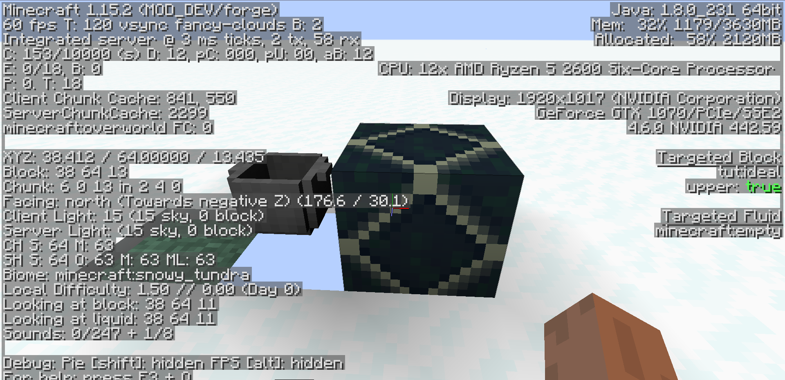
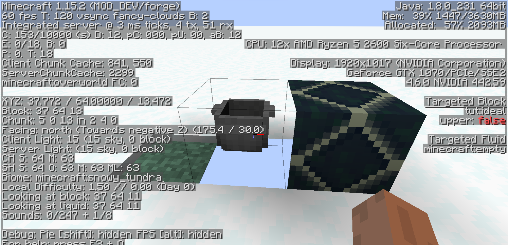
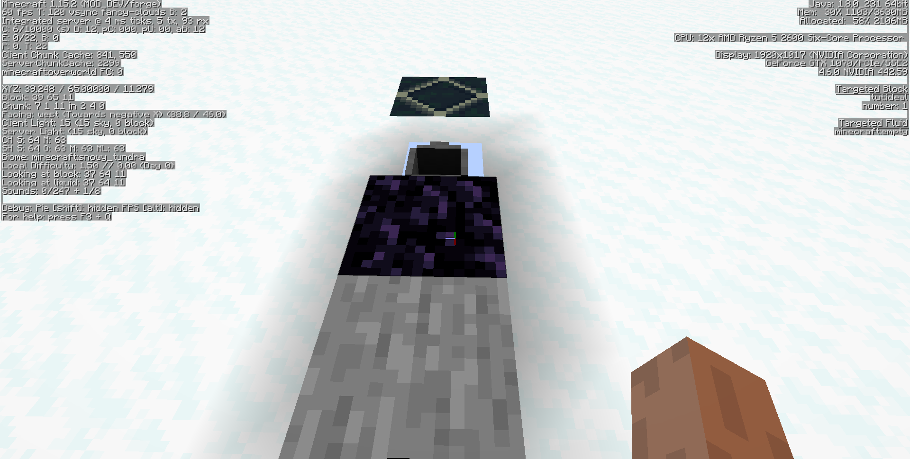
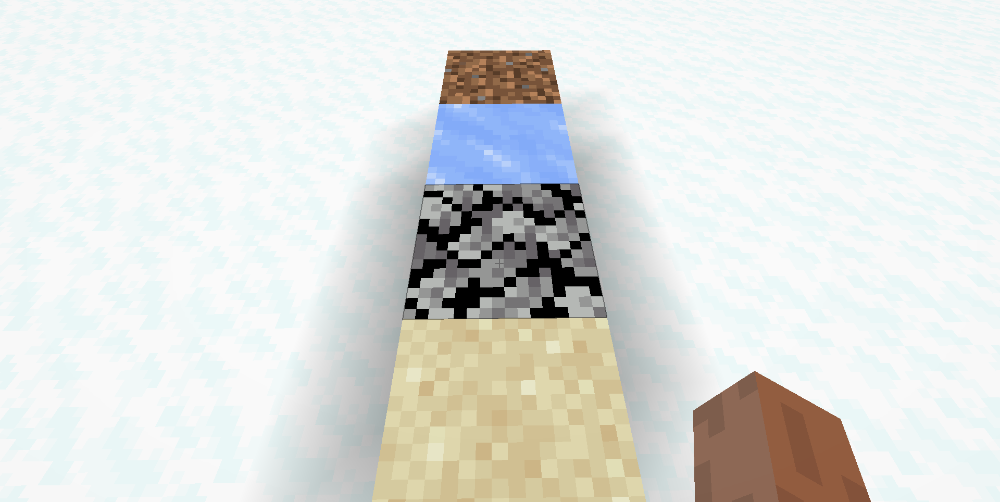

description: Добавление собственных состояний блоков.

# Состояние блока

Что такое `Blockstates` или же по простому `состояние блоков`? Данный термин появился в 1.8, состояние блоков позволяет задать определённый параметр блоку, при достижении которого, блок будет менять свою модель. Примером могут послужить: пшеница, датчик дневного света, калитка, забор и т.д. У каждого из этих блоков есть свои состояния, которые применяются в тех или иных ситуациях, и о которых пойдёт речь в данной статье.

В игре существует только 3 типа состояний блоков:
* `BooleanProperty` - логический тип. Хранит в себе логические значения.
* `PropertyEnum` - перечисляемый тип. Хранит в себе перечисляемые значения.
* `IntegerProperty` - целочисленный тип. Хранит в себе числа от `0` до `2147483647`. (знак минус применять не рекомендуется, так что весь счёт начинается от 0!)

## BooleanProperty

Перейдём в ранее созданный класс `IdealBlock` и создадим переменную `BooleanProperty` типа.
```java
public static final BooleanProperty UPPER = BooleanProperty.create("upper");
```

Добавим в конструктор стандартное значение для данной переменной.
```java
this.setDefaultState(this.stateContainer.getBaseState().with(UPPER, Boolean.valueOf(false)));
```

Если хотим больше одного типа прописать, то делаем это так:
```java
this.setDefaultState(this.stateContainer.getBaseState().with(UPPER, Boolean.valueOf(false)).with(OTHER_STATE, Base_Value));
```

Давайте сделаем простой пример использования переменной `BooleanProperty`. Добавим в класс нашего блока метод `fillStateContainer`.
```java
@Override
protected void fillStateContainer(StateContainer.Builder<Block, BlockState> builder) { builder.add(UPPER);  }
```

Перейдём в папку `blockstates` и откроем файл с названием нашего блока
```json
{
  "variants": {
    "upper=false": { "model": "tut:block/ideal1" },
    "upper=true": { "model": "tut:block/ideal2" }
  }
}
```

Вы могли заметить, что вместо пустых ковычек(стандартное состояние) стоит наша переменная с двумя значениями `true` и `false`. А так же указаны модели для состояния `upper=false` и `upper=true`. Зайдём в игру и поставим на наши камни любой блок, откроем меню отладки на кнопку F3 и наведём на наш блок камней и увидим, что значение `upper` стоит на `true`.
[](images/state_true.png)
[](images/state_false.png)
## PropertyInteger

В классе блока создадим переменную `IntegerProperty` типа.
```java
public static final IntegerProperty NUMBER = IntegerProperty.create("number", 0, 3);
```
Где 0 минимально значение и 3 максимальное. 

Добавим в конструктор стандартное значение для данной переменной.
this.setDefaultState(this.stateContainer.getBaseState().with(UPPER, Boolean.valueOf(false)).with(NUMBER, Integer.valueOf(0)));
Модифицируем метод `fillStateContainer`.
```java
@Override
protected void fillStateContainer(StateContainer.Builder<Block, BlockState> builder) { builder.add(UPPER).add(NUMBER);  }
```
Перейдём в папку `blockstates` и откроем файл с названием нашего блока
```json
{
  "variants": {
    "number=0": { "model": "block/stone" },
    "number=1": { "model": "block/obsidian" },
    "number=2": { "model": "tut:block/ideal1" },
    "number=3": { "model": "tut:block/ideal2" }
  }
}
```
[](images/state_int.png)

## PropertyEnum

Создадим энум наследующийся от IStringSerializable.
```java
public enum  EnumTime implements IStringSerializable
{
    WINTER("winter"),  SUMMER("summer"), AUTUMT("autumn"), SPRING("spring");

    public String name = "";

    EnumTime(String nameIn )
    {
        name = nameIn;
    }

    @Override
    public String getName()
    {
        return name;
    }
}
```
Сам EnumProperty.
```java
public static final EnumProperty<EnumTime> TIME = EnumProperty.create("time", EnumTime.class);
```
Установим стандартное значение в конструкторе.
```java
this.setDefaultState(this.stateContainer.getBaseState().with(TIME, EnumTime.SPRING));
```
Метод `fillStateContainer`.
```java
@Override
protected void fillStateContainer(StateContainer.Builder<Block, BlockState> builder) { builder.add(TIME);  }
```
И еще раз модифицируем `blockstate`
```json
{
  "variants": {
    "time=spring": { "model": "block/oak_leaves" },
    "time=winter": { "model": "block/ice" },
    "time=summer": { "model": "block/sand" },
    "time=autumn": { "model": "block/dirt" }
  }
}
```
[](images/state_enum.png)