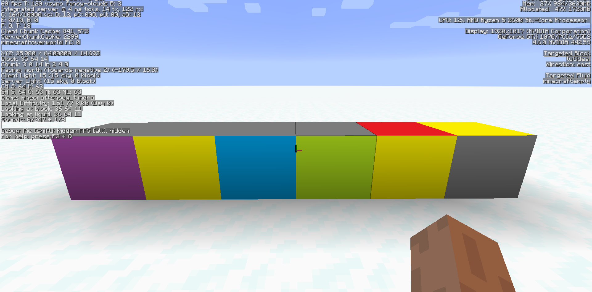

description: Добавление собственных состояний блоков.

# Состояние блока

Что такое `Blockstates` или же по простому `состояние блоков`? Данный термин появился в 1.8, состояние блоков позволяет задать определённый параметр блоку, при достижении которого, блок будет менять свою модель. Примером могут послужить: пшеница, датчик дневного света, калитка, забор и т.д. У каждого из этих блоков есть свои состояния, которые применяются в тех или иных ситуациях, и о которых пойдёт речь в данной статье.

В игре существует только 4 типа состояний блоков:
* `BooleanProperty` - логический тип. Хранит в себе логические значения.
* `PropertyEnum` - перечисляемый тип. Хранит в себе перечисляемые значения.
* `IntegerProperty` - целочисленный тип. Хранит в себе числа от `0` до `2147483647`. (знак минус применять не рекомендуется, так что весь счёт начинается от 0!)
* `DirectionProperty` - поворот плока. Хранит в себе Direction.Plane.

Все состояния майнкрафт хранит в `BlockStateProperties`. Там есть половина того что вам может быть нужно.
## BooleanProperty

Перейдём в ранее созданный класс `IdealBlock` и создадим переменную `BooleanProperty` типа.
```java
public static final BooleanProperty UPPER = BooleanProperty.create("upper");
```

Добавим в конструктор стандартное значение для данной переменной.
```java
this.setDefaultState(this.stateContainer.getBaseState().with(UPPER, Boolean.valueOf(false)));
```

Если хотим больше одного типа прописать, то делаем это так:
```java
this.setDefaultState(this.stateContainer.getBaseState().with(UPPER, Boolean.valueOf(false)).with(OTHER_STATE, Base_Value));
```

Давайте сделаем простой пример использования переменной `BooleanProperty`. Добавим в класс нашего блока метод `fillStateContainer`.
```java
@Override
protected void fillStateContainer(StateContainer.Builder<Block, BlockState> builder) { builder.add(UPPER);  }
```

Перейдём в папку `blockstates` и откроем файл с названием нашего блока
```json
{
  "variants": {
    "upper=false": { "model": "tut:block/ideal1" },
    "upper=true": { "model": "tut:block/ideal2" }
  }
}
```

Вы могли заметить, что вместо пустых ковычек(стандартное состояние) стоит наша переменная с двумя значениями `true` и `false`. А так же указаны модели для состояния `upper=false` и `upper=true`. Зайдём в игру и поставим на наши камни любой блок, откроем меню отладки на кнопку F3 и наведём на наш блок камней и увидим, что значение `upper` стоит на `true`.
[](images/state_true.png)
[](images/state_false.png)
## PropertyInteger

В классе блока создадим переменную `IntegerProperty` типа.
```java
public static final IntegerProperty NUMBER = IntegerProperty.create("number", 0, 3);
```
Где 0 минимально значение и 3 максимальное. 

Добавим в конструктор стандартное значение для данной переменной.
```java
this.setDefaultState(this.stateContainer.getBaseState().with(UPPER, Boolean.valueOf(false)).with(NUMBER, Integer.valueOf(0)));
```
Модифицируем метод `fillStateContainer`.
```java
@Override
protected void fillStateContainer(StateContainer.Builder<Block, BlockState> builder) { builder.add(UPPER).add(NUMBER);  }
```
Перейдём в папку `blockstates` и откроем файл с названием нашего блока
```json
{
  "variants": {
    "number=0": { "model": "block/stone" },
    "number=1": { "model": "block/obsidian" },
    "number=2": { "model": "tut:block/ideal1" },
    "number=3": { "model": "tut:block/ideal2" }
  }
}
```
[](images/state_int.png)

## PropertyEnum

Создадим перечисление, наследующиеся от IStringSerializable.
```java
public enum  EnumTime implements IStringSerializable
{
    WINTER("winter"),  SUMMER("summer"), AUTUMT("autumn"), SPRING("spring");

    public String name = "";

    EnumTime(String nameIn )
    {
        name = nameIn;
    }

    @Override
    public String getName()
    {
        return name;
    }
}
```
Сам EnumProperty.
```java
public static final EnumProperty<EnumTime> TIME = EnumProperty.create("time", EnumTime.class);
```
Установим стандартное значение в конструкторе.
```java
this.setDefaultState(this.stateContainer.getBaseState().with(TIME, EnumTime.SPRING));
```
Метод `fillStateContainer`.
```java
@Override
protected void fillStateContainer(StateContainer.Builder<Block, BlockState> builder) { builder.add(TIME);  }
```
И еще раз модифицируем `blockstate`
```json
{
  "variants": {
    "time=spring": { "model": "block/oak_leaves" },
    "time=winter": { "model": "block/ice" },
    "time=summer": { "model": "block/sand" },
    "time=autumn": { "model": "block/dirt" }
  }
}
```
[](images/state_enum.png)
## DirectionProperty

На самом деле `DirectionProperty` это сокращение `EnumProperty<Direction>`. Поэтому использование не сильно отличается. Испольуется для создания блоков с поворотом. Создадим `DirectionProperty`.
```java
public static final DirectionProperty DIRECTION = DirectionProperty.create("direction", Direction.NORTH, Direction.EAST, Direction.SOUTH, Direction.WEST, Direction.UP, Direction.DOWN);
```
Установим стандартное значение для установки. И передадим в `fillStateContainer`.
```java
this.setDefaultState(this.stateContainer.getBaseState().with(DIRECTION, Direction.UP));
```
```java
@Override
protected void fillStateContainer(StateContainer.Builder<Block, BlockState> builder) { builder.add(DIRECTION);  }
```
Чтоб при установке блока он ставился с поворотом предопределим метод getStateForPlacement.
```java
@Override
public BlockState getStateForPlacement(BlockItemUseContext context) {
    return this.getDefaultState().with(DIRECTION, context.getPlacementHorizontalFacing().rotateY());
}
```
И соответственно изменим `blockstate`.
```json
{
  "variants": {
    "direction=south": { "model": "tut:block/ideal2" },
    "direction=west":  { "model": "tut:block/ideal2", "y": 90 },
    "direction=north": { "model": "tut:block/ideal2", "y": 180 },
    "direction=east":  { "model": "tut:block/ideal2", "y": 270 },
    "direction=up":    { "model": "tut:block/ideal2", "x": 180 },
    "direction=down":  { "model": "tut:block/ideal2", "x": 270 }
  }
}
```
Модифицируем модельку, чтоб были различные стороны.
```json
{
  "parent": "block/cube",
  "textures": {
    "particle": "tut:blocks/dir_1",
    "down": "tut:blocks/dir_1",
    "up": "tut:blocks/dir_2",
    "north": "tut:blocks/dir_3",
    "east": "tut:blocks/dir_4",
    "south": "tut:blocks/dir_5",
    "west": "tut:blocks/dir_6"
  }
}
```
[](images/state_dir.png)

## IWaterLoggable
С 1.13 у нас появилась возможность делать блоки, содержищие воду(например забор). Для того чтоб это повторить, блок должен быть не полным, нужно унаследовать блок от IWaterLoggable, добавить проперти BlockStateProperties.WATERLOGGED и предопределить пару методов:
```java
    @Override
    public BlockState getStateForPlacement(BlockItemUseContext context)
    {
        IFluidState ifluidstate = context.getWorld().getFluidState(context.getPos());
        return this.getDefaultState().with(WATERLOGGED, ifluidstate.getFluid() == Fluids.WATER);
    }
    
    @Override
    public void neighborChanged(BlockState state, World worldIn, BlockPos pos, Block blockIn, BlockPos fromPos, boolean isMoving)
    {
        IFluidState ifluidstate = worldIn.getFluidState(pos);
        worldIn.setBlockState(pos, state.with(WATERLOGGED, ifluidstate.getFluid() == Fluids.WATER));
        super.neighborChanged(state, worldIn, pos, blockIn, fromPos, isMoving);
    }
    
    @Override
    public IFluidState getFluidState(BlockState state) {
        return state.get(WATERLOGGED) ? Fluids.WATER.getStillFluidState(false) : super.getFluidState(state);
    }
```
