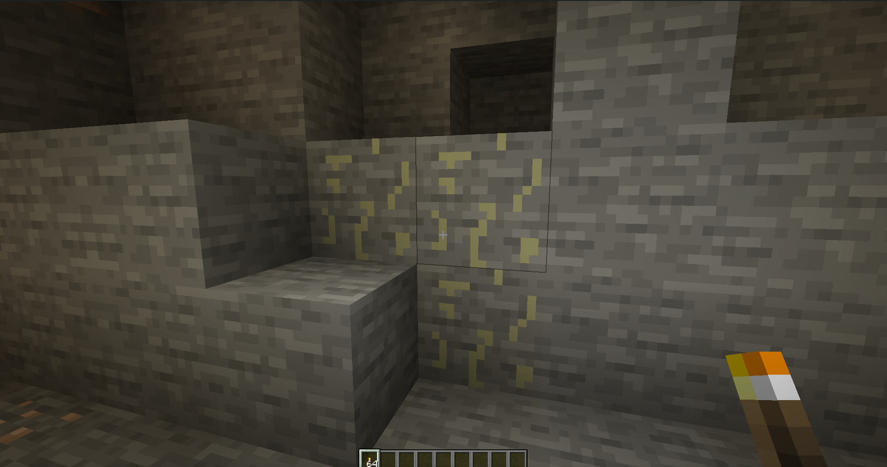

description: Создание собственного блока.

# Создание руды с генерацией в мире
Иногда надо сделать свою руду с герерацией в мире. Это мы и разберем в этой статье.
## Основа
Создадим класс нашей руды наследующийся от OreBlock:
```java
public class AluminumOreBlock extends OreBlock
{
    public AluminumOreBlock()
    {
        super(Properties.create(Material.ROCK).hardnessAndResistance(10, 10).harvestTool(ToolType.PICKAXE));
    }

    @Override
    public List<ItemStack> getDrops(BlockState state, LootContext.Builder builder) {
        return ImmutableList.of(new ItemStack(Item.getItemFromBlock(this)));
    }
}
```
Материал камень, инструмент кирка, прочность 10. Дропает себя же. Зарегистрируем стандартным образом.
## Генерация в мире
Для генерации нам надо добавить руду в список генерируемых Feature:
```java
    @SubscribeEvent
    public static void initServer(FMLCommonSetupEvent event)
    {
        addAluminumOre(Biomes.DARK_FOREST);
    }
    public static void addAluminumOre(Biome biome)
    {
        biome.addFeature(GenerationStage.Decoration.UNDERGROUND_ORES,
                Feature.ORE.withConfiguration(new OreFeatureConfig(OreFeatureConfig.FillerBlockType.NATURAL_STONE, TutBlocks.AL.get().getDefaultState(), 17))
                        .withPlacement(Placement.COUNT_RANGE.configure(new CountRangeConfig(20, 0, 0, 128))));

    }
```
Теперь в темном лесу будет наша руда! Так можно добавить в любой биом. Давайте найдем её!
[](img/ore_in_cave.png )
