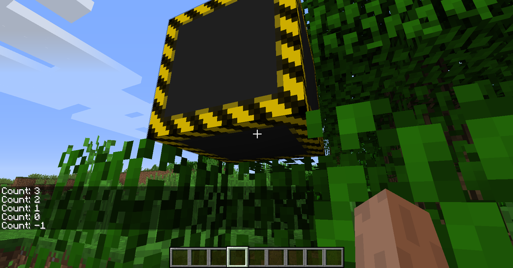

description: Обычный блок не может уникальные данные. Если мы хотим что бы наш блок содержал уникальные данные для каждого отдельно взятого экземпляра нам нужно использовать TileEntity.

# Tile Entitie

_Гайд перевел и дополнил пользователь форума — [AustereTony](https://forum.mcmodding.ru/members/austeretony.7279/)._

В данной статье я предоставляю свой перевод гайда с сайта shadowfacts по работе с TileEntity. Исходники примера доступны [тут](https://github.com/AustereTony/Guides/tree/master/1.12.2/Tile%20Entities/Counter).

В Майнкрафте класс `Block` используется для представления не просто единичного блока в мире, а блока как типа. Инстанс (экземпляр) `Block` содержит свойства для каждого экземпляра вашего блока, существующего в мире. Если мы хотим что бы наш блок содержал уникальные данные для каждого отдельно взятого экземпляра нам нужно использовать `TileEntity`.

Существует распространённый миф что `TileEntity` это плохо, особенно для производительности. Это не так. Они могут негативно влиять на производительность если они реализованы не умело, как в прочем и любые другие объекты.

Тайлы бывают двух типов: обновляющиеся (_ticking_) и не обновляющиеся (_non-ticking_). Обновляющиеся тайлы обновляются каждый игровой тик (обычно 20 раз в секунду). Они влияют на производительность интенсивнее и требуют аккуратной реализации. Не обновляющиеся тайлы существуют для простого хранения данных и в этом туториале мы создадим простой, не обновляющийся `TileEntity`.

## Вспомогательные средства

Прежде чем мы создадим тайл, мы добавим класс, который упростит их создание в будущем.

В первую очередь создадим класс `BlockTileEntity`:

```java
// ru.austeretony.counter.block.tile.BlockTileEntity.java

public abstract class BlockTileEntity<T extends TileEntity> extends BaseBlock {

    public BlockTileEntity(String name, Material material, float hardness, float resistanse, SoundType soundType) {
 
        super(name, material, hardness, resistanse, soundType);
    }

    public abstract Class<T> getTileEntityClass();

    public T getTileEntity(IBlockAccess world, BlockPos position) {
 
        return (T) world.getTileEntity(position);
    }

    @Override
    public boolean hasTileEntity(IBlockState blockState) {
 
        return true;
    }

    @Nullable
    @Override
    public abstract T createTileEntity(World world, IBlockState blockState);
}
```

Этот класс предоставляет нам следующее:
* Он расширяет `BaseBlock`, содержащий нашу удобную базовую реализацию `Block`
```java
// ru.austeretony.counter.block.base.BaseBlock.java

public class BaseBlock extends Block {

    public BaseBlock(String name, Material material, float hardness, float resistanse, SoundType soundType) {
 
        super(material);
 
        this.setRegistryName(name);
        this.setUnlocalizedName(name);
        this.setHardness(hardness);
        this.setResistance(resistanse);
        this.setSoundType(soundType);
    }
}
```
* Он содержит обобщение, представляющее наш класс `TileEntity`. Он будет использован для создания вспомогательных средств для уменьшения количества необходимых приведений типов для получения экземпляра нашего тайла на определённой позиции и для уверенности в том, что созданный тайл имеет корректный тип.
* Он переопределяет `hasTileEntity(IBlockState)` из `Block` и возвращает `true`. Это даёт понять Майнкрафту что у нашего блока есть тайл и его нужно создать.
* Он содежит два абстрактных метода: 1) `getTileEntityClass()` - тут мы будем возвращать класс нашего `TileEntity`, что позволит ему быть зарегистрированным вместе с блоком, 2) `createTileEntity()` - более специфичная версия стандартного метода из `Block`. Майнкрафт вызывает его каждый раз когда нужно создать новый экземпляр тайла, например когда мы устанавливаем наш блок.

## Блок

Теперь когда у нас есть удобная основа самое время создать блок.

Создадим `BlockCounter`, расширяющий `BlockTileEntity`.

```java
// ru.austeretony.counter.block.BlockCounter.java

public class BlockCounter extends BlockTileEntity<TileEntityCounter> {

    public BlockCounter(String name, Material material, float hardness, float resistanse, SoundType soundType) {
 
        super(name, material, hardness, resistanse, soundType);
 
        this.setHarvestLevel("pickaxe", 3);
    }

    @Override
    public boolean onBlockActivated(World world, BlockPos position, IBlockState blockState, EntityPlayer player, EnumHand hand, EnumFacing side, float hitX, float hitY, float hitZ) {
 
        if (!world.isRemote) {
     
            TileEntityCounter tileEntity = getTileEntity(world, position);
     
            if (side == EnumFacing.DOWN) {
         
                tileEntity.decrementCount();
         
            }
     
            else if (side == EnumFacing.UP) {
         
                tileEntity.incrementCount();
            }
     
            player.sendMessage(new TextComponentString("Count: " + tileEntity.getCount()));
        }
 
        return true;
    }

    @Override
    public Class<TileEntityCounter> getTileEntityClass() {
 
        return TileEntityCounter.class;
    }

    @Override
    public TileEntityCounter createTileEntity(World world, IBlockState blockState) {
 
        return new TileEntityCounter();
    }
}
```

Наш блок расширяет `BlockTileEntity` и содержит обобщение `TileEntityCounter` (который предстоит создать), так как этот тайл принадлежит этому блоку.

В конструкторе мы просто напросто вызываем суперконструктор и передаём туда все параметры, которые будем указывать при создании блока.

В методе `getTileEntityClass()` вернём `TileEntityCounter.class` (мы ещё создадим его).
Это позволит зарегистрировать его ассоциировав с именем блока.

В `createTileEntity()` мы возвращаем новый экземпляр класса `TileEntityCounter`.

Ну и в конце концов в `onBlockActivated()`, вызываемый при правом клике по блоку мы делаем следующее:
* Проверяем, что действия производятся на сервере (это очень важно при работе с `TileEntity`!).
* Достаём экземпляр `TileEntityCounter`.
* Если игрок кликнул по нижней стороне - уменьшаем значение счётчика.
* Если клик по верхней стороне - увеличиваем значение.
* Отправляем сообщение в чат, содержащие значение счётчика.
* Возвращаем `true`.

## Разделение: клиент и сервер

Как было подмечено выше, перед тем как работать со счётчиком тайла, мы должны удостовериться, что действия происходят на сервере. Делаем мы это потому как в Майнкрафте клиент и сервер полностью разделены и некоторые методы вызываются для обеих сторон.

В многопользовательской игре множество клиентов подключены к одному серверу. В этом случае разделение между сторонами очевидно, но в одиночной игре всё немного сложнее. В многопользовательской игре сервер, к которому происходит подключение, отражает _физический сервер_ и все отдельные подключенные клиенты являются _физическими клиентами_.

В одиночной игре клиент и сервер тоже разделены даже несмотря на то, что они исполняются на одном компьютере (на одной JVM, но в разных потоках). В одиночной игре клиент подключается к локальному, приватному серверу, функции которого схожи с физическим сервером. В этом случае серверный поток отражает _логический сервер_, а клиентский поток отражает _логический клиент_, так как обе логические стороны выполняются на одной физической стороне.

Поле `World.isRemote` используется для проверки стороны, на которой происходит выполнение (будь она логической или физической). Оно равно `true` для _физического клиента_ в многопользовательской игре и для _логического клиента_ в одиночной игре. Это поле равно `false` для _физического сервера_ в многопользовательской игре и для _логического сервера_ в одиночной.

Делая проверку в условии `!world.isRemote`, мы обеспечиваем уверенность что действия будут производится на сервере (физическом или логическом).

## Создание тайла для блока

Теперь когда у нас есть блок, мы должны создать тайл для него.

Создадим класс `TileEntityCounter`:

```java
// ru.austeretony.counter.block.tile.TileEntityCounter.java

public class TileEntityCounter extends TileEntity {

    private int count;

    @Override
    public NBTTagCompound writeToNBT(NBTTagCompound tagCompound) {
 
        tagCompound.setInteger("count", this.count);
 
        return super.writeToNBT(tagCompound);
    }

    @Override
    public void readFromNBT(NBTTagCompound tagCompound) {
 
        this.count = tagCompound.getInteger("count");
 
        super.readFromNBT(tagCompound);
    }

    public int getCount() {
 
        return this.count;
    }

    public void incrementCount() {
 
        this.count++;
 
        this.markDirty();
    }

    public void decrementCount() {
 
        this.count--;
 
        this.markDirty();
    }
}
```

Содержимое весьма не хитрое:
* Класс расширяет стандартный `TileEntity`
* Содержит приватное поле `count`, содержащее значение счётчика.
* Переопределяет `writeToNBT()` и `readFromNBT()` что бы наши данные были сохранены и загружены с диска.
* Предоставляет методы `getCount()`, `incrementCount()`, `decrementCount()` для работы с полем `count`.
Кроме того, в методах, изменяющих значение счётчика (`count`) происходит вызов `markDirty()` из `TileEntity`. Он даёт игре понять что данные были изменены с момента последнего сохранения и их нужно перезаписать.

## NBT формат

Данный формат используется для хранения данных в виде пар ключ-значение, которые легко сериализуется в байты и сохраняется на диск. Вы можете ознакомиться с классом NBTTagCompound для представления о типах данных, которые он может хранить. Ванильный код содержит множество хороших примеров по сохранению и чтению сложных структур данных.

В нашем случае мы сохраняем значение поля count как целочисленный тип `Integer` с ключём в виде строки "`count`" в NBT в методе `writeToNBT()` и читаем его в `readFromNBT()`.

## Регистрация

Тайл нашего блока нужно зарегистрировать. Делать мы это будем там же, где регистрируем наши блоки.

Регистрацию будем производить через вызов `GameRegistry.registerTileEntity()`
и передавать в него класс тайла и его регистрационное имя. Это требуется для того, что бы при загрузке Майнкрафт определял какой `TileEntity` к какому блоку принадлежит и пересоздавал его загружая из NBT.

```java
// ru.austeretony.counter.main.BlockRegistry.java

public class BlockRegistry {

    public static final Block
    BLOCK_COUNTER = new BlockCounter("block_counter", Material.ROCK, 10.0F, 10.0F, SoundType.STONE).setCreativeTab(CreativeTabs.BUILDING_BLOCKS);

    public static void register() {
 
        setBlockRegister(BLOCK_COUNTER);
        setItemBlockRegister(BLOCK_COUNTER);
        GameRegistry.registerTileEntity(((BlockCounter) BLOCK_COUNTER).getTileEntityClass(), BLOCK_COUNTER.getRegistryName().toString());
    }

    @SideOnly(Side.CLIENT)
    public static void registerRender() {
         
        setItemBlockRender(BLOCK_COUNTER);
    }

    private static void setBlockRegister(Block block) {
 
        ForgeRegistries.BLOCKS.register(block);
    }

    private static void setItemBlockRegister(Block block) {
 
        ForgeRegistries.ITEMS.register(new ItemBlock(block).setRegistryName(block.getRegistryName()));
    }

    @SideOnly(Side.CLIENT)
    private static void setItemBlockRender(Block block) {
 
        ModelLoader.setCustomModelResourceLocation(Item.getItemFromBlock(block), 0, new ModelResourceLocation(block.getRegistryName(), "inventory"));
    }
}
```

Не забывайте, регистрация `Block`, `ItemBlock` и `TileEntity` происходит во время преинициализации в `CommonProxy`, а регистрация рендера для `ItemBlock` происходит в процессе преинициализации в `ClientProxy` (для рендера через `ModelLoader`).

## Финал

Теперь, когда все сделано, запускаем игру и достаем наш блок-счётчик из вкладки "блоки".
Установив его, кликните ПКМ по верхней стороне блока - счётчик увеличит значение и в чате появится сообщение.

[](images/incremented.png)

Нажав ПКМ по нижней стороне несколько раз вы увидите это:

[](images/decremented.png)

Клик ПКМ по другим сторонам выведет в чат сообщение с текущим значением счётчика.