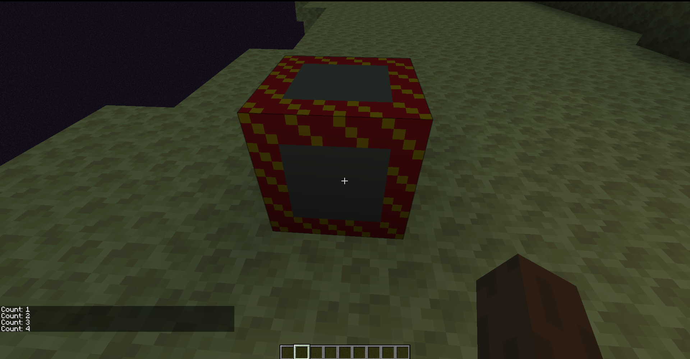

description: Создаие и использование TileEntity.

# Tile Entitie

В Майнкрафте класс `Block` используется для представления не просто единичного блока в мире, а блока как типа. Экземпляр `Block` содержит свойства для каждого экземпляра блока в мире. Если мы хотим, что бы наш блок содержал уникальные данные/свойстава/GUI для каждого экземпляра, нужно использовать `TileEntity`.

Тайлы бывают двух типов: обновляющиеся и не обновляющиеся. Обновляющиеся тайлы обновляются каждый игровой тик (обычно 20 раз в секунду). Они влияют на производительность сильнее и требуют очень аккуратной реализации. Т.е. не обновляющиеся тайлы существуют для простого хранения данных, а тикающие для блоков, делающих что то в мире.

## Блок

Создадим `CounterBlock`, расширяющий `Block`.

```java
public class CounterBlock extends Block
{
    public CounterBlock()
    {
        super(Properties.create(Material.ROCK));
    }

    @Override
    public ActionResultType onBlockActivated(BlockState state, World world, BlockPos position, PlayerEntity playerEntity, Hand hand, BlockRayTraceResult result)
    {

        if (!world.isRemote)
        {
            CounterTile tileEntity = (CounterTile) world.getTileEntity(position);
            tileEntity.incCount();
            playerEntity.sendMessage(new StringTextComponent("Count: " + tileEntity.getCount()));
        }

        return ActionResultType.SUCCESS;
    }

    @Override public boolean hasTileEntity(BlockState state){ return true;	}
    @Override public TileEntity createTileEntity(BlockState state, IBlockReader world) { return new CounterTile(); }
}

```

В конструкторе мы просто напросто вызываем супер и передаём туда все пропертисы.

В методе `hasTileEntity` мы говорим игре, что блок имеет тайл.
В `createTileEntity` мы возвращаем новый экземпляр тайлаr.

Ну и в конце концов в `onBlockActivated`, вызываемый при правом клике по блоку мы делаем следующее:
* Проверяем, что действия производятся на сервере (это очень важно при работе с `TileEntity`!).
* Достаём экземпляр `CounterTile`.
* Отправляем сообщение в чат, содержащие значение счётчика.
* Возвращаем `true`.

## Разделение: клиент и сервер

Как было подмечено выше, перед тем как работать со счётчиком тайла, мы должны удостовериться, что действия происходят на сервере. Делаем мы это потому как в Майнкрафте клиент и сервер полностью разделены и некоторые методы вызываются для обеих сторон.

В многопользовательской игре множество клиентов подключены к одному серверу. В этом случае разделение между сторонами очевидно, но в одиночной игре всё немного сложнее. В многопользовательской игре сервер, к которому происходит подключение, отражает _физический сервер_ и все отдельные подключенные клиенты являются _физическими клиентами_.

В одиночной игре клиент и сервер тоже разделены даже несмотря на то, что они исполняются на одном компьютере (на одной JVM, но в разных потоках). В одиночной игре клиент подключается к локальному, приватному серверу, функции которого схожи с физическим сервером. В этом случае серверный поток отражает _логический сервер_, а клиентский поток отражает _логический клиент_, так как обе логические стороны выполняются на одной физической стороне.

Поле `World.isRemote` используется для проверки стороны, на которой происходит выполнение (будь она логической или физической). Оно равно `true` для _физического клиента_ в многопользовательской игре и для _логического клиента_ в одиночной игре. Это поле равно `false` для _физического сервера_ в многопользовательской игре и для _логического сервера_ в одиночной.

Делая проверку в условии `!world.isRemote`, мы обеспечиваем уверенность что действия будут производится на сервере (физическом или логическом).

## Создание тайла

Теперь когда у нас есть блок, мы должны создать тайл для него. Но, для начала, я советую сдалть класс-обертку над тайлом, в которой будут прорписаны методы синхронизации:

```java
public abstract class TutTile extends TileEntity
{
    public TutTile(TileEntityType<?> tileEntityTypeIn)
    {
        super(tileEntityTypeIn);
    }

    public CompoundNBT getUpdateTag()
    {
        return write(new CompoundNBT());
    }

    public abstract SUpdateTileEntityPacket getUpdatePacket();

    public abstract void onDataPacket(NetworkManager net, SUpdateTileEntityPacket pkt);
}

```
* getUpdatePacket возвращает объект пакета синхронизации(уже с данными). Фактически это аналог write.
* onDataPacket чтение из пакета синхронизации.

Создадим класс `CounterTile`:

```java
public class CounterTile extends TutTile
{
    private int count = 0;
    public CounterTile()
    {
        super(PhoenixTiles.COUNTER.get());
    }

    public void incCount()
    {
        count++;
    }

    public int getCount()
    {
        return count;
    }

    @Override
    public void read(CompoundNBT nbt)
    {
        count = nbt.getInt("count");
        super.read(nbt);
    }

    @Override
    public CompoundNBT write(CompoundNBT nbt)
    {
        nbt.putInt("count", count);
        return super.write(nbt);
    }

    @Override
    public SUpdateTileEntityPacket getUpdatePacket()
    {
        return new UpdatePacket(count);
    }

    @Override
    public void onDataPacket(NetworkManager net, SUpdateTileEntityPacket pkt)
    {
        count = ((UpdatePacket) pkt).count;
    }

    static class UpdatePacket extends SUpdateTileEntityPacket
    {
        public int count;

        public UpdatePacket(int countIn)
        {
            this.count = countIn;
        }

        @Override
        public void readPacketData(PacketBuffer buffer) throws IOException
        {
            buffer.writeInt(count);
            super.readPacketData(buffer);
        }

        @Override
        public void writePacketData(PacketBuffer buffer) throws IOException
        {
            count = buffer.readInt();
            super.writePacketData(buffer);
        }
    }
}
```

Разбор:
* count - количество кликов.
* В супер передается зарегистрированный тип тайла. Регистрацию мы сделаем далее.
* incCount и getCount методы работы с кол-вом кликов.
* write сохранение информации в NBT.
* read чтение информации, сохраненной в NBT.
* getUpdatePacket возвращает объект пакета синхронизации(уже с данными). Фактически это аналог write.
* onDataPacket чтение из пакета синхронизации.
* UpdatePacket класс пакета. Далее его разбор:
    * count хранит кол-во прыжков
    * readPacketData чтение из пакета
    * writePacketData запись в пакет
 
## NBT формат

Данный формат используется для хранения данных в виде пар ключ-значение, которые легко сериализуется в байты и сохраняется на диск. Вы можете ознакомиться с классом CompoundNBT для представления о типах данных, которые он может хранить. Ванильный код содержит множество хороших примеров по сохранению и чтению сложных структур данных.

В нашем случае мы сохраняем значение поля count как целочисленный тип `Integer` с ключём в виде строки "`count`" в NBT в методе `write()` и читаем его в `read()`.

## Формат пакетов

Пакеты используются для синхрогнизации информации между клиентом и сервером. В отличие от NBT значение получается не по ключу, а читается в той же последовательности, что и пишется. Т.е. если пишется int int BlockPos int, то и читается int int BlockPos int(инты читаются в том же порядке что и пишутся иначе данные перепутаются), иначе, скорее всего, вылетит исключение.

## Регистрация

Перед регитсрацией тайла, нам нужно зарегестрировать блок. Регестрация тайла почти ничем не отличается от регестрации блока:
```java
public class TutTiles
{
    public static final DeferredRegister<TileEntityType<?>> TILE_ENTITIES = new DeferredRegister(ForgeRegistries.TILE_ENTITIES, Tut.MOD_ID);

    public static final RegistryObject<TileEntityType<CounterTile>> COUNTER = TILE_ENTITIES.register("counter", () -> TileEntityType.Builder.create(CounterTile::new, TutBlocks.COUNTER.get()).build(null));

    public static void register()
    {
        TILE_ENTITIES.register(FMLJavaModLoadingContext.get().getModEventBus());
    }
}
```
Не забдем вызвать `TutTiles.register()` в конструкторе главного класса.

## Финал

Теперь, кликнув на блок, мы увидем какое нам число.

[](images/work.png)
