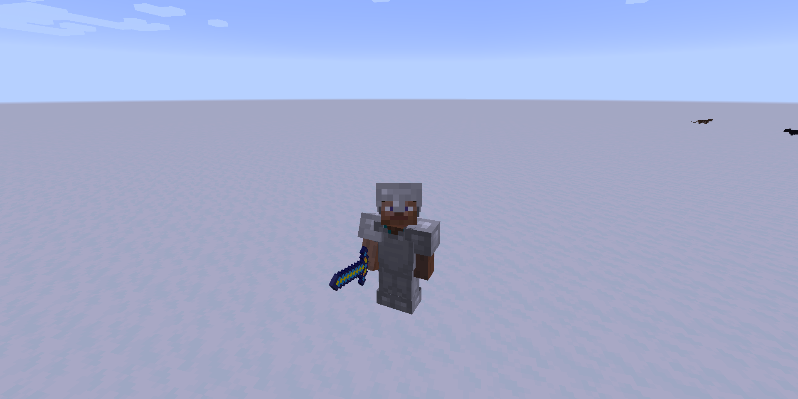

description: Создание собственной брони.

# Создание брони

## Основа

Создадим класс брони CookieArmor.
```java
public class CookieArmor extends ArmorItem
{
    public CookieArmor(EquipmentSlotType slot)
    {
        super(TutArmorMaterials.COOKIE, slot, new Properties());
    }
}
```
Зарегистрируем нашу броню. Примерно должно выглядить так
```java
public static final RegistryObject<Item> COOKIE_HELM  = ITEMS.register("cookie_helmet", () -> new CookieArmor(EquipmentSlotType.HEAD));
public static final RegistryObject<Item> COOKIE_CHEST = ITEMS.register("cookie_chest",  () -> new CookieArmor(EquipmentSlotType.CHEST));
public static final RegistryObject<Item> COOKIE_LEGS  = ITEMS.register("cookie_leggins",() -> new CookieArmor(EquipmentSlotType.LEGS));
public static final RegistryObject<Item> COOKIE_FEET  = ITEMS.register("cookie_boots",  () -> new CookieArmor(EquipmentSlotType.FEET));
```
[](images/base.png)
И!.... Она выглядит как железная..... Давайте это исправим!
Нам нужно создать текстуру для брони. Чтобы сделать текстуру как показано ниже, зайдите в корневую папку .minecraft --> version --> файл 1.12.2.jar (открыть с помощью WinRar) и идём по пути:
1.12.2.jar\assets\minecraft\textures\models\armor и выбираем любой слот кроме chainmail_layer_1 и в Photoshop или в Paint перерисовываем по своему вкусу.


Положим наши текстуры по пути:
```md
└── src    
    └── main
        └── resources
            └── assets
                └── tut
                    └── textures
                        └── armor
```
Так же надо предопределить метод getArmorTexture:
```java
@Override
public String getArmorTexture(ItemStack itemstack, Entity entity, EquipmentSlotType slot, String layer) 
{
    if (slot == EquipmentSlotType.LEGS) 
	{
       return TestMod.MOD_ID + ":textures/armor/cookie_2.png";
    } 
	else 
	{
         return TestMod.MOD_ID + ":textures/armor/cookie_1.png";
    }
}
```
Запускаем игру, выдаём себе броню и надеваем.

[](images/equipped_armor.png)

## Свой материал

 Создадим перечисление своих материалов:
```java
public enum TutArmorMaterials implements IArmorMaterial
{
    COOKIE("cookie", 25, new int[]{2, 5, 6, 2},
                9, SoundEvents.ITEM_ARMOR_EQUIP_LEATHER, 0.0F, Ingredient.fromItems(Items.COOKIE));
    private static final int[] MAX_DAMAGE_ARRAY = new int[]{13, 15, 16, 11};
    private final String name;
    private final int maxDamageFactor;
    private final int[] damageReductionAmount;
    private final int enchantability;
    private final SoundEvent soundEvent;
    private final float toughness;
    private final Ingredient repairMaterial;

    TutArmorMaterials(String nameIn, int maxDamageFactorIn, int[] damageReductionAmountsIn, int enchIn, SoundEvent equipSoundIn, float toughnessIn, Ingredient repairMaterial)
    {
        this.name = nameIn;
        this.maxDamageFactor = maxDamageFactorIn;
        this.damageReductionAmount = damageReductionAmountsIn;
        this.enchantability = enchIn;
        this.soundEvent = equipSoundIn;
        this.toughness = toughnessIn;
        this.repairMaterial = repairMaterial;
    }

    @Override public int getDurability(EquipmentSlotType slotIn)            { return MAX_DAMAGE_ARRAY[slotIn.getIndex()] * this.maxDamageFactor; }
    @Override public int getDamageReductionAmount(EquipmentSlotType slotIn) { return this.damageReductionAmount[slotIn.getIndex()];              }
    @Override public int getEnchantability()                                { return this.enchantability;                                        }
    @Override public SoundEvent getSoundEvent()                             { return this.soundEvent;                                            }
    @Override public Ingredient getRepairMaterial()                         { return this.repairMaterial;                                        }
    @Override public float getToughness()                                   { return this.toughness;                                             }

    @OnlyIn(Dist.CLIENT)
    @Override public String getName() { return this.name; }
}
```
Разберемся в параметрах:
* `nameIn` - Имя
* `maxDamageFactorIn` - Максимальный сдерживаемый урон
* `damageReductionAmountsIn` - Защита каждой части оброни, где 0 сапоги, а 3 шлем
* `enchIn` - Лёгкость зачарования.
* `SoundEvent` - Звук экиперовки
* `toughnessIn` - Скорость поломки
* `repairMaterial` - Предмет для починки
