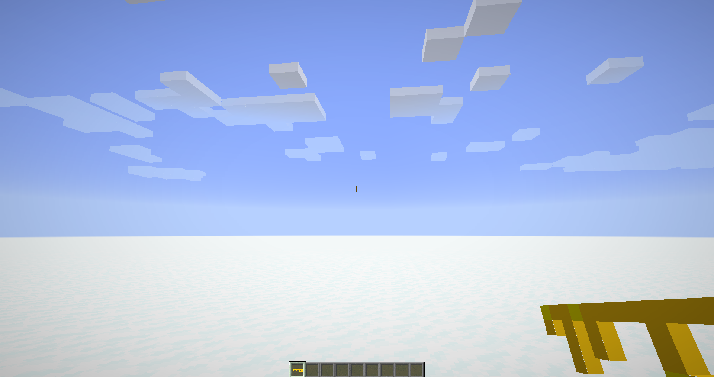
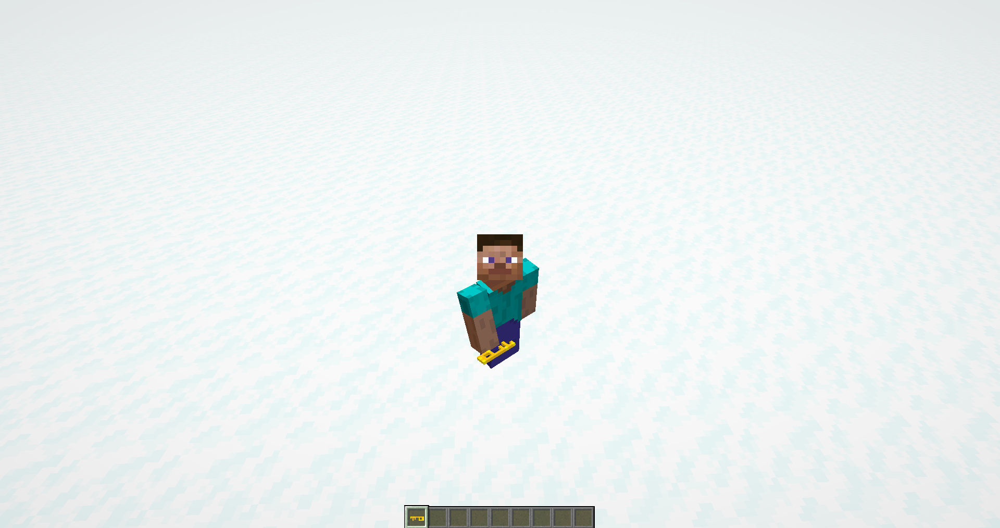

description: Создание собственного предмета.

# Создание предмета

## Основа

Создадим класс для нашего предмета.

```java
public class KeyItem extends Item
{
    public KeyItem()
    {
        super(new Properties());
    }
}
```
У Properties есть методы для настройки:

| Параметр         | Описание                                   |
|------------------|--------------------------------------------|
| food             | Делает предмет едой                        |
| addToolType      | Делает инструмент какого-то типа.          |
| defaultMaxDamage | Устанавливает максимальную прочность.      |
| group            | Группа предметов в творческом режиме игры. |
| setISTER         | Устанавливает кастомный рендер предмету.   |
| rarity           | Редкость предмета.                         | 
| setNoRepair      | Запрещает чинить предмет, если он сломан.  |  

## Регистрация

Создадим класс TutItems.

```java
public class TutItems
{
    private static final DeferredRegister<Item> ITEMS = new DeferredRegister<>(ForgeRegistries.ITEMS, TestMod.MOD_ID);

    public static final RegistryObject<Item> KEY = ITEMS.register("key",  KeyItem::new);

    public static void register()
    {
        ITEMS.register(FMLJavaModLoadingContext.get().getModEventBus());
    }
}
```

Всё! Вот так быстро и просто мы создали основной класс для регистрации предметов. Чтобы использовать наш предмет,
где-то в моде, достаточно написать `TutItems.KEY.get()`. Осталось добавить `TutItems.register()` в коструктор главного класса нашего мода.

Теперь можете запустить Minecraft и посмотреть свой предмет в живую. Чтобы получить предмет пропишите `/give @p tut:key`.
Вместо `tut` у вас должен быть `modId` вашего мода! Вместо `key` у вас должно быть регистрируемое имя вашего предмета.

[](images/non_model.png)

## Модель

В отличие от 1.12.2 в 1.15.2 не нужно регистрировать рендер. Достаточно сделать модельку с именем `reg_nme.json`. В нашем случае `key.json`.
Создадим файл `key.json` в `assets/tut/models/item`.

Пропишем такой код для плоской модели:
```json
{
  "parent": "item/generated",
  "textures": {
    "layer0": "tut:items/key"
  }
}
```

`tut` - modId нашего мода.
`key` - регистрируемое имя нашего предмета.

Если ваша текстура к модели берётся из самого Minecraft, то `tut:`(modId) прописывать не надо! Текстуру необходимо добавить по пути:
```md
src/main/resources/assets/tut/textures/items
```

Запускаем игру и видим, что у нас получилось:
[](images/simple_model.png)

[](images/simple_model_2.png)
