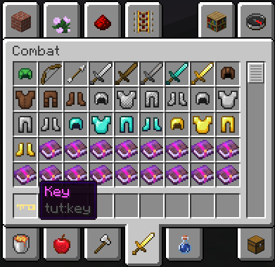

description: Создание группы редкости предметов, с помощью которой можно управлять цветом их названий.

# Редкость предметов

В Minecraft цвет большинства предметов белый. Однако, цвет зачарованных инструментов меняется на алмазный.
Цвет зачарованной книги желтый.

За цвет названий предметов отвечает редкость `rarity` этого предмета. Редкость отвечает **только** за цвет названия.
Ни для чего больше в игре она не применяется.

## Зачем использовать редкость?

Цвет названия предмета можно установить через .json файл используя [коды форматирования](http://minecraft.gamepedia.com/Formatting_codes).

Вот так можно получить оранжевое название предмета для "Легендарного ключа":

```markdown
"item.tut.key": "§6Legendary key"
```

Но что если вы создаете большой RPG мод, в котором есть легендарные, божественные, невероятные и т.д. предметы?

Можно проставлять цветовые коды перед каждым названием, но что если в один день вы решили изменить цвет легендарных предметов?
Придется менять названия у всех предметов из этой категории. Неудобно.

С помощью системы редкости вам достаточно будет поменять цвет в одном месте и он сразу изменится у всех предметов, которые
находятся в этой категории редкости.

## Регистрация редкости

Добавим в файл предметов строку:

```java
// TutItems.java
public static Rarity RARITY_TUTORIAL = Rarity.create(name, color);
```

Разберем аргументы:
* `name` (строка) — название класса предмета
* `color` (`TextFormatting`) — цвет названия предмета

Добавим "Эпическую" редкость предметов. Названия должны окрашиваться в пурпурный цвет:

```java
// TutItems.java

public static Rarity RARITY_EPIC = Rarity.create("epic", TextFormatting.DARK_PURPLE);
```

## Применение к предмету

В проперти предмета вызовем метод `rarity`:

```java
// KeyItem.java
public KeyItem()
{
    super(new Properties().rarity(TutItems.RARITY_EPIC));
}
```

Теперь название предмета пурпурного цвета:

[](images/epic_test.png)