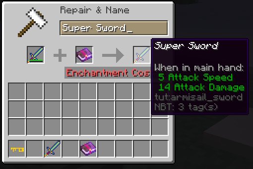

description: Прочность инструментов.

# Починка инструментов

В прошлой статье мы создали использовали алмазный тир, но при этом наши инструменты имели характеристики как у алмазных. 
Давайте это исправим! Создадим перечисление имплиментирующее IItemTier:

```java
public enum TutTiers implements IItemTier
{
    MAGIC_TIER(4, 2500, 7.2F, 5.0F, 5, Ingredient.fromStacks(new ItemStack(Items.ENCHANTED_BOOK, 5)));

    private final int harvestLevel;
    private final int maxUses;
    private final float efficiency;
    private final float attackDamage;
    private final int enchantability;
    private final Ingredient repairMaterial;

    TutTiers(int harvestLevelIn, int maxUsesIn, float efficiencyIn, float attackDamageIn, int enchantabilityIn, Ingredient repairMaterialIn) {
        this.harvestLevel = harvestLevelIn;
        this.maxUses = maxUsesIn;
        this.efficiency = efficiencyIn;
        this.attackDamage = attackDamageIn;
        this.enchantability = enchantabilityIn;
        this.repairMaterial = repairMaterialIn;
    }

    @Override public int getMaxUses()               {  return this.maxUses;        }
    @Override public float getEfficiency()          {  return this.efficiency;     }
    @Override public float getAttackDamage()        {  return this.attackDamage;   }
    @Override public int getHarvestLevel()          {  return this.harvestLevel;   }
    @Override public int getEnchantability()        {  return this.enchantability; }
    @Override public Ingredient getRepairMaterial() { return this.repairMaterial;  }
}
```
И так разберем что тут к чему: 
* `harvestLevel` - Уровень добычи блока.
* `maxUses` - Количество использований - прочность
* `efficiency` - Эффективность
* `attackDamage` - Урон
* `enchantability` - Лёгкость зачарования.
* `repairMaterial` - Предмет для починки
У нас вышел тир, который имеет 4 уровень добычи, 2500 прочности, 7.2 эффективности, 5 урона и полностью чинится 5 зачарованными книгами. Давайте применим его:
```java
public class ItemToolAxe extends AxeItem
{
    public ItemToolAxe()
    {
        super(TutTiers.MAGIC_TIER, 8, 1, new Properties().maxStackSize(1));
    }
}
```
[](images/repair.png)