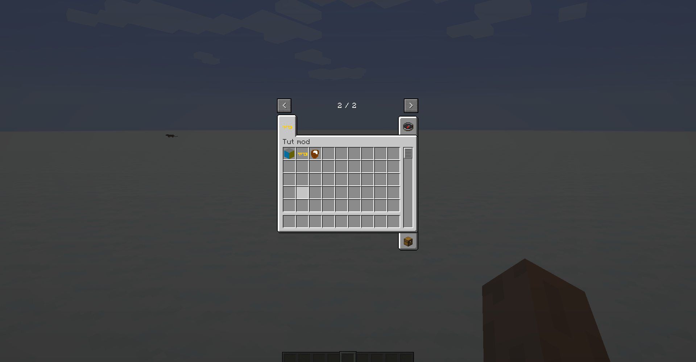

description: Создание группы предметов в креативе.

# Создание группы предметов в креативе.
Создадим класс свойе группы
```java
public class TutGroup extends ItemGroup
{
    public TutGroup(String name)
    {
        super(name);
    }

    @Override
    @Nonnull
    public ItemStack createIcon() 
    {
        return new ItemStack(TutItems.KEY.get());
    }

    @Override
    public boolean hasSearchBar()
    {
        return false;// true если нужен поисковик в нашей вкладке.
    }
}
```
Перейдём в главный класс и добавим переменную:
```java
    public static final ItemGroup TUT_TAB = TutGroup(TutMod.MOD_ID);
```

* `TutMod.MOD_ID` - это ключ локализации. (см. статью "Локализация")
* `createIcon` - этот метод возвращает как иконку предмет ключа из нашего мода.

Теперь нам нужно добавить туда предметы/блоки. Чтобы это сделать перейдём в класс с предметом, к примеру в `KeyItem` и вызовем в такой метод:
```java
super(Item.Properties().group(TutMod.TUT_TAB));
```

* `TutMod` - это наш главный класс.
* `TUT_TAB` - это наша переменная.

Заходим в игру и видим, что наш предмет добавился во вкладку. (С блоками так же)

[](images/tab_3.png)
