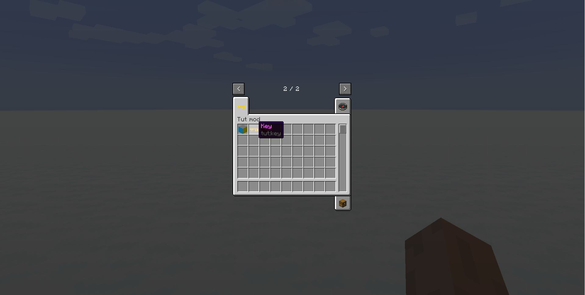

description: Создание локализации вещей.

# Локализация

Мы достаточно предметов сделали, теперь нам нужно их перевести. Перейдём по пути
```md
└── src    
    └── main
        └── resources
            └── assets
                └── tut
```

Создадим папку `lang`, а в ней файл `en_us` формата `.json`.

!!! важно
    Обратите внимание, что с 1.12+ все файлы ресурсов должны быть в нижнем регистре в противном случаи придётся использовать pack.mcmeta!

Содержание файла:
```text
{
  "language": "English",
  "language.region": "United States",
  "language.code": "en_us",
  "author": "WildTan",
  
    "itemGroup.tut": "Tut mod",
    "item.tut.key": "Key",
    "block.tut.ideal": "Ideal block"
}
```

* `itemGroup.*TabName*` - такой вид используется для локализации вкладки в творческом режиме.
* `item.*modid*.*ItemName*` - такой вид используется для локализации предметов.
* `block.*modid*.*BlockName*` - такой вид используется для локализации блока.

* `*TabName*` - название вашей вкладки.
* `*ItemName*` - RegistryName вашего предмета.
* `*BlockName*` - RegistryName вашего блока.
* `*modid*` - modid вашего мода

Перейдём в игру и сменим язык на русский. Теперь предметы которые мы указали в файле переведены. Для других языков делается также.


[](img/lang.png)
