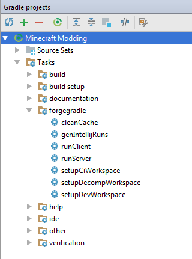

description: Настройка рабочего пространства для разраобтки модов с помощью IDE Idea.

# Использование Idea

Итак, у нас есть папка со следующими файлами внутри:

* build.gradle
* gradlew (.bat и .sh)
* папка gradle

Запустите Idea и в стартовом окне кликните по кнопке "Import Project". Импортируйте файл "build.gradle".

[{: .border }](images/importing.png)

Убедитесь, что у вас выбран пункт "Use default gradle wrapper (recommended)". Все остальные настройки оставьте
по умолчанию и нажмите ОК.

[{: .w8 .border }](images/import_settings.png)

Потребуется подождать некоторое время, пока среда разработки полностью выполнит все импортирует и соберет наш проект.
За процессом импорта и сборки можно следить в правом нижнем углу среды разработки.

Теперь откройте меню "View" в верхней части экрана и выберите пункты "Tools Windows > Gradle".

У вас откроется окно с Gradle задачами. Gradle — популярная система автоматической сборки, которая из исходников
собирает готовые программы и делает еще много других необходимых, но **рутинных** дел. Эти самые дела называются
задачами/заданиями/тасками — **tasks**. Мы как раз и открыли окно тасков.

Выглядит оно примерно так:

[{: .border }](images/gradle_tasks.png)

И вот мы автоматически и без лишних хлопот настроили рабочее пространство. Чувствуете мощь автоматических
сборщиков?

### Тестовый запуск

Вы только что настроили рабочее пространство для создания собственного мода. Если хотите, можете запустить
клиент или сервер и удостовериться, что все работает, как надо.

Для запуска опять откройте меню "tasks" и выберите пункт "fg_runs". Появится окно с выбором, что запустить: runClient, runServer. После первого запуска они появятся в Run.
