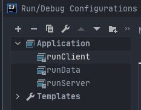

description: Установка необходимых программ, которые необходимы для разработки Minecraft модов и первичная настройка рабочего пространства.

# Установка программ

Для разработки модов с помощью Forge необходимо подготовить рабочее окружение, а именно установить Java, JDK, IDE и сам Forge.

Forge официально поддерживает 2 IDE, [IntelliJ](https://www.jetbrains.com/ru-ru/idea/download/#section=windows) и [Eclipse](https://www.eclipse.org/downloads/), их и рекомендуется использовать при разработке модов.

Cкачать и установить последнюю версию Java можно на [официальном сайте](https://java.com/ru/download/).

## JDK

Для разработки собственных модов нам потребуется писать программный код и пользоваться разными библиотеками. Это не входит в стандартный Java пакет, поэтому нам нужно установить JDK (Java Development Kit) (Комплект инструментов для разработки на Java).

Скачайте [последнюю версию JDK](http://www.oracle.com/technetwork/java/javase/downloads/jdk8-downloads-2133151.html) и следуйте инструкциям по установке. Ничего в настройках установки менять не надо.

## Forge

Скачайте набор инструментов для разработки модификаций (MDK) с [официального сайта Forge](https://files.minecraftforge.net/maven/net/minecraftforge/forge/index_1.16.3.html):

Создайте в любом удобном для вас месте папку и распакуйте туда скачанный архив. Вы увидите много файлов.
Не все из них вам нужны. Чтобы не захламлять рабочее пространство, удалите все файлы, кроме:

* build.gradle
* gradlew.bat
* папки gradle

## Первичная настройка

Следующим шагом будет запуск IDE в папке где вы распаковали скачанный архив.

При первом запуске произойдёт генерация рабочего пространства, дождитесь её окончания.

Как генерация завершится, запустите консоль внутри вашего редактора и введите одну из команд:

Для IntelliJ "gradlew genIntellijRuns"

Для Eclipse "gradlew genEclipseRuns"

<!-- Это всё делается для того, чтобы мы смогли создать конфигурацию запуска для своей IDE. С ней мы сможем запускать наш мод из IDE. -->

### Настройка запуска

Мы на финише! Последнее что нам потребуется сделать это указать IDE что запускать.
Для этого находим кнопку "Add Configuration..."

После нажатия на неё нам откроется окно в котором мы вибираем "Application" и из выпадающего списка "RunClient"

