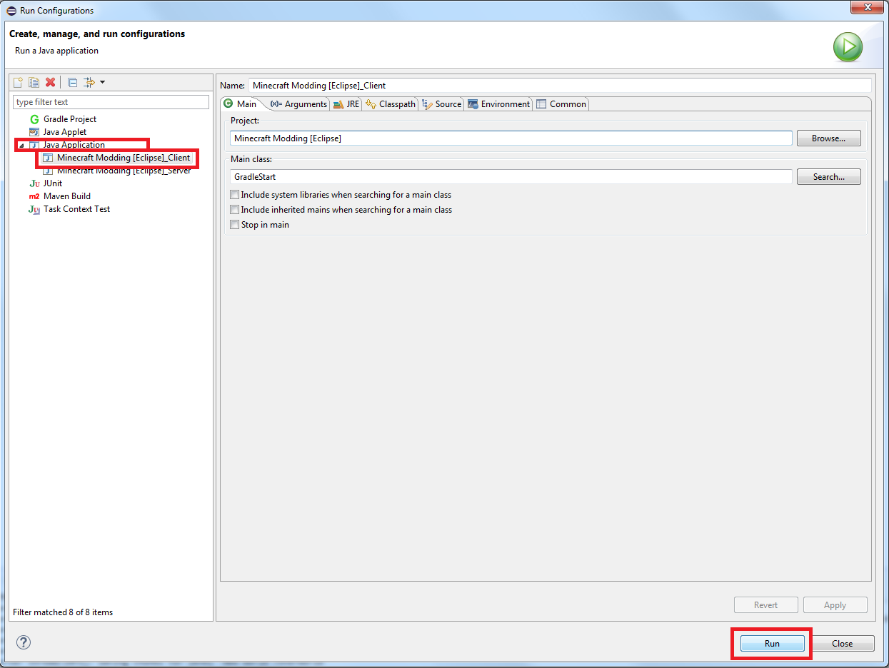

description: Настройка рабочего пространства для разраобтки модов с помощью IDE Eclipse.

# Использование Eclipse

Итак, у нас есть папка со следующими файлами внутри:

* build.gradle
* gradlew (.bat и .sh)
* папка gradle

Теперь откройте Eclipse. Нет особой разницы, где располагается рабочее пространство. В верхней части экрана откройте
меню "File" и выберите пункт "Import". В появившемся списке выберите "Gradle > Gradle Project".

Пропустите вступительное окно Gradle нажатием на кнопку "Next >", если оно появится.

На следующем окне укажите папку с распакованными файлами. Нажмите "Finish".

## Gradle таски

Откройте меню "Window" в верхней части экрана и выберите пункты "Show View > Other...".

В появившемся окне выберите "Gradle > Gradle Tasks".

У вас откроется окно с Gradle задачами. Gradle — популярная система автоматической сборки, которая из исходников
собирает готовые программы и делает еще много других необходимых, но **рутинных** дел. Эти самые дела называются
задачами/заданиями/тасками — **tasks**. Мы как раз и открыли окно тасков.

Выглядит оно примерно так:

[{: .border }](images/gradle_tasks.png)

## Тестовый запуск

Для тестового запуска в верхней части экрана откройте меню "Run" и выберите пункт "Run configurations". В появившемся
окне слева откройте вкладку "Java Application" и выберите клиент или сервер. Затем, нажмите на кнопку "Run".

[{: .border }](images/run.png)