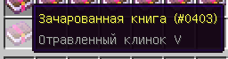
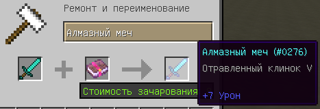
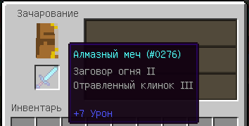

description: Добавление собственных чар.

# Собственные чары

В игре имеется большое кол-во разнообразных чар, которые позволяют улучшить инструменты и броню. В данной статье мы
поговорим о создании собственных чар.

## Создание чар

Создадим чары, которые будут накладывать отравление на сущность, если её ударить.

```java title="PoisonBladeEnchantment.java"
package ru.mcmodding.tutorial.common.enchantment;

import net.minecraft.enchantment.Enchantment;
import net.minecraft.enchantment.EnumEnchantmentType;
import net.minecraft.entity.Entity;
import net.minecraft.entity.EntityLivingBase;
import net.minecraft.potion.Potion;
import net.minecraft.potion.PotionEffect;

public class PoisonBladeEnchantment extends Enchantment {
    public PoisonBladeEnchantment() {
        super(70, 3, EnumEnchantmentType.weapon);
        setName("poison_blade");
        addToBookList(this);
    }

    /**
     * Дополнительная обработка при атаке сущности.
     *
     * @param attacker атакующий.
     * @param victim цель атакующего или его жертва.
     * @param level уровень чар
     */
    @Override
    public void func_151368_a(EntityLivingBase attacker, Entity victim, int level) {
        if (victim instanceof EntityLivingBase) {
            ((EntityLivingBase) victim).addPotionEffect(new PotionEffect(Potion.poison.id, 200 * level));
        }
    }

    /**
     * Максимальный уровень чар.
     *
     * @return Возвращает максимальный уровень для зачаривания.
     */
    @Override
    public int getMaxLevel() {
        return 5;
    }
}
```

Конструктор класса `Enchantment` принимает три параметра:

1. `enchantId` - уникальный идентификатор чар. Должен быть уникальным, чтобы избежать конфликта с ванильными или модовыми чарами.
2. `weight` - "вес" чар, влияет на стоимость зачаривания в наковальне, а также вероятность появления в генерации лута и у жителей в торговле.
3. `type` - применимость чар к предметам.

!!! warning "Обратите внимание!"
    Всего в игре может быть 256 чар(таблицу имеющихся чар и их идентификаторы можно посмотреть в таблице, в конце статьи),
    не забывайте про существование модов и хорошим тоном будет считаться вынос идентификатора чар в конфиг, чтобы избежать
    пересечения с другими модами и возможностью изменить идентификатор. Вы можете расширить самостоятельно массив чар с 
    помощью рефлексии или использовать моды, которые уже это делают.

Применимость чар определяется с помощью перечисления `EnumEnchantmentType`:

| Название    | Описание                  |
|-------------|---------------------------|
| all         | Все предметы              |
| armor       | Броня                     |
| armor_feet  | Ботинки                   |
| armor_legs  | Штаны                     |
| armor_torso | Нагрудник                 |
| armor_head  | Шлем                      |
| weapon      | Оружие                    |
| digger      | Инструмент                |
| fishing_rod | Удочка                    |
| breakable   | Предмет имеющий прочность |
| bow         | Лук                       |

Также вы могли заметить вызов метода `Enchantment#addToBookList(Enchantment)`, данный метод добавляет в список книг с чарами
наши новосозданные чары. Если вы не хотите, чтобы была книга с вашими чарами, то просто удалите вызов.

Вы также можете переопределить в своей реализации чар такие методы:

1. `Enchantment#getMinLevel` - возвращает минимальный уровень чар.
2. `Enchantment#getMaxLevel` - возвращает максимальный уровень чар.
3. `Enchantment#getMinEnchantability(Integer)` - минимальный уровень зачаровываемости, рассчитывается по формуле: `1 + level * 10`.
4. `Enchantment#getMaxEnchantability(Integer)` - максимальный уровень зачаровываемости, рассчитывается по формуле: `Enchantment#getMinEnchantability(Integer) + 5`.
5. `Enchantment#calcModifierDamage(Integer, DamageSource)` - расчёт модификатора урона по уровню и `DamageSource`.
6. `Enchantment#func_152376_a(Integer, EnumCreatureAttribute)` - расчёт дополнительного урона по уровню и `EnumCreatureAttribute`.
7. `Enchantment#canApplyTogether(Enchantment)` - возможность совмещать текущие чары с другими.
8. `Enchantment#setName(String)` - задаёт имя чар с шаблоном `enchantment.*name*`.
9. `Enchantment#canApply(ItemStack)` - возможность накладывать чары на предмет.
10. `Enchantment#func_151368_a(EntityLivingBase, Entity, int)` - дополнительная обработка при атаке сущности. Метод принимает аргументы: `атакующий`, `его цель` и `уровень чар`.
11. `Enchantment#func_151367_b(EntityLivingBase, Entity, int)` - дополнительная обработка для защиты при нападении. Метод принимает аргументы: `атакующий`, `его цель` и `уровень чар`.
12. `Enchantment#canApplyAtEnchantingTable(ItemStack)` - возможность получения чар через стол зачарования.
13. `Enchantment#isAllowedOnBooks` - возможность накладывать текущие чары на книгу через стол зачарования.

!!! tip "Подсказка"
    Если положить обычную книгу в стол зачарования, то можно получить книгу с чарами.

Приступим к регистрации.

```java title="ModEnchantments.java"
package ru.mcmodding.tutorial.common.handler;

import net.minecraft.enchantment.Enchantment;
import ru.mcmodding.tutorial.common.enchantment.PoisonBladeEnchantment;

public class ModEnchantments {
    public static Enchantment poisonBlade;

    public static void register() {
        poisonBlade = new PoisonBladeEnchantment();
    }
}
```

И вызовем метод `ModEnchantments#register` в `CommonProxy#preInit`:

```java hl_lines="11"
package ru.mcmodding.tutorial.common;

import cpw.mods.fml.common.event.FMLPreInitializationEvent;
import ru.mcmodding.tutorial.common.handler.*;

public class CommonProxy {

    public void preInit(FMLPreInitializationEvent event) {
        // ...
        
        ModEnchantments.register();
    }
}
```

Зайдём в игру и проверим то, что у нас получилось.







## Чары плавления блоков

Создадим по предыдущей части чары для плавления, но теперь нам понадобится событие `BlockEvent.HarvestDropsEvent`.

```java
package ru.mcmodding.tutorial.common.enchantment;

import net.minecraft.enchantment.Enchantment;
import net.minecraft.enchantment.EnumEnchantmentType;

public class MeltingEnchantment extends Enchantment {
    public MeltingEnchantment() {
        super(71, 4, EnumEnchantmentType.digger);
        setName("melting");
        addToBookList(this);
    }
}
```

Перейдём в класс с Forge событиями и добавим обработку события `BlockEvent.HarvestDropsEvent`:

```java
package ru.mcmodding.tutorial.common.handler;

import cpw.mods.fml.common.eventhandler.SubscribeEvent;
import net.minecraft.enchantment.EnchantmentHelper;
import net.minecraft.item.ItemStack;
import net.minecraft.item.crafting.FurnaceRecipes;
import net.minecraftforge.event.world.BlockEvent;

import java.util.LinkedList;
import java.util.List;

public class ForgeEventListener {
    @SubscribeEvent
    public void onHarvest(BlockEvent.HarvestDropsEvent event) {
        ItemStack inHand = event.harvester.getHeldItem();
        if (inHand == null || EnchantmentHelper.getEnchantmentLevel(ModEnchantments.melting.effectId, inHand) <= 0) {
            return;
        }
        List<ItemStack> smeltedDrop = new LinkedList<>();

        event.drops.removeIf(drop -> {
            // Получаем результат плавления дропа
            ItemStack result = FurnaceRecipes.smelting().getSmeltingResult(drop);
            if (result != null) {
                smeltedDrop.add(result.copy());
                return true;
            }
            return false;
        });
        event.drops.addAll(smeltedDrop);
    }
}
```

Вы могли заметить, что в примере используется класс-хелпер `EnchantmentHelper`.

Доступные методы:

1. `EnchantmentHelper#getEnchantmentLevel(Integer, ItemStack)` - возвращает уровень чар наложенных на предмет. Параметры метода: `идентификатор чар`, `стек предмета`.
2. `EnchantmentHelper#getEnchantments(ItemStack)` - возвращает карту всех чар наложенных на предмет. Возвращаемая карта: `Map<Integer, Integer>`, первым идёт идентификатор чар, вторым уровень чар.
3. `EnchantmentHelper#setEnchantments(Map<Integer, Integer>, ItemStack)` - задаёт новую карту чар для предмета(или удаляет чары, если предмет был зачарован).
4. `EnchantmentHelper#getMaxEnchantmentLevel(Integer, ItemStack[])` - возвращает самый большой уровень заклинания в переданном массиве стеков предметов. Параметры метода: `идентификатор чар`, `массив стеков предметов`.
5. `EnchantmentHelper#getEnchantmentModifierDamage(ItemStack[], DamageSource)` - возвращает модификатор защитных чар на доспехах, установленных на игроке. Параметры метода: `массив стеков брони`, `источник урона`.
6. `EnchantmentHelper#getEnchantmentModifierLiving(EntityLivingBase, EntityLivingBase)` - возвращает модификатор урона по сущности. Параметры метода: `атакующий`, `цель атакующего`.
7. `EnchantmentHelper#func_152377_a(ItemStack, EnumCreatureAttribute)` - аналогично `EnchantmentHelper#getEnchantmentModifierLiving`.
8. `EnchantmentHelper#func_151384_a(EntityLivingBase, Entity)` - дополнительная обработка для защиты при нападении.
9. `EnchantmentHelper#func_151385_b(EntityLivingBase, Entity)` - дополнительная обработка при атаке сущности.
10. `EnchantmentHelper#getKnockbackModifier(EntityLivingBase, EntityLivingBase)` - возвращает уровень чар "Отдача" для текущего предмета в руке.
11. `EnchantmentHelper#getFireAspectModifier(EntityLivingBase)` - возвращает уровень чар "Заговор огня" для текущего предмета в руке.
12. `EnchantmentHelper#getRespiration(EntityLivingBase)` - возвращает уровень чар "Подводное дыхание" для текущего предмета в руке.
13. `EnchantmentHelper#getEfficiencyModifier(EntityLivingBase)` - возвращает уровень чар "Эффективность" для текущего предмета в руке.
14. `EnchantmentHelper#getSilkTouchModifier(EntityLivingBase)` - содержит ли предмет в руке чары "Шёлковое касание".
15. `EnchantmentHelper#getFortuneModifier(EntityLivingBase)` - возвращает уровень чар "Удача" для текущего предмета в руке.
16. `EnchantmentHelper#func_151386_g(EntityLivingBase)` - возвращает уровень чар "Морская удача" для текущего предмета в руке.
17. `EnchantmentHelper#func_151387_h(EntityLivingBase)` - возвращает уровень чар "Приманка" для текущего предмета в руке.
18. `EnchantmentHelper#getLootingModifier(EntityLivingBase)` - возвращает уровень чар "Добыча" для текущего предмета в руке.
19. `EnchantmentHelper#getAquaAffinityModifier(EntityLivingBase)` - возвращает уровень чар "Подводник (Родство с водой)" для текущего предмета в руке.
20. `EnchantmentHelper#func_92099_a(Enchantment, EntityLivingBase)` - возвращает стек предмета, который содержит передаваемые чары в параметре метода.
21. `EnchantmentHelper#calcItemStackEnchantability(Random, Integer, Integer, ItemStack)` - возвращает расчёт зачаровываемости предмета. Параметры метода: `рандом`, `формула обработки(0, 1 или 2 принимается)`, `сила зачаривания(максимум 15)`, `стек предмета`.
22. `EnchantmentHelper#addRandomEnchantment(Random, ItemStack, Integer)` - добавляет случайные чары на предмет. Параметры метода: `рандом`, `стек предмета`, `уровень зачароваемости`.
23. `EnchantmentHelper#buildEnchantmentList(Random, ItemStack, Integer)` - создаёт список случайных данных о зачаровании, которые могут быть добавлены вместе в ItemStack, 3-й параметр - это общий уровень зачаровываемости.
24. `EnchantmentHelper#mapEnchantmentData(Integer, ItemStack)` - создает карту данных о зачаровании по пройденным уровням зачаровываемости, которую можно добавить в ItemStack.

## Таблица чар

Идентификаторы указанные в таблице уже являются занятыми, поэтому вам необходимо их избегать при создании собственных чар.

| Идентификатор | Название             | Описание                                      | Макс. уровень |
|---------------|----------------------|-----------------------------------------------|---------------|
| 0             | protection           | Защита                                        | 4             |
| 1             | fireProtection       | Защита от огня                                | 4             |
| 2             | featherFalling       | Защита от падения                             | 4             |
| 3             | blastProtection      | Защита от взрывов                             | 4             |
| 4             | projectileProtection | Защита от снарядов                            | 4             |
| 5             | respiration          | Подводное дыхание                             | 3             |
| 6             | aquaAffinity         | Подводник (Родство с водой)                   | 1             |
| 7             | thorns               | Шипы                                          | 3             |
| 16            | sharpness            | Острота                                       | 5             |
| 17            | smite                | Небесная кара                                 | 5             |
| 18            | baneOfArthropods     | Бич членистоногих (Гибель насекомых)          | 5             |
| 19            | knockback            | Отдача (Отбрасывание)                         | 2             |
| 20            | fireAspect           | Заговор огня                                  | 2             |
| 21            | looting              | Добыча                                        | 3             |
| 32            | efficiency           | Эффективность                                 | 5             |
| 33            | silkTouch            | Шёлковое касание                              | 1             |
| 34            | unbreaking           | Прочность                                     | 3             |
| 35            | fortune              | Удача                                         | 3             |
| 48            | power                | Сила                                          | 5             |
| 49            | punch                | Отбрасывание стрелами                         | 2             |
| 50            | flame                | Горящая стрела                                | 1             |
| 51            | infinity             | Бесконечность                                 | 1             |
| 61            | field_151370_z       | Морская удача (Увеличенный бонус при рыбалке) | 3             |
| 62            | field_151369_A       | Приманка                                      | 3             |
