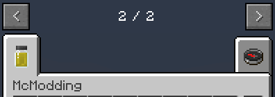
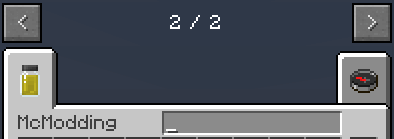

description: Вкладка для предметов в креативе.

# Вкладка в креативе

Предметов и блоков становится всё больше, а получать их через команду `/give` становится проблематично и неудобно.
Давайте создадим свою вкладку в творческом режиме!

```java
package ru.mcmodding.tutorial.common.handler;

import cpw.mods.fml.relauncher.Side;
import cpw.mods.fml.relauncher.SideOnly;
import net.minecraft.creativetab.CreativeTabs;
import net.minecraft.item.Item;
import ru.mcmodding.tutorial.McModding;

public class ModTab extends CreativeTabs {
    public static final ModTab INSTANCE = new ModTab();

    private ModTab() {
        super(McModding.MOD_ID);
    }

    @Override
    @SideOnly(Side.CLIENT)
    public Item getTabIconItem() {
        return ModItems.PAINT_CAN;
    }
}
```

В супер-класс мы передаём нелокализованное название нашей вкладки. 
Для локализации вкладки добавьте `itemGroup.mcmodding=McModding` в необходимый файл локализации.

Метод `getTabIconItem` возвращает предмет, который будет отображаться на самой вкладке. Для добавления блока
используйте `Item#getItemFromBlock`.

Чтобы использовать нашу вкладку в предмете или блоке, воспользуемся методом `setCreativeTab`, добавим его в конструктор
ранее созданных нами предметов и блоков.

```java
public class RingItem extends Item {
    public RingItem() {
        // Какой-то код...
        setCreativeTab(ModTab.INSTANCE);
    }
}
```

Запускаем игру и видим:


Всё работает, но отображается банка с краской чёрного цвета, а мы хотим жёлтый цвет. Для этого нам понадобится метод `func_151243_f`.

```java
public class ModTab extends CreativeTabs {
    @Override
    @SideOnly(Side.CLIENT)
    public int func_151243_f() {
        return 11;
    }
}
```

Данный метод возвращает damage для предмета, который будет отображаться во вкладке. Банка с жёлтой краской имеет 11 damage,
поэтому пишем 11.



## Поиск во вкладке

Представим, что предметов и блоков во вкладке стало настолько много, что их становится тяжело искать, глаза разбегаются
в разные стороны. Для того чтобы исправить данную проблему, добавим поле поиска, как во вкладке со всеми предметами!

```java
public class ModTab extends CreativeTabs {
    private ModTab() {
        super(McModding.MOD_ID);
        setBackgroundImageName("item_search.png");// Чтобы отображалось поле поиска
    }
    
    @Override
    public boolean hasSearchBar() {
        return true;
    }
}
```

Вы также можете изменять длину поля для поиска с помощью метод `CreativeTabs#getSearchbarWidth`.

```java
public class ModTab extends CreativeTabs {
    @Override
    public int getSearchbarWidth() {
        return 70;
    }
}
```



## Фон вкладки

Мы добавили свою вкладку, добавили поиск по ней, но кажется чего-то не хватает...
К вкладкам можно добавлять свои фоны, ранее мы уже выставляли готовый фон для отображения поиска, так давайте создадим
собственный фон!

Помещать фоны придётся по такому пути: `assets/minecraft/textures/gui/container/creative_inventory`. Название
текстуры с фоном должно начинаться с `tab_`!


Теперь укажем `setBackgroundImageName(String)` аналогично, как мы делали с `item_search` в предыдущей главе, только в нашем случае это будет `tab_mcmodding.png`

```java
public class ModTab extends CreativeTabs {
    private ModTab() {
        super(McModding.MOD_ID);
        setBackgroundImageName("mcmodding.png");
    }
}
```

