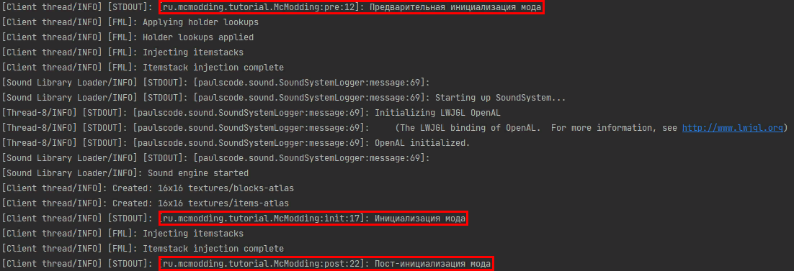

description: Объяснение того, как Forge загружает мод в Minecraft. Названия стадий загрузки и советы по их использованию.

# Стадии загрузки мода

Forge загружает моды в 3 стадии: предварительная инициализация, инициализация и пост-инициализация или `pre`, `init`, `post`.

Есть и другие стадии, но эти три являются самыми главными. Все они выполняются в разные моменты загрузки мода и предназначены для
разных целей.

## Использование стадий

Все стадии загрузки мода могут использоваться **только** в главном файле мода! То есть в файле с аннотацией `@Mod`. Стадии
загрузки можно использовать при помощи аннотации `@EventHandler`.

### Предварительная инициализация

Стадия предварительной инициализации используется для того, чтобы дать игре знать о том, что есть в моде: блоках, предметах и так далее.

Чаще всего в этой стадии выполняются следующие действия:

* Регистрация блоков и предметов.
* Регистрация Tile Entity
* Регистрация сущностей
* Присвоение имен в Ore Dictionary

Событие этой стадии: `FMLPreInitializationEvent`. В главном файле его использование выглядит следующим образом:

```java
@EventHandler
public void pre(FMLPreInitializationEvent e) {
}
```

### Инициализация

Стадия инициализации предназначена для выполнения действий с объектами, зарегистрированными в предварительной инициализации.

Чаще всего в этой стадии выполняются следующие действия:

* Регистрация генераторов структур
* Регистрация рендера сущностей, блоков и т.п.

Событие этой стадии: `FMLInitializationEvent`. В главном файле его использование выглядит следующим образом:

```java
@EventHandler
public void init(FMLInitializationEvent e) {
}
```

### Пост-инициализация

На стадии пост-инициализации рекомендуется выполнять действия, связанные с регистрацией рецептов, интеграцией с другими модами и т.п. что требует отложенных действий

Событие этой стадии: `FMLPostInitializationEvent`. В главном файле его использование выглядит следующим образом:

```java
@EventHandler
public void post(FMLPostInitializationEvent e) {
}
```

## Итог

Учитывая 3 основные стадии загрузки Forge мода, наш главный файл мода должен выглядит приблизительно так:

```java
package ru.mcmodding.tutorial;

import cpw.mods.fml.common.Mod;
import cpw.mods.fml.common.event.FMLInitializationEvent;
import cpw.mods.fml.common.event.FMLPostInitializationEvent;
import cpw.mods.fml.common.event.FMLPreInitializationEvent;

@Mod(modid = "mcmodding")
public class McModding {
    @EventHandler
    public void pre(FMLPreInitializationEvent e) {
        System.out.println("Предварительная инициализация мода");
    }

    @EventHandler
    public void init(FMLInitializationEvent e) {
        System.out.println("Инициализация мода");
    }

    @EventHandler
    public void post(FMLPostInitializationEvent e) {
        System.out.println("Пост-инициализация мода");
    }
}
```

Если вы запустите клиент с этим кодом загрузки стадий, то в консоли увидите следующее:

{: .border }

Мы настоятельно не рекомендуем в дальнейшем оставлять информирование о загрузке мода, ведь это информация не несёт в 
себе никакой смысловой нагрузки и приводит лишь к захламлению консоли и файлов с логами.