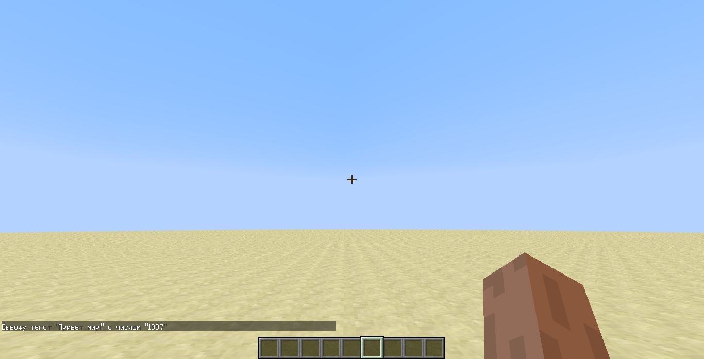

description: Пакетная система.

# Пакетная система

## Основная часть

Пакетная система предназначена для обмена данными между клиентом и серверов. В разработке модов пакетная система играет
довольно значимую роль. К примеру, её можно использовать для синхронизации данных с клиентом, отправлять какие-либо
данные на сервер и т.п.

Чтобы работать с пакетами необходимо создать новый объект класса `SimpleNetworkWrapper` и передать ему название канала.

`SimpleNetworkWrapper` - это обёртка над Netty, позволяющая создавать свои каналы без понимания мощностей библиотеки
Netty. Класс принимает лишь один аргумент `channelName`, который должен быть уникальным. Мы рекомендуем указывать
`ModId` в название канала, чтобы избежать пересечения с каналами других модов.

Для большего удобства, добавим переменную в главный класс, а регистрацию пакетов будем производить в `CommonProxy#pre`.

```java
package ru.mcmodding.tutorial;

import cpw.mods.fml.common.Mod;
import cpw.mods.fml.common.network.simpleimpl.SimpleNetworkWrapper;

@Mod(modid = McModding.MOD_ID)
public class McModding {
    public static final SimpleNetworkWrapper NETWORK = new SimpleNetworkWrapper(McModding.MOD_ID + ":channel");
}
```

Пакет можно создать с помощью реализации интерфейса `IMessage`, который содержит два метода, такие как:
`IMessage#toBytes(ByteBuf)` и `IMessage#fromBytes(ByteBuf)`. Обработать данные полученные из пакета можно с помощью
реализации интерфейса `IMessageHandler<IMessage, IMessage>`(первый параметр - получаемый пакет, второй параметр - отправляемый),
который имеет метод `IMessageHandler#onMessage(IMessage, MessageContext)`.

!!! info "Информация"
    Вы можете создавать внутренний класс для обработчика пакетов, а можете реализовывать `IMessage` и `IMessageHandler` 
    в одном классе, сути от этого не меняется и код проще не становится.

```java
package ru.mcmodding.tutorial.common.handler.packet;

import cpw.mods.fml.common.network.ByteBufUtils;
import cpw.mods.fml.common.network.simpleimpl.IMessage;
import cpw.mods.fml.common.network.simpleimpl.IMessageHandler;
import cpw.mods.fml.common.network.simpleimpl.MessageContext;
import io.netty.buffer.ByteBuf;
import net.minecraft.util.ChatComponentText;

public class ServerMessagePacket implements IMessage, IMessageHandler<ServerMessagePacket, IMessage> {
    private String message;
    private int number;

    /**
     * Должен быть пустым, чтобы во время регистрации пакета не приходилось указывать параметры.
     */
    public ServerMessagePacket() {
    }

    /**
     * Будет использоваться для формирования пакета по параметрам.
     *
     * @param message Сообщения, которое будет выводиться на серверной стороне.
     * @param number Число, которое будет выводиться на серверной стороне.
     */
    public ServerMessagePacket(String message, int number) {
        this.message = message;
        this.number = number;
    }

    /**
     * Данный метод вызывается при чтении из байтового буфера.
     *
     * @see <a href="https://netty.io/4.0/api/io/netty/buffer/ByteBuf.html">ByteBuf</a>
     * @param buf Байтовый буфер используемый для чтения данных из пакета.
     */
    @Override
    public void fromBytes(ByteBuf buf) {
        message = ByteBufUtils.readUTF8String(buf);
        number = buf.readInt();
    }

    /**
     * Данный метод вызывается при записи в байтовый буфер.
     *
     * @see <a href="https://netty.io/4.0/api/io/netty/buffer/ByteBuf.html">ByteBuf</a>
     * @param buf Байтовый буфер используемый для записи данных в пакет.
     */
    @Override
    public void toBytes(ByteBuf buf) {
        ByteBufUtils.writeUTF8String(buf, message);
        buf.writeInt(number);
    }

    /**
     * Данный метод вызывается для обработки входящих данных из {@code message} пакета.
     *
     * @param packet Пакет с информацией. Рекомендуется использовать его для получения данных!
     * @param ctx Контекст обработки пакетов. Позволяющий получить текущую сторону на которой было получено сообщение,
     *            а также обработчиков(клиент и сервер)
     * @return Возвращает пакет для ответа клиенту(ответ с клиента на сервер в данном случае не будет работать!)
     */
    @Override
    public IMessage onMessage(ServerMessagePacket packet, MessageContext ctx) {
        String message = packet.message;
        int number = packet.number;
        // Отправляем сообщение игроку, который и отправил пакет с данными.
        ctx.getServerHandler().playerEntity.addChatMessage(new ChatComponentText("Вывожу текст \"" + message + "\" с числом \"" + number + "\""));
        return null;
    }
}
```

!!! tip "Подсказка #1"
    Вы можете использовать утилитарный класс `ByteBufUtils` для возможности записывать и читать такие данные как: 
    ItemStack, NBTTagCompound, String, а также производить кодирование с помощью varInt и varShort.

!!! tip "Подсказка #2"
    Чтобы получить игрока при обработке пакета на клиенте, воспользуйтесь `Minecraft.getMinecraft().thePlayer`.

Необходимо зарегистрировать пакет, чтобы это сделать, обратимся к `SimpleNetworkWrapper#registerMessage`.

```java
package ru.mcmodding.tutorial.common;

import cpw.mods.fml.common.event.FMLPreInitializationEvent;
import cpw.mods.fml.relauncher.Side;
import ru.mcmodding.tutorial.McModding;
import ru.mcmodding.tutorial.common.handler.packet.ServerMessagePacket;

public class CommonProxy {
    public void preInit(FMLPreInitializationEvent event) {
        McModding.NETWORK.registerMessage(new ServerMessagePacket(), ServerMessagePacket.class, 0, Side.SERVER);
    }
}
```

Рассмотрим метод `SimpleNetworkWrapper#registerMessage` более подробно! Данный метод принимает четыре параметра, такие как:

* `IMessageHandler`(или `Class<IMessageHandler>`, только он всё равно создаст новый объект из класса) объект обработчика пакета.
* `Class<IMessage>` класс хранящий данные для отправки.
* `Integer` уникальный идентификатор пакета.
* `Side` сторона на которой будет обрабатываться пакет.

Теперь поговорим о том, как отправлять пакеты. Класс `SimpleNetworkWrapper` предоставляет нам такие методы для отправки пакетов:

| Название метода                                                               | Описание                                             | Сторона обработки |
|-------------------------------------------------------------------------------|------------------------------------------------------|-------------------|
| `SimpleNetworkWrapper#sendToAll(IMessage)`                                    | Отправляет пакет всем игрокам находящимся на сервере | Клиентская        |
| `SimpleNetworkWrapper#sendTo(IMessage, EntityPlayerMP)`                       | Отправляет пакет конкретному игроку                  | Клиентская        |
| `SimpleNetworkWrapper#sendToAllAround(IMessage, NetworkRegistry$TargetPoint)` | Отправляет пакет всем находящимся игрокам в радиусе  | Клиентская        |
| `SimpleNetworkWrapper#sendToDimension(IMessage, Integer)`                     | Отправляет пакет всем игрокам в измерении(DimId)     | Клиентская        |
| `SimpleNetworkWrapper#sendToServer(IMessage)`                                 | Отправляет пакет на сервер                           | Серверная         |

В нашем случае пакет будет отсылаться на сервер, а значит нам походит метод `SimpleNetworkWrapper#sendToServer`. Вот
такой пример отправки пакета на сервер у нас получился.

```java
package ru.mcmodding.tutorial.common.handler;

import cpw.mods.fml.common.eventhandler.SubscribeEvent;
import cpw.mods.fml.common.gameevent.InputEvent;
import org.lwjgl.input.Keyboard;
import ru.mcmodding.tutorial.McModding;
import ru.mcmodding.tutorial.common.handler.packet.ServerMessagePacket;

public class FMLEventListener {
    @SubscribeEvent
    public void onKeyInput(InputEvent.KeyInputEvent event) {
        if (Keyboard.isKeyDown(Keyboard.KEY_B)) {
            McModding.NETWORK.sendToServer(new ServerMessagePacket("Привет мир!", 1337));
        }
    }
}
```

Регистрируем слушателя событий и заходим в игру для проверки!



## Best practice

В прошлой части статьи мы поговорили о том, как создать, отправить и обработать пакет, но пора поговорить о том, как
делать не надо в случае получения пакет с клиентской стороны. Многие, кто писал хоть раз пакетную систему, 
сталкивались с такой проблемой, как синхронизация данных для Tile Entity(серверная сторона). 
На своей практике мы замечали такого вида код:

```java
package com.author.bestmod;

public class MyPacketHandler implements IMessageHandler<MyPacket, IMessage> {
    @Override
    public IMessage onMessage(MyPacket packet, MessageContext ctx) {
        TileEntity tile = ctx.getServerHandler().playerEntity.worldObj.getTileEntity(packet.x, packet.y, packet.z);
        if (tile instanceof MyBestTile) {
            tile.readFromNBT(packet.nbtData);
        }
        return null;
    }
}
```

Минусом данного обработчика является то, что, во-первых, получение Tile Entity происходит с принудительной загрузкой чанков.
Чтобы исправить это, необходимо использовать `World#blockExists`, а затем уже получать Tile Entity. Во-вторых, получение
Tile Entity производится по данным из пакета, а это говорит о том, что практически любой желающий сможет заменить координаты
и получить чужой Tile Entity(например в регионе). В третьих, чтение данных NBT производится из пакета, а это равносильно
прошлому пункту. В случае с клиентом, данный подходи ещё будет уместен, но вы должны избегать такого кода на сервере.

При формировании обработчика пакета на серверной стороне, вы должны тщательно подходить к решению данного вопроса, чтобы
в дальнейшем не страдали обычные игрок и администраторы серверов.