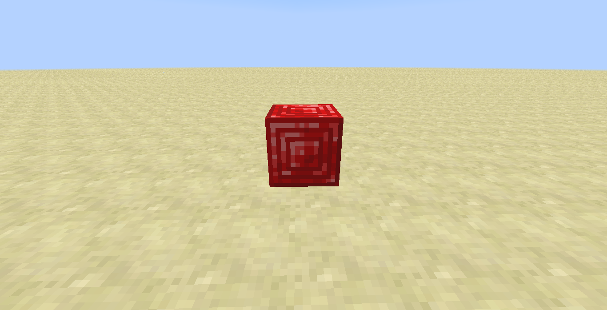
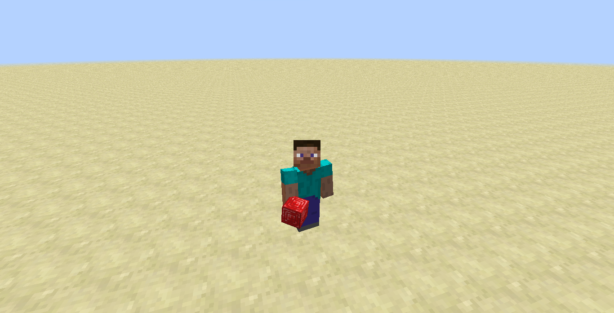

description: Создание собственного блока.

# Создание Блока

## Основа

Чтобы написать свой первый блок, вам необходимо создать класс и наследоваться от Block.

```java
package ru.mcmodding.tutorial.common.block;

import net.minecraft.block.Block;
import net.minecraft.block.material.Material;
import ru.mcmodding.tutorial.McModding;
import ru.mcmodding.tutorial.common.handler.ModTab;

public class RubyBlock extends Block {
    public RubyBlock() {
        super(Material.rock);
        setBlockName("ruby");
        setBlockTextureName(McModding.MOD_ID + ":ruby");
    }
}
```

Разберёмся, что у нас в конструкторе написано.

* `setBlockName(String)` - задаёт нелокализованное название блоку(см. статью [Локализация](https://mcmodding.ru/1.7.10/basics/lang/))
* `setBlockTextureName(String)` - задаёт текстуру. Необходимо указывать ModId, чтобы текстура бралась не из ресурсов Minecraft, а из ресурсов нашего мода. Пример: `modId:textureName`, можно также указывать путь: 'modId:folder/textureName'

Остальные сеттеры вы можете самостоятельно просмотреть в классе Block, ко многим из них прилагаются комментарии от MCP и MinecraftForge.

Теперь приступим к регистрации нашего блока. Чтобы зарегистрировать наш рубиновый блок, необходимо использовать `GameRegistry#registerBlock` 
в который передаётся экземпляр класса `Block` и регистрируемое имя блока. Создадим для большего удобства класс `ModBlocks` 
в котором будут храниться объекты наших блоков и будет происходить регистрация.

```java
package ru.mcmodding.tutorial.common.handler;

import cpw.mods.fml.common.registry.GameRegistry;
import ru.mcmodding.tutorial.common.block.RubyBlock;

public class ModBlocks {
    public static final RubyBlock RUBY = new RubyBlock();

    public static void register() {
        GameRegistry.registerBlock(RUBY, "ruby");
    }
}
```

Осталось добавить вызов метода `ModBlocks#register` в `CommonProxy#preInit`

```java
public class CommonProxy {
    public void preInit(FMLPreInitializationEvent event) {
        ModBlocks.register();
    }
}
```

Запускаем игру и заходим в мир. Чтобы получить только что написанный блок, введите такую команду:
`/give @p mcmodding:ruby`.

Текстура рубинового блока:

{: .border }

!!! warning "Внимание!"
    Соотношение сторон должно быть 1:1, т.е если ваша текстура шириной 32 пикселя, то и высота должна быть 32 пикселя, иначе текстура не будет загружена!
    Исключением являются текстуры с KeyFrame анимацией.

Если всё было сделано, как написано в статье, то в результате наш блок получит текстуру:

{: .border }

{: .border }

{: .border }

## Модель

!!! danger "Важно!"
    Данный раздел рассчитан на более опытных разработчиков!

Для блока, как и для предмета, можно добавлять модель. MinecraftForge позволяет уже из "коробки" загружать модели форматов Techne и Wavefront(.obj), но этот вариант не является правильным, а также будет рассмотрен позднее.
В данном же разделе мы поговорим про "запечённую" отрисовку блоков.

Условно говоря "запечённый" рендер блоков это тот, который не обновляется постоянно. Примером могут послужить обычные пирожки, мы изначально заготавливаем все ингредиенты, а затем запекаем получившуюся и "обработанную" массу в духовке, без последующей возможности изменения её.
Аналогично и с отрисовкой блоков, который происходит за счёт отрисовки чанка и только после обновления чанка, данные для отрисовки блока могут быть изменены на видеокарте(смена текстуры, поворот модели и т.п.)
Данный подход является более эффективным, чем использовать `TileEntitySpecialRenderer`, но о нём позднее.

Также у этого способа отрисовки есть свой минус, вы возможно уже догадались какой, а именно, что данные для отрисовки будут обновляться только после изменения чанка. Следовательно, анимацию такому блоку нельзя будет добавить, лишь только анимация текстуры будет работать(покадровая анимация).

!!! info "Примечание"
    Если вы заметили неверное пояснение про запечённый рендер блоков, то мы будем рады принять Pull Request с исправлением.

Переходим к коду! Создадим класс и реализуем в нём интерфейс `ISimpleBlockRenderingHandler`.

```java
package ru.mcmodding.tutorial.client.render.block;

import cpw.mods.fml.client.registry.ISimpleBlockRenderingHandler;
import net.minecraft.block.Block;
import net.minecraft.client.renderer.RenderBlocks;
import net.minecraft.world.IBlockAccess;

public class RubyBlockRenderer implements ISimpleBlockRenderingHandler {
    /**
     * Данный метод отвечает за отрисовку блока в инвентаре.
     * 
     * @param block блок для которого применяется данная отрисовка
     * @param metadata метаданные блока
     * @param modelId уникальный идентификатор модели
     * @param renderer глобальный рендер блоков
     */
    @Override
    public void renderInventoryBlock(Block block, int metadata, int modelId, RenderBlocks renderer) {
    }

    /**
     * Данный метод определяет необходимость, а также за отрисовку блока в мире.
     * 
     * @param world     мир в котором находится блок.
     * @param x         позиция блока по X координате.
     * @param y         позиция блока по Y координате.
     * @param z         позиция блока по Z координате.
     * @param block     блок для которого применяется данная отрисовка.
     * @param modelId   уникальный идентификатор модели.
     * @param renderer  глобальный рендер блоков.
     * @return возвращает условие для отрисовки блока в мире
     */
    @Override
    public boolean renderWorldBlock(IBlockAccess world, int x, int y, int z, Block block, int modelId, RenderBlocks renderer) {
        return false;
    }

    /**
     * Данный метод определяет необходимость отрисовки блока в 3D виде. При низкой настройки графики, блок не будет сплюснутым.
     * 
     * @param modelId уникальный идентификатор модели.
     * @return возвращает условие для отрисовки модели в 3D виде.
     */
    @Override
    public boolean shouldRender3DInInventory(int modelId) {
        return false;
    }

    /**
     * Уникальный идентификатор отрисовки блока. Не должен быть ниже 42 числа, иначе будет конфликт с ванильной отрисовкой блоков!
     * 
     * @return возвращает уникальный номер.
     */
    @Override
    public int getRenderId() {
        return 0;
    }
}
```

Прежде чем мы приступим к написанию отрисовки для блока, зададим уникальный идентификатор отрисовки и зарегистрируем её.
Создадим метод `ModBlocks#registerRender`:

```java
package ru.mcmodding.tutorial.common.handler;

import cpw.mods.fml.client.registry.RenderingRegistry;
import ru.mcmodding.tutorial.client.render.block.RubyBlockRenderer;

public class ModBlocks {
    public static int rubyRenderId = -1;
    
    @SideOnly(Side.CLIENT)
    public static void registerRender() {
        rubyRenderId = RenderingRegistry.getNextAvailableRenderId();

        RenderingRegistry.registerBlockHandler(new RubyBlockRenderer());
    }
}
```

Чтобы нам постоянно не прибавлять к 42 + 1, воспользуемся уже готовым методом `RendereingRegistry#getNextAvailableRenderId`, который также позволит избежать пересечения уникального идентификатора с другими модами.

!!! tip "Подсказка"
    `RenderingRegistry#registerBlockHandler` имеет два параметра, такие как: renderId и handler, т.е. вы можете указать не только отрисовку, но и привязать, к примеру, к ванильному блоку свою отрисовку блока.

Теперь добавим уникальный идентификатор в отрисовку и укажем блоку использовать её.

Для отрисовки:

```java
package ru.mcmodding.tutorial.client.render.block;

import cpw.mods.fml.client.registry.ISimpleBlockRenderingHandler;

public class RubyBlockRenderer implements ISimpleBlockRenderingHandler {
    @Override
    public int getRenderId() {
        return ModBlocks.rubyRenderId;
    }
}
```

Для блока:

```java
package ru.mcmodding.tutorial.common.block;

import net.minecraft.block.Block;
import ru.mcmodding.tutorial.common.handler.ModBlocks;

public class RubyBlock extends Block {
    @Override
    public int getRenderType() {
        return ModBlocks.rubyRenderId;
    }
}
```

В `ClientProxy#init`:

```java
package ru.mcmodding.tutorial.client;

import cpw.mods.fml.common.event.FMLInitializationEvent;
import ru.mcmodding.tutorial.common.CommonProxy;
import ru.mcmodding.tutorial.common.handler.ModBlocks;

public class ClientProxy extends CommonProxy {
    @Override
    public void init(FMLInitializationEvent event) {
        ModBlocks.registerRender();
    }
}
```

!!! tip "Подсказка"
    Все идентификаторы отрисовки блоков Minecraft будут доступны в таблице, в конце раздела.

Приступи к написанию собственной отрисовки блока! Переходим в метод `RubyBlockRenderer#renderWorldBlock`, в нём необходимо
вернуть `true`, чтобы наш блок отрисовывался всегда, вне зависимости от установленных поблизости блоков.

```java
package ru.mcmodding.tutorial.client.render.block;

import cpw.mods.fml.client.registry.ISimpleBlockRenderingHandler;
import net.minecraft.block.Block;
import net.minecraft.client.renderer.RenderBlocks;
import net.minecraft.util.IIcon;
import net.minecraft.world.IBlockAccess;

public class RubyBlockRenderer implements ISimpleBlockRenderingHandler {
    @Override
    public boolean renderWorldBlock(IBlockAccess world, int x, int y, int z, Block block, int modelId, RenderBlocks renderer) {
        // Сторона для получения текстуры
        int side = 0;
        // Получаем текстуру блока
        IIcon icon = renderer.getBlockIcon(block, world, x, y, z, side);

        // Отрисовка прямоугольника по координате X с инвертированием на обратную сторону
        renderer.renderFaceXNeg(block, x, y, z, icon);
        renderer.renderFaceXPos(block, x, y, z, icon);

        // Отрисовка прямоугольника по координате Y с инвертированием на обратную сторону
        renderer.renderFaceYNeg(block, x, y, z, icon);
        renderer.renderFaceYPos(block, x, y, z, icon);

        // Отрисовка прямоугольника по координате Z с инвертированием на обратную сторону
        renderer.renderFaceZNeg(block, x, y, z, icon);
        renderer.renderFaceZPos(block, x, y, z, icon);
        return true;
    }
}
```

В игре мы получим такой результат:


Вы можете не использовать стандартные методы для отрисовки сторон блока, а написать с нуля свой рендер, как вам будет угодно за счёт использования Tessellator'a.

!!! danger "Важно!"
    Важно знать, что нет необходимости вызывать методы `Tessellator#startDrawing`, `Tessellator#startDrawingQuads` и `Tessellator#draw` в методе `ISimpleBlockRenderingHandler#renderWorldBlock`,
    так как это может привести к падению(крашу) и снижению производительности клиента игры!

Таблица ванильных, уникальных идентификаторов отрисовок блоков:

| Идентификатор | Описание                                    |
|---------------|---------------------------------------------|
| -1            | Пустота                                     |
| 0             | Обычный блок                                |
| 1             | Отрисовка как у растений(крестиком)         |
| 2             | Факел                                       |
| 3             | Огонь                                       |
| 4             | Жидкость                                    |
| 5             | Редстоун(провод)                            |
| 6             | Агрокультуры(картошка, морковь и т.п.)      |
| 7             | Дверь                                       |
| 8             | Лестница                                    |
| 9             | Рельсы                                      |
| 10            | Ступеньки                                   |
| 11            | Забор                                       |
| 12            | Рычаг                                       |
| 13            | Кактус                                      |
| 14            | Кровать                                     |
| 15            | Повторитель                                 |
| 16            | Основа поршня                               |
| 17            | Центральная часть поршня(когда активирован) |
| 18            | Тонкое стекло                               |
| 19            | Стебель арбуза/тыквы(посажен на грядке)     |
| 20            | Лиана                                       |
| 21            | Калитка забора                              |
| 22            | Не используется                             |
| 23            | Кувшинка                                    |
| 24            | Котёл                                       |
| 25            | Зелье варочная стойка                       |
| 26            | Рамка портала в край                        |
| 27            | Драконье яйцо                               |
| 28            | Какао-бобы(растущие на дереве)              |
| 29            | Растяжка(крюк)                              |
| 30            | Нитка                                       |
| 31            | Вращаемый блок(кварц. колонна, древесина)   |
| 32            | Каменная ограда                             |
| 33            | Цветочный горшок                            |
| 34            | Маяк                                        |
| 35            | Наковальня                                  |
| 36            | Редстоун(диод)(?)                           |
| 37            | Компаратор                                  |
| 38            | Воронка                                     |
| 39            | Кварц                                       |
| 40            | Растения в два блока                        |
| 41            | Витражное стекло(цветное тонкое стекло)     |