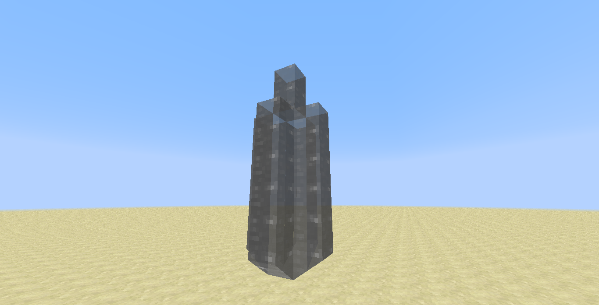
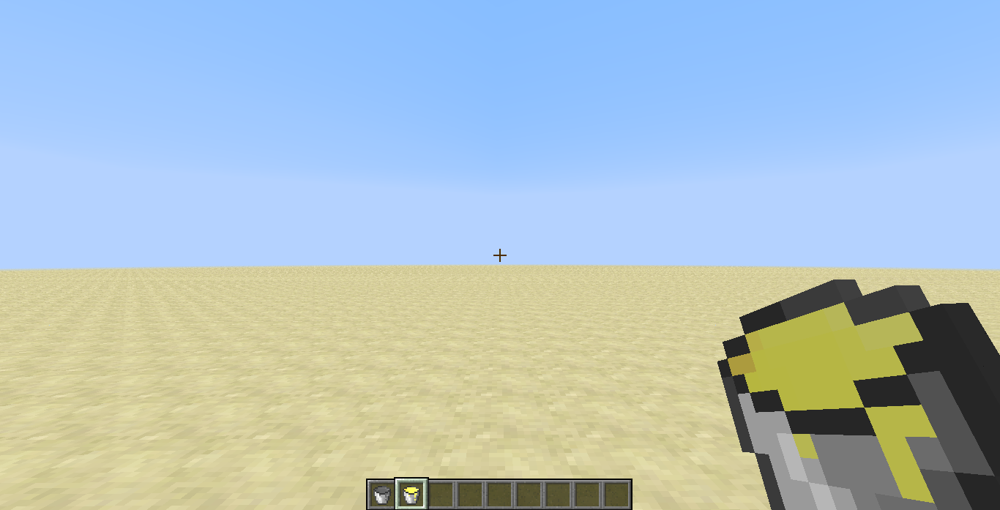

description: Создание собственной жидкости.

# Жидкость

В данной статье мы создадим собственную жидкость и газ, а также добавим к ним вёдра, чтобы можно было собирать или
наоборот разливать жидкости.

Создадим переменную с жидкостью:

```java
package ru.mcmodding.tutorial.common.handler;

import net.minecraftforge.fluids.Fluid;
import net.minecraftforge.fluids.FluidRegistry;
import ru.mcmodding.tutorial.McModding;

public class ModBlocks {
    public static final Fluid JUICE_FLUID = new Fluid(McModding.MOD_ID + ":juice");

    public static void register() {
        FluidRegistry.registerFluid(JUICE_FLUID);
    }
}
```

!!! danger "Важно!"
    Название жидкости необходимо указывать с `ModId` вашего мода, иначе может возникнуть конфликт с жидкостями из других модов!

Нам необязательно создавать класс и наследоваться от Fluid, так как MinecraftForge позаботились о нас и добавили
удобные сеттеры.

* `Fluid#setUnlocalizedName(String)` - задаёт нелокализованное название жидкости, как правило, оно уже указывается в конструкторе и будет полезно только если вы хотите сменить нелокализованное название и оставить название жидкости.
* `Fluid#setBlock(Block)` - "прикрепляет" жидкость к блоку.
* `Fluid#setLuminosity(Integer)` - уровень излучаемого света от жидкости. При 0 жидкость не будет излучать свет.
* `Fluid#setDensity(Integer)` - плотность жидкости. Отрицательная плотность указывает на то, что жидкость легче воздуха(полезно при создании газов). Также если плотность одной жидкости больше другой, то та у которой она больше, будет заменять жидкость с меньшей плотностью.
* `Fluid#setTemperature(Integer)` - температура жидкости. На таяние снега/льда/снеговика не влияет.
* `Fluid#setViscosity(Integer)` - вязкость жидкости. Чем больше, тем медленнее жидкость растекается, а чем меньше, тем быстрее.
* `Fluid#setGaseous(Integer)` - газообразная жидкость. Служит лишь индикатором, что жидкость является газообразной.
* `Fluid#setRarity(EnumRarity)` - редкость жидкости. Используется для отображения цвета текста в подсказке.
* `Fluid#setStillIcon(IIcon)` - задаёт текстуру неподвижной жидкости.
* `Fluid#setFlowingIcon(IIcon)` - задаёт текстуру подвижной жидкости.
* `Fluid#setIcons(IIcon, IIcon)` - задаёт текстуру неподвижной и подвижной жидкости.
* `Fluid#setIcons(IIcon)` - задаёт текстуру неподвижной и подвижной жидкости.

Если же хотите окрасить жидкость, то необходимо переопределить метод `Fluid#getColor`.

Теперь необходимо создать блок, который будет распространять нашу жидкость.

```java
package ru.mcmodding.tutorial.common.block.fluid;

import cpw.mods.fml.relauncher.Side;
import cpw.mods.fml.relauncher.SideOnly;
import net.minecraft.block.material.Material;
import net.minecraft.client.renderer.texture.IIconRegister;
import net.minecraft.world.IBlockAccess;
import net.minecraft.world.World;
import net.minecraftforge.fluids.BlockFluidClassic;
import net.minecraftforge.fluids.Fluid;
import ru.mcmodding.tutorial.McModding;
import ru.mcmodding.tutorial.common.handler.ModTab;

public class JuiceFluidBlock extends BlockFluidClassic {
    public JuiceFluidBlock(Fluid fluid) {
        super(fluid, Material.water);
        // Привязываем жидкость к текущему блоку
        fluid.setBlock(this);
        setBlockName("juice");
        setBlockTextureName(McModding.MOD_ID + ":juice_still");
        setCreativeTab(ModTab.INSTANCE);
    }

    /**
     * Данный метод вызывается для проверки возможности вытеснения блоков жидкостью(как это делает вода с рычагами, редстоуном и т.п.)
     *
     * @param world     мир в котором установлен блок.
     * @param x         позиция блока по X координате.
     * @param y         позиция блока по Y координате.
     * @param z         позиция блока по Z координате.
     * @return Возвращает логическое значение.
     */
    @Override
    public boolean canDisplace(IBlockAccess world, int x, int y, int z) {
        // Чтобы наша жидкость не заменяла воду, лаву или иные жидкости, добавим проверку, что материал блока не является жидкостью.
        return !world.getBlock(x, y, z).getMaterial().isLiquid() && super.canDisplace(world, x, y, z);
    }

    /**
     * Данный метод вызывается при попытке вытеснить блок.
     *
     * @param world     мир в котором установлен блок.
     * @param x         позиция блока для вытеснения по X координате.
     * @param y         позиция блока для вытеснения по Y координате.
     * @param z         позиция блока для вытеснения по Z координате.
     * @return Возвращает логическое значение.
     */
    @Override
    public boolean displaceIfPossible(World world, int x, int y, int z) {
        // Чтобы наша жидкость не заменяла воду, лаву или иные жидкости, добавим проверку, что материал блока не является жидкостью.
        return !world.getBlock(x, y, z).getMaterial().isLiquid() && super.displaceIfPossible(world, x, y, z);
    }

    @Override
    @SideOnly(Side.CLIENT)
    public void registerBlockIcons(IIconRegister register) {
        super.registerBlockIcons(register);
        // Получаем переданную жидкость через конструктор и добавляем ей текстуру неподвижной и подвижной жидкости.
        getFluid().setIcons(blockIcon, register.registerIcon(McModding.MOD_ID + ":juice_flow"));
    }
}
```

Текстуры подвижной и неподвижной жидкости:


Осталось зарегистрировать блок и можно запускать игру!

```java
package ru.mcmodding.tutorial.common.handler;

import cpw.mods.fml.common.registry.GameRegistry;
import net.minecraftforge.fluids.Fluid;
import net.minecraftforge.fluids.FluidRegistry;
import ru.mcmodding.tutorial.McModding;
import ru.mcmodding.tutorial.common.block.fluid.JuiceFluidBlock;
import ru.mcmodding.tutorial.common.block.fluid.SteamFluidBlock;

public class ModBlocks {
    public static final Fluid JUICE_FLUID = new Fluid(McModding.MOD_ID + ":juice");
    public static final Fluid STEAM_FLUID = new Fluid(McModding.MOD_ID + ":steam").setDensity(-1).setGaseous(true);

    public static JuiceFluidBlock JUICE;
    public static SteamFluidBlock STEAM;

    public static void register() {
        // Жидкость должна быть зарегистрирована раньше, чем блок для которой она будет прикреплена!
        if (FluidRegistry.registerFluid(JUICE_FLUID)) {
            // Если конфликтов никаких нет, то регистрируем блок для жидкости, иначе ничего не делаем.
            JUICE = new JuiceFluidBlock(JUICE_FLUID);
            GameRegistry.registerBlock(JUICE, "juice");
        }

        if (FluidRegistry.registerFluid(STEAM_FLUID)) {
            STEAM = new SteamFluidBlock(STEAM_FLUID);
            GameRegistry.registerBlock(STEAM, "steam");
        }
    }
}
```

Бонусом мы сделали пар, `SteamFluidBlock` почти не отличается от `JuicedFluidBlock`, так что вы можете самостоятельно его
добавить и зарегистрировать по вышеуказанному примеру.


Если всё было сделано правильно, то вы получите такой результат:




## Ведро

!!! danger "Важно!"
    Данный раздел рассчитан на более опытных разработчиков прочитавших статью [Использование событий](../event/basics.md)!

Создадим класс ведра, который будет наследоваться от `ItemBucket`.

```java
package ru.mcmodding.tutorial.common.item.tool;

import net.minecraft.block.Block;
import net.minecraft.item.ItemBucket;
import ru.mcmodding.tutorial.McModding;
import ru.mcmodding.tutorial.common.handler.ModTab;

public class BucketItem extends ItemBucket {
    public BucketItem(String name, Block fluidBlock) {
        super(fluidBlock);
        setUnlocalizedName(name + "_bucket");
        setMaxStackSize(1);
        setCreativeTab(ModTab.INSTANCE);
        setTextureName(McModding.MOD_ID + ':' + name + "_bucket");
    }
}
```

Родительскому классу необходимо передать блок жидкости, которую ведро будет содержать. Создадим класс-обработчик, который
будет регистрировать вёдра, а также обрабатывать заполнение вёдер жидкостью.

```java
package ru.mcmodding.tutorial.common.handler;

import cpw.mods.fml.common.eventhandler.Event;
import cpw.mods.fml.common.eventhandler.SubscribeEvent;
import cpw.mods.fml.common.registry.GameRegistry;
import net.minecraft.block.Block;
import net.minecraft.item.ItemBucket;
import net.minecraft.item.ItemStack;
import net.minecraftforge.event.entity.player.FillBucketEvent;
import net.minecraftforge.fluids.Fluid;
import net.minecraftforge.fluids.FluidContainerRegistry;
import ru.mcmodding.tutorial.common.item.tool.BucketItem;

import java.util.HashMap;
import java.util.Map;

public class BucketHandler {
    // В данной карте будут храниться вёдра, которые мы будем получать по блоку жидкости
    private static final Map<Block, ItemBucket> buckets = new HashMap<>();

    /**
     * Вспомогательный метод необходимый для простой регистрации вёдер.
     *
     * @param name  название ведра
     * @param fluid жидкость к которой будет привязано ведро.
     * @return Возвращает объект ведра.
     */
    public static BucketItem registryBucket(String name, Fluid fluid) {
        BucketItem bucket = new BucketItem(name, fluid.getBlock());
        // Регистрируем экземпляр ведра.
        GameRegistry.registerItem(bucket, name + "_bucket");
        // Регистрируем контейнер с жидкостью, т.е. ведро. Последним параметром является стек пустого ведра.
        FluidContainerRegistry.registerFluidContainer(fluid, new ItemStack(bucket), FluidContainerRegistry.EMPTY_BUCKET);
        // Добавляем к нашему блоку жидкости ведро, которое будет даваться при сборе жидкости.
        buckets.put(fluid.getBlock(), bucket);
        return bucket;
    }

    @SubscribeEvent
    public void onFillBucket(FillBucketEvent event) {
        // Получаем ведро по блоку, по которому было произведён клик.
        ItemBucket bucket = buckets.get(event.world.getBlock(event.target.blockX, event.target.blockY, event.target.blockZ));

        // Если ведро было обнаружено и метаданные блока равны 0(источник жидкости)
        if (bucket != null && event.world.getBlockMetadata(event.target.blockX, event.target.blockY, event.target.blockZ) == 0) {
            // Заменяем источник жидкости на блок воздуха(уничтожаем блок)
            event.world.setBlockToAir(event.target.blockX, event.target.blockY, event.target.blockZ);
            // Новый стек с ведром жидкости
            event.result = new ItemStack(bucket);
            // Говорим событию, что заполнение прошло успешно и нам необходимо получить ведро с жидкостью
            event.setResult(Event.Result.ALLOW);
        }
    }
}
```

`FluidContainerRegistry#registerFluidContainer` позволяет добавлять ведро к жидкости. Вы можете передать в метод
`FluidStack`(аналогичен `ItemStack`), новый стек ведра с жидкостью, а также если хотите своё пустое ведро передать, то
указав его третьим параметром или вовсе воспользоваться классом `FluidContainerData`.

Зарегистрируем обработчик!

```java
package ru.mcmodding.tutorial.common;

import cpw.mods.fml.common.event.FMLPreInitializationEvent;
import net.minecraftforge.common.MinecraftForge;
import ru.mcmodding.tutorial.common.handler.BucketHandler;

public class CommonProxy {
    public void preInit(FMLPreInitializationEvent event) {
        MinecraftForge.EVENT_BUS.register(new BucketHandler());
    }
}
```

Перейдём в класс `ModBlocks` и зарегистрируем вёдра для сока и пара.

```java
package ru.mcmodding.tutorial.common.handler;

import cpw.mods.fml.common.registry.GameRegistry;
import cpw.mods.fml.relauncher.Side;
import cpw.mods.fml.relauncher.SideOnly;
import net.minecraft.item.ItemStack;
import net.minecraftforge.fluids.Fluid;
import net.minecraftforge.fluids.FluidContainerRegistry;
import net.minecraftforge.fluids.FluidRegistry;
import ru.mcmodding.tutorial.McModding;
import ru.mcmodding.tutorial.common.block.fluid.JuiceFluidBlock;
import ru.mcmodding.tutorial.common.block.fluid.SteamFluidBlock;
import ru.mcmodding.tutorial.common.item.tool.BucketItem;

public class ModBlocks {
    public static final Fluid JUICE_FLUID = new Fluid(McModding.MOD_ID + ":juice");
    public static final Fluid STEAM_FLUID = new Fluid(McModding.MOD_ID + ":steam").setDensity(-1).setGaseous(true);

    public static JuiceFluidBlock JUICE;
    public static SteamFluidBlock STEAM;

    public static void register() {
        // Жидкость должна быть зарегистрирована раньше, чем блок для которой она будет прикреплена!
        if (FluidRegistry.registerFluid(JUICE_FLUID)) {
            // Если конфликтов никаких нет, то регистрируем блок для жидкости, иначе ничего не делаем.
            JUICE = new JuiceFluidBlock(JUICE_FLUID);
            GameRegistry.registerBlock(JUICE, "juice");

            // Регистрировать ведро необходимо после регистрации блока жидкости и самой жидкости.
            ModItems.JUICE_BUCKET = BucketHandler.registryBucket("juice", JUICE_FLUID);
        }

        if (FluidRegistry.registerFluid(STEAM_FLUID)) {
            STEAM = new SteamFluidBlock(STEAM_FLUID);
            GameRegistry.registerBlock(STEAM, "steam");

            ModItems.STEAM_BUCKET = BucketHandler.registryBucket("steam", STEAM_FLUID);
        }
    }
}
```

!!! info "Пояснение к регистрации"
    Вы можете регистрировать жидкость через `FluidContainerRegistry#registerFluidContainer`, но данное решение будет подходить
    если у вас используется своя реализация ведра, а не наследник от `ItemBucket`.

Не забываем добавить в `ModItems` две переменные(регистрировать предметы вёдер не нужно!):

```java
package ru.mcmodding.tutorial.common.handler;

import ru.mcmodding.tutorial.common.item.tool.*;

public class ModItems {
    public static BucketItem JUICE_BUCKET;
    public static BucketItem STEAM_BUCKET;
}
```

Текстуры вёдер:


Какой результат должен быть после проделанных действий:




