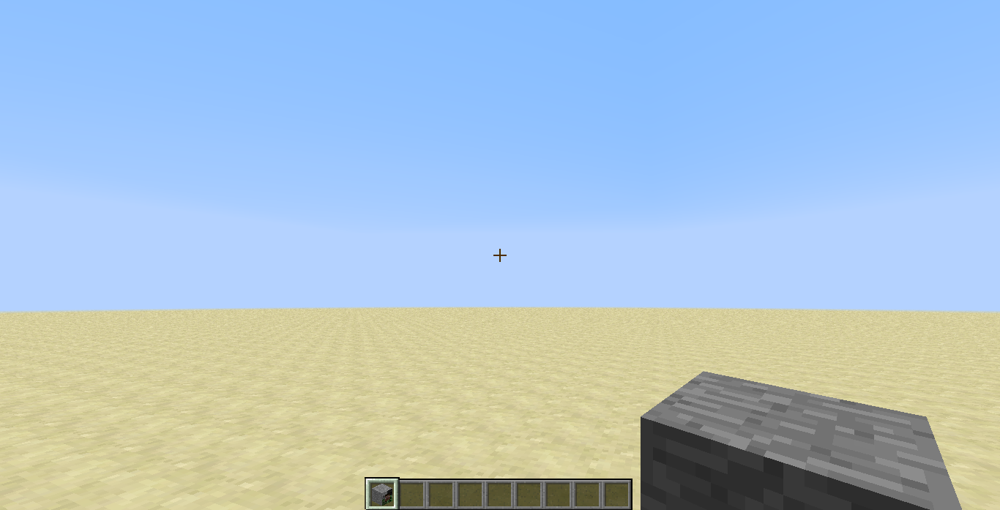

description: Метаданные блока.

# Метаданные

Метаданные блока - это 4 бита информации, которые можно записать для блока. В Minecraft метаданные могут содержать
информацию о повороте блока, его состоянии или иные данные, которые можно уместить в 4 бита, 
с целью уменьшения потребления памяти. В противном же случае, используется [Tile Entity](http://127.0.0.1:8000/1.7.10/block/tile-entity).

!!! warning "Важно!"
    Если у ваших блоков имеются подтипы, то они также будут сохраняться в метаданные блока и следовательно, данные о
    других состояниях необходимо будет формировать за счёт "маски", основанной на побитовых операциях.

Создадим блок, который имеет подтипы, как например блок шерсти.

```java
package ru.mcmodding.tutorial.common.block;

import cpw.mods.fml.relauncher.Side;
import cpw.mods.fml.relauncher.SideOnly;
import net.minecraft.block.Block;
import net.minecraft.block.material.Material;
import net.minecraft.creativetab.CreativeTabs;
import net.minecraft.item.Item;
import net.minecraft.item.ItemDye;
import net.minecraft.item.ItemStack;
import net.minecraft.world.IBlockAccess;
import net.minecraft.world.World;
import ru.mcmodding.tutorial.common.handler.ModTab;

import java.util.List;

public class ColoredStoneBlock extends Block {
    public ColoredStoneBlock() {
        super(Material.rock);
        setBlockName("colored_stone");
        setBlockTextureName("stone");
        setCreativeTab(ModTab.INSTANCE);
    }

    /**
     * Данный метод обрабатывает входящие метаданные и возвращает цвет блока, отображаемого в инвентаре.
     *
     * @param metadata метаданные установленного блока
     * @return Возвращает цвет блока.
     */
    @Override
    @SideOnly(Side.CLIENT)
    public int getRenderColor(int metadata) {
        return ItemDye.field_150922_c[metadata % ItemDye.field_150922_c.length];
    }

    /**
     * Данный метод обрабатывает входящие данные и возвращает цвет блока, установленного в мире, который будет домножен к основному.
     *
     * @param world мир в котором установлен блок.
     * @param x     позиция блока по X координате.
     * @param y     позиция блока по Y координате.
     * @param z     позиция блока по Z координате.
     * @return Возвращает множитель цвета.
     */
    @Override
    @SideOnly(Side.CLIENT)
    public int colorMultiplier(IBlockAccess world, int x, int y, int z) {
        int metadata = world.getBlockMetadata(x, y, z);
        return ItemDye.field_150922_c[metadata % ItemDye.field_150922_c.length];
    }

    /**
     * Данный метод вызывается когда блок, устанавливается с помощью ItemBlock
     *
     * @param world     мир в котором устанавливается блок.
     * @param x         позиция на которой был установлен блок по X координате.
     * @param y         позиция на которой был установлен блок по Y координате.
     * @param z         позиция на которой был установлен блок по Z координате.
     * @param side      сторона с которой был установлен блок.
     * @param hitX      позицию на блоке, на которой производилось нажатие по X координате.
     * @param hitY      позицию на блоке, на которой производилось нажатие по Y координате.
     * @param hitZ      позицию на блоке, на которой производилось нажатие по Z координате.
     * @param metadata  исходные метаданные.
     * @return Возвращает обработанное значение метаданных до установки блока в мире. Во всех остальных случаях возвращаются исходные метаданные.
     */
    @Override
    public int onBlockPlaced(World world, int x, int y, int z, int side, float hitX, float hitY, float hitZ, int metadata) {
        return metadata;
    }

    @Override
    @SideOnly(Side.CLIENT)
    public void getSubBlocks(Item item, CreativeTabs tab, List blocks) {
        for (int damage = 0, size = ItemDye.field_150922_c.length; damage < size; damage++) {
            blocks.add(new ItemStack(item, 1, damage));
        }
    }
}
```

В добавок, нам необходимо создать класс предмета, чтобы метаданные правильно закреплялись за блоком при его установке в мире.

```java
package ru.mcmodding.tutorial.common.item.block;

import net.minecraft.block.Block;
import net.minecraft.item.ItemColored;
import net.minecraft.item.ItemDye;

public class ColoredStoneBlockItem extends ItemColored {
    public ColoredStoneBlockItem(Block block) {
        // Первый параметр указывает на блок, который будет устанавливаться, а что предмет имеет подтипы "id:damage"
        super(block, true);
        // Задаёт массив имён для ItemColored#getUnlocalizedName
        func_150943_a(ItemDye.field_150921_b);
    }
}
```

В большинстве случаев вы должны использовать `ItemBlock`, вместо `ItemColored`. Мы же используем `ItemColored`, чтобы
не выполнять лишних действий, таких как: указание метаданных, изменение нелокализованного названия с использованием метаданных
и т.п.

Теперь необходимо зарегистрировать наш блок:

```java
package ru.mcmodding.tutorial.common.handler;

import cpw.mods.fml.common.registry.GameRegistry;
import ru.mcmodding.tutorial.common.block.ColoredStoneBlock;
import ru.mcmodding.tutorial.common.item.block.ColoredStoneBlockItem;

public class ModBlocks {
    public static final ColoredStoneBlock COLORED_STONE = new ColoredStoneBlock();
    
    public static void register() {
        GameRegistry.registerBlock(COLORED_STONE, ColoredStoneBlockItem.class, "colored_stone");
    }
}
```

Как вы могли заметить, в метод регистрации блока передаётся новый параметр `Class<ItemBlock>`, так мы скажем игре, что
наш предмет `ColoredStoneBlockItem` "принадлежит" блоку `ColoredStoneBlock`.

!!! danger "Важно!"
    Если в конструкторе наследника `ItemBlock`, вы укажете дополнительные к Block параметры, то, чтобы получить объекты в конструкторе, необходимо
    будет передать их в четвёртый параметр метода `GameRegistry#registerBlock(Block, Class<ItemBlock>, String, Object[])`.
    При этом, передавать объект блока не нужно!

Запустим игру, возьмём добавленные блоки в руки и разместим их в мире.


Для наглядности, мы установили поверх наших цветных камней, ванильный камень.

## Поворачиваемый блок

Цветные блоки сделать оказалось довольно просто, но как насчёт добавления блока, который будет смотреть на игрока при
его установке? Для этого нам понадобится лишь один метод `Block#onBlockPlacedBy`, который получает параметр связанный с
сущностью установившей блок(сущность может быть не только игроком!)

Текстура лицевой части блока:


```java
package ru.mcmodding.tutorial.common.block;

import cpw.mods.fml.relauncher.Side;
import cpw.mods.fml.relauncher.SideOnly;
import net.minecraft.block.Block;
import net.minecraft.block.material.Material;
import net.minecraft.client.renderer.texture.IIconRegister;
import net.minecraft.entity.EntityLivingBase;
import net.minecraft.item.ItemStack;
import net.minecraft.util.IIcon;
import net.minecraft.util.MathHelper;
import net.minecraft.world.World;
import ru.mcmodding.tutorial.McModding;
import ru.mcmodding.tutorial.common.handler.ModTab;

public class FaceBlock extends Block {
    @SideOnly(Side.CLIENT)
    private IIcon faceIcon;

    public FaceBlock() {
        super(Material.rock);
        setBlockName("face");
        setBlockTextureName("stone");
        setCreativeTab(ModTab.INSTANCE);
    }

    @Override
    @SideOnly(Side.CLIENT)
    public IIcon getIcon(int side, int meta) {
        if (meta == 2 && side == 2) return faceIcon;
        if (meta == 3 && side == 5) return faceIcon;
        if (meta == 0 && side == 3) return faceIcon;
        if (meta == 1 && side == 4) return faceIcon;
        return blockIcon;
    }

    @Override
    @SideOnly(Side.CLIENT)
    public void registerBlockIcons(IIconRegister register) {
        super.registerBlockIcons(register);
        faceIcon = register.registerIcon(McModding.MOD_ID + ":face");
    }

    /**
     * Данный метод вызывается после установки блока в мире.
     *
     * @param world     мир в котором устанавливается блок.
     * @param x         позиция на которой был установлен блок по X координате.
     * @param y         позиция на которой был установлен блок по Y координате.
     * @param z         позиция на которой был установлен блок по Z координате.
     * @param placer    сущность установившая блок в мире.
     * @param stack     предмет с помощью которого был установлен блок.
     */
    @Override
    public void onBlockPlacedBy(World world, int x, int y, int z, EntityLivingBase placer, ItemStack stack) {
        int direction = MathHelper.floor_double(((placer.rotationYaw * 4.0) / 360.0) + 2.5) & 3;
        world.setBlockMetadataWithNotify(x, y, z, direction, 2);
    }
}
```

!!! tip "Подсказка"
    Создавать и добавлять класс наследующий `ItemBlock` нет необходимости, так как в данном случае не используется
    заготовленные метаданные из ItemStack.

В методе `Block#onBlockPlacedBy` мы задаём установленному блоку метаданные через метод `World#setBlockMetadataWithNotify(Integer, Integer, Integer, Integer, Integer)`.
Разберём метод подробнее: первые три параметра отвечаю за позицию на которой необходимо произвести установку метаданных,
следующим параметром идут метаданные, а затем флаг.

| Флаг | Описание                                                                                                |
|------|---------------------------------------------------------------------------------------------------------|
| 1    | Вызвать обновление соседних блоков                                                                      |
| 2    | Вызвать обновление блока(в случае клиента - перерисовать, в случае сервера - отправить блок на клиент)  |
| 3    | Вызвать действия флагов 1 и 2. В случае клиента, действие флага 2 не будет применено(перерисовка блока) |

!!! info "Информация"
    Почему-то MinecraftForge в JavaDoc отсылает смотреть метод `World#setBlock` насчёт флагов, но в случае установки
    метаданных, описание из `World#setBlock` не будет являться верным. Вы можете самостоятельно в этом убедиться
    посмотрев код метода.

В дальнейшем вы можете использовать побитовые операции для дальнейшей работы с метаданными блока, чтобы записывать не только
поворот блока, но и какое-то дополнительное состояние. Более подробные примеры работы с метаданными блоков вы сможете
найти в коде блоков, таких как: забор, тыквы, редстоун механизмы и др.



