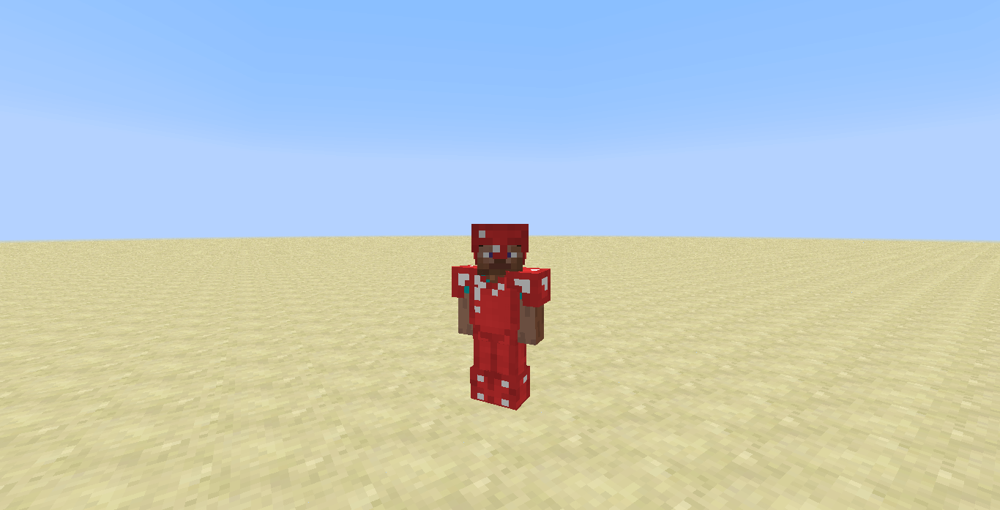
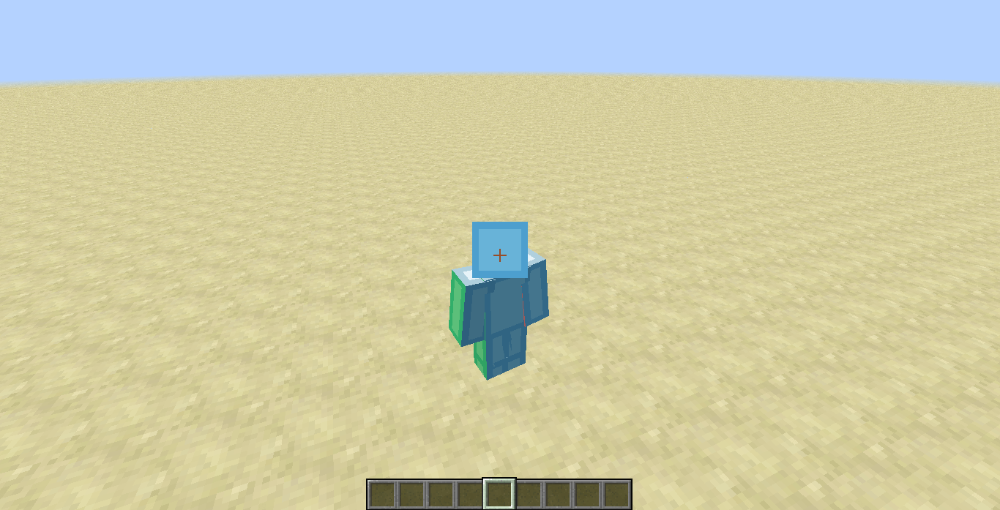
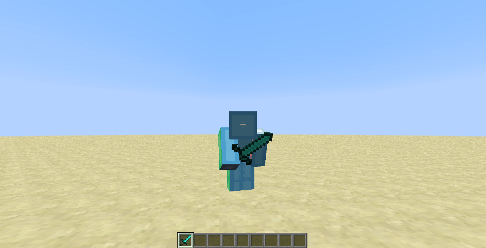

description: Создание собственной брони

# Собственная броня

В данной статье вы научитесь создавать свою броню, как в обычном стиле Minecraft, так и с моделью.
Также в главе мы рассмотрим вариант реализации `ISpecialArmor` интерфейса.

## Материал брони

Создадим материал для нашей брони. Для удобства, создадим его в `ModItems`.

```java
public class ModItems {
    public static final ItemArmor.ArmorMaterial RUBY_ARMOR_MATERIAL = EnumHelper.addArmorMaterial("mcmodding:ruby", 66, new int[]{5, 5, 5, 5}, 30);
}
```

Теперь ознакомимся с параметрами метода `EnumHelper#addArmorMaterial(String, Integer, Integer[], Integer)`

1. Название материала, в нашем случае будет `mcmodding:ruby`. Рекомендуется добавлять `ModId` перед названием, чтобы случайно не заменить материалы из других модов!
2. Коэффициент прочности, который будет умножен на максимальную прочность элемента брони. Максимальная прочность: шлем - 11, нагрудник - 16, штаны - 15, ботинки - 13.
3. Коэффициент поглощения урона.
4. Коэффициент зачаровывания. Чем больше значение, тем лучше будут чары при зачаровывание.

Таблица материалов `ItemArmor$ArmorMaterial`:

| Материал | Коэфф. прочности | Коэффициент поглощения(шлем, нагрудник, штаны, ботинки) | Зачаровываемость |
|----------|------------------|---------------------------------------------------------|------------------|
| CLOTH    | 5                | `1, 3, 2, 1` => 7 очков брони                           | 15               |
| CHAIN    | 15               | `2, 5, 4, 1` => 12 очков брони                          | 12               |
| IRON     | 15               | `2, 6, 5, 2` => 15 очков брони                          | 9                |
| GOLD     | 7                | `2, 5, 3, 1` => 11 очков брони                          | 25               |
| Diamond  | 33               | `3, 8, 6, 3` => 20 очков брони                          | 10               |

## Стандартная броня

Для создания брони необходимо наследоваться от `ItemArmor` и передать в супер-класс материал, индекс отрисовки и тип брони.

Индекс отрисовки нужен для определения текстуры брони. Так как мы реализовываем собственную броню, нам индекс отрисовки не понадобится.
Выставляем сразу 0.

```java
package ru.mcmodding.tutorial.common.item.armor;

import net.minecraft.entity.Entity;
import net.minecraft.item.ItemArmor;
import net.minecraft.item.ItemStack;
import ru.mcmodding.tutorial.McModding;
import ru.mcmodding.tutorial.common.handler.ModItems;
import ru.mcmodding.tutorial.common.handler.ModTab;

public class RubyArmor extends ItemArmor {
    public RubyArmor(String elementName, int armorType) {
        super(ModItems.RUBY_ARMOR_MATERIAL, 0, armorType);
        setUnlocalizedName("ruby_" + elementName);
        setTextureName(McModding.MOD_ID + ":ruby_" + elementName);
        setCreativeTab(ModTab.INSTANCE);
    }
}
```

1. `elementName` - название элемента. В нашем случае это будут: `helmet`, `plate`, `legs` и `boots`.
2. `armorType` - тип брони. Шлем - 0, нагрудник - 1, штаны - 2, ботинки - 3

Переходим в `ModItems` и создаём переменные на каждый элемент брони:

```java
public class ModItems {
    public static final RubyArmor RUBY_HELMET = new RubyArmor("helmet", 0);
    public static final RubyArmor RUBY_PLATE = new RubyArmor("plate", 1);
    public static final RubyArmor RUBY_LEGS = new RubyArmor("legs", 2);
    public static final RubyArmor RUBY_BOOTS = new RubyArmor("boots", 3);
}
```

Добавляем текстуры:


Регистрируем и запускаемся.


Броня на игроке отображается неправильно, она имеет текстуру кожаной брони. Для исправления этого нам необходимо добавить в 
`assets/modId/textures/models/armors` текстуры моделей брони.


Теперь необходимо добавить метод `ItemArmor#getArmorTexture(ItemStack, Entity, Integer, String)`.

```java
public class RubyArmor extends ItemArmor {
    /**
     * Формирует путь к текстуре брони
     *
     * @param stack  Стэк элемента брони который в данный момент надет на сущность
     * @param entity Сущность на которой надета броня
     * @param slot   Слот в котором находится броня
     * @param type   Подтип текстуры, может быть null или "overlay". Используется для наложения маски цвета для кожаной брони.
     * @return возвращает путь до текстуры брони
     */
    public String getArmorTexture(ItemStack stack, Entity entity, int slot, String type) {
        return String.format("%s:textures/models/armor/ruby_layer_%d.png", McModding.MOD_ID, slot == 2 ? 2 : 1);
    }
}
```

Разберём "магическое" условие `slot == 2 ? 2 : 1`, текстура модели брони разделена на две части. 
Первая часть `ruby_layer_1` содержит развёртку для шлема, нагрудника и ботинок, а вторая часть `ruby_layer_2` содержит
развёртку для штанов. В условие выше мы проверяем, что если броня находится в слоте штанов, то нам необходим индекс 2
(будет преобразован в `ruby_layer_2`), а все остальные слоты должны иметь индекс 1(будет преобразован в `ruby_layer_1`)

!!! warning "Важно!"
    Не забывайте, что необходимо указывать `ModId` мода, чтобы игра смогла найти текстуру к вашей броне.

Снова запускаем игру и смотрим на результат.



## ISpecialArmor

Вы когда-нибудь хотели, чтобы броня имела особые условия для защиты или могла поглощать урон от меча или иных видов урона?
Для решения данной задачи, был добавлен интерфейс `ISpecialArmor`. Реализуем его в нашем классе брони.

```java
package ru.mcmodding.tutorial.common.item.armor;

import net.minecraftforge.common.ISpecialArmor;

public class RubyArmor extends ItemArmor implements ISpecialArmor {
    /**
     * Извлекает модификаторы, которые будут использоваться при расчете урона по броне.
     * <p>
     * Броня с более высоким приоритетом будет получать урон, наносимый ей перед броней с более низким приоритетом.
     * Если есть несколько единиц брони с одинаковым приоритетом,
     * урон будет распределен между ними на основе коэффициента поглощения.
     *
     * @param player Сущность на которой надета броня.
     * @param armor  Стэк элемента брони который в данный момент надет на сущность.
     * @param source Источник урона, который может быть использован для изменения свойств брони в зависимости от типа или наносящего урон(сущность или игрок).
     * @param damage Общий урон, применяемый к сущности
     * @param slot   Слот в котором находится броня.
     * @return Экземпляр ArmorProperties, содержащий информацию о том, как броне наносится урон.
     */
    @Override
    public ArmorProperties getProperties(EntityLivingBase player, ItemStack armor, DamageSource source, double damage, int slot) {
        if (slot == 1) {
            // Вернём для нагрудника свойство к двукратному поглощению
            return new ArmorProperties(1, 2.0, 1_000);
        }
        // Вернёт стандартные значения свойства брони
        return new ArmorProperties(0, damageReduceAmount / 25D, armor.getMaxDamage() + 1 - armor.getItemDamage());
    }

    /**
     * Получает отображаемое кол-во брони.
     *
     * @param player Сущность на которой надета броня.
     * @param armor  Стэк элемента брони который в данный момент надет на сущность.
     * @param slot   Слот в котором находится броня.
     * @return Количество очков брони для отображения, 2 на щит.
     */
    @Override
    public int getArmorDisplay(EntityPlayer player, ItemStack armor, int slot) {
        if (slot == 1) {
            return 6;// Отобразим 3 щита для слота нагрудника
        }
        return damageReduceAmount;// Кол-во брони будет отображаться в зависимости от коэффициента поглощения
    }

    /**
     * Наносит урон стэку брони. Метод отвечает за уменьшение долговечности предмета и размера стэка.
     * Если стэк исчерпан, он будет удалён автоматически из инвентаря.
     *
     * @param entity Сущность на которой надета броня.
     * @param stack  Стэк элемента брони который в данный момент надет на сущность.
     * @param source Источник урона, который может быть использован для изменения свойств брони в зависимости от типа или наносящего урон(сущность или игрок).
     * @param damage Общий урон, применяемый к броне
     * @param slot   Слот в котором находится броня.
     */
    @Override
    public void damageArmor(EntityLivingBase entity, ItemStack stack, DamageSource source, int damage, int slot) {
        // Если урон исходит от кактуса, то мы не будем ломать стэк нашей брони
        if (source == DamageSource.cactus) {
            return;
        }
        stack.damageItem(damage, entity);// Урон стэку будет нанесён как для обычной брони
    }
}
```

Конструктор класса `ArmorProperties`:

1. `priority` - приоритет. Броня с более высоким приоритетом будет получать урон, наносимый ей перед броней с более низким приоритетом.
2. `ratio` - коэффициент поглощения урона. Чем выше значение, тем больше урона будет поглощено.
3. `max` - лимит поглощения урона. Ограничивает поглощаемое кол-во урона. Стандартное значение равно `Integer#MAX_VALUE`.

Запускаем игру и проверяем новые свойства рубиновой брони.

## Броня с моделью

Создать броню с обычной текстурой не составило труда. Давайте создадим броню с нестандартной моделью. Для этого
нам понадобиться программа [Blockbench](https://www.blockbench.net/)

В программе необходимо выбрать `Modded Entity`, создайте модель брони под каждую часть тела и 
выставите опорные точки(Pivot Point) для правильного поворота частей брони.

!!! tip "Подсказка"
    Для того, чтобы модель отображалась правильно, необходимо расположить модель лицевой стороной на севере.

!!! tip "Подсказка"
    Если вам необходима модель игрока или любая другая модель персонажа Minecraft, вы можете сделать так:
    `File -> New -> Minecraft Skin`, затем выбрать `File -> Convert Project -> Modded Entity`.

Не забудьте проверить, что модель соответствует версии `Forge 1.7-1.13`, как показано ниже


### Таблица опорных точек

| Часть тела  | X    | Y   |
|-------------|------|-----|
| Голова      | 0    | 24  |
| Тело        | 0    | 24  |
| Левая рука  | -5   | 22  |
| Правая рука | 5    | 22  |
| Левая нога  | -1.9 | 12  |
| Правая нога | 1.9  | 12  |

!!! warning "Важно"
    Опорные точки для левого и правого ботинка должны быть аналогичны левой и правой ноге

### Добавление модели в игру

После того как вы сделали свою модель брони её необходимо добавить в игру. Чтобы это сделать необходимо нажать `File -> Export -> Export Java Entity`.
Не забудьте скачать текстуру вашей модели.

Затем создаём класс `RubyArmorModel` в `ru.mcmodding.tutorial.client.render.model`. Скорее всего у вас возникнут проблемы при переносе
кода из экспортированного класса в новый, а именно проблема будет заключаться в `ModelBox` который не имеет последним параметром
`boolean`. Данный параметр отвечает за отражение текстуры на модели. Чтобы это исправить, возьмите из `ModelBox` 
первый передаваемый параметр и установите ему значение `mirror = true`(если последний параметр `true`).

!!! danger "Обратите внимание!"
    Класс-наследник должен быть ModelBiped.

Было:

```java
public class RubyArmorModel extends ModelBiped {
    private final ModelRenderer leftLeg;
    
    public RubyArmorModel() {
        leftLeg = new ModelRenderer(this);
        leftLeg.setRotationPoint(1.9F, 12.0F, 0.0F);
        leftLeg.cubeList.add(new ModelBox(leftLeg, 0, 16, -2.0F, 1.0F, -2.0F, 4, 7, 4, 1.0F, true));
    }
}
```

Стало:

```java
public class RubyArmorModel extends ModelBiped {
    private final ModelRenderer leftLeg;
    
    public RubyArmorModel() {
        leftLeg = new ModelRenderer(this);
        leftLeg.setRotationPoint(1.9F, 12.0F, 0.0F);
        leftLeg.mirror = true;
        leftLeg.cubeList.add(new ModelBox(leftLeg, 0, 16, -2.0F, 1.0F, -2.0F, 4, 7, 4, 1.0F));
    }
}
```

Полный пример модели брони:

```java
package ru.mcmodding.tutorial.client.render.model;

import cpw.mods.fml.relauncher.Side;
import cpw.mods.fml.relauncher.SideOnly;
import net.minecraft.client.model.ModelBiped;
import net.minecraft.client.model.ModelBox;
import net.minecraft.client.model.ModelRenderer;
import net.minecraft.entity.Entity;
import net.minecraft.entity.EntityLivingBase;
import net.minecraft.entity.player.EntityPlayer;
import net.minecraft.item.EnumAction;
import net.minecraft.item.ItemStack;

@SideOnly(Side.CLIENT)
public class RubyArmorModel extends ModelBiped {

    private final ModelRenderer helmet;
    private final ModelRenderer plate;
    private final ModelRenderer rightArm;
    private final ModelRenderer leftArm;
    private final ModelRenderer rightLeg;
    private final ModelRenderer leftLeg;
    private final ModelRenderer rightBoot;
    private final ModelRenderer leftBoot;
    
    private static RubyArmorModel instance;

    public RubyArmorModel() {
        textureWidth = 64;
        textureHeight = 32;

        helmet = new ModelRenderer(this);
        helmet.setRotationPoint(0.0F, 0.0F, 0.0F);
        helmet.cubeList.add(new ModelBox(helmet, 0, 0, -4.0F, -8.0F, -4.0F, 8, 8, 8, 1.0F));

        plate = new ModelRenderer(this);
        plate.setRotationPoint(0.0F, 0.0F, 0.0F);
        plate.cubeList.add(new ModelBox(plate, 16, 16, -4.0F, 0.0F, -2.0F, 8, 12, 4, 1.01F));

        rightArm = new ModelRenderer(this);
        rightArm.setRotationPoint(-5.0F, 2.0F, 0.0F);
        rightArm.cubeList.add(new ModelBox(rightArm, 40, 16, -3.0F, -2.0F, -2.0F, 4, 12, 4, 1.0F));

        leftArm = new ModelRenderer(this);
        leftArm.setRotationPoint(5.0F, 2.0F, 0.0F);
        leftArm.mirror = true;
        leftArm.cubeList.add(new ModelBox(leftArm, 40, 16, -1.0F, -2.0F, -2.0F, 4, 12, 4, 1.0F));

        rightLeg = new ModelRenderer(this);
        rightLeg.setRotationPoint(-1.9F, 12.0F, 0.0F);
        rightLeg.cubeList.add(new ModelBox(rightLeg, 0, 16, -2.0F, 1.0F, -2.0F, 4, 7, 4, 1.0F));

        leftLeg = new ModelRenderer(this);
        leftLeg.setRotationPoint(1.9F, 12.0F, 0.0F);
        leftLeg.mirror = true;
        leftLeg.cubeList.add(new ModelBox(leftLeg, 0, 16, -2.0F, 1.0F, -2.0F, 4, 7, 4, 1.0F));

        rightBoot = new ModelRenderer(this);
        rightBoot.setRotationPoint(-1.9F, 12.0F, 0.0F);
        rightBoot.cubeList.add(new ModelBox(rightBoot, 0, 16, -2.0F, 9.0F, -2.0F, 4, 3, 4, 1.0F));

        leftBoot = new ModelRenderer(this);
        leftBoot.setRotationPoint(1.9F, 12.0F, 0.0F);
        leftBoot.mirror = true;
        leftBoot.cubeList.add(new ModelBox(leftBoot, 0, 16, -2.0F, 9.0F, -2.0F, 4, 3, 4, 1.0F));
    }

    /**
     * Отрисовка модели
     *
     * @param entity         Сущность на которой будет отрисована модель
     * @param limbSwingSpeed Скорость движения конечностями(движение ног и рук)
     * @param limbSwing      Движение конечностями
     * @param lifeTime       Время жизни сущности на которой отрисовывается модель
     * @param yaw            Поворот головы
     * @param pitch          Поворот тела
     * @param scaleFactor    Множитель размера
     */
    @Override
    public void render(Entity entity, float limbSwingSpeed, float limbSwing, float lifeTime, float yaw, float pitch, float scaleFactor) {
        setRotationAngles(limbSwingSpeed, limbSwing, lifeTime, yaw, pitch, scaleFactor, entity);

        helmet.render(scaleFactor);

        plate.render(scaleFactor);

        rightArm.render(scaleFactor);
        leftArm.render(scaleFactor);

        rightLeg.render(scaleFactor);
        leftLeg.render(scaleFactor);

        rightBoot.render(scaleFactor);
        leftBoot.render(scaleFactor);
    }

    @Override
    public void setRotationAngles(float limbSwingSpeed, float limbSwing, float lifeTime, float yaw, float pitch, float scaleFactor, Entity entity) {
        super.setRotationAngles(limbSwingSpeed, limbSwing, lifeTime, yaw, pitch, scaleFactor, entity);
        setRotation(helmet, bipedHead);
        setRotation(plate, bipedBody);

        setRotation(rightArm, bipedRightArm);
        setRotation(leftArm, bipedLeftArm);

        setRotation(rightLeg, bipedRightLeg);
        setRotation(leftLeg, bipedLeftLeg);

        setRotation(rightBoot, bipedRightLeg);
        setRotation(leftBoot, bipedLeftLeg);
    }

    /**
     * Устанавливает состояние для определённых моделей.
     *
     * @param entity     Сущность на которой надета броня.
     * @param armorStack Стэк элемента брони который в данный момент надет на сущность.
     * @param armorSlot  Слот в котором находится броня.
     * @return возвращает самого себя.
     */
    public RubyArmorModel setStates(EntityLivingBase entity, ItemStack armorStack, int armorSlot) {
        // Отображает элемент головы, если текущий элемент брони находится в 0 слоте
        helmet.showModel = armorSlot == 0;

        // Отображает элемент правой, левой рук и тела, если текущий элемент брони находится в 1 слоте
        rightArm.showModel = leftArm.showModel = plate.showModel = armorSlot == 1;
        // Отображает элемент правой и левой ноги, если текущий элемент брони находится в 2 слоте
        rightLeg.showModel = leftLeg.showModel = armorSlot == 2;
        // Отображает элемент правого и левого ботинка, если текущий элемент брони находится в 3 слоте
        rightBoot.showModel = leftBoot.showModel = armorSlot == 3;

        // Сбрасываем значение удерживаемого предмета, а также прицеливания из лука
        heldItemRight = 0;
        aimedBow = false;

        final ItemStack heldStack = entity.getHeldItem();
        // Если в руке имеется предмет, то переключаем общее состояние "удерживания" на 1(угол поворота руки будет домножен на 1)
        heldItemRight = heldStack != null ? 1 : 0;

        // Если в руке есть предмет и он используется, то задаются определённые состояния(см. ниже)
        if (heldStack != null && entity instanceof EntityPlayer && ((EntityPlayer) entity).getItemInUseCount() > 0) {
            // Текущее состояние предмета с которым мы взаимодействуем
            final EnumAction action = heldStack.getItemUseAction();

            // Состояние "защита", пример: меч
            if (action == EnumAction.block) {
                heldItemRight = 3;// Угол поворота руки будет домножен на 3
            }
            // Состояние "прицеливание", пример: лук
            else if (action == EnumAction.bow) {
                aimedBow = true;
            }
        }
        // Сущность крадётся(присела)
        isSneak = entity.isSneaking();
        return this;
    }

    /**
     * Задаёт родительские повороты модели
     *
     * @param child  Модель которой будут установлены повороты
     * @param parent Модель от которой берутся повороты
     */
    private void setRotation(ModelRenderer child, ModelRenderer parent) {
        child.rotateAngleX = parent.rotateAngleX;
        child.rotateAngleY = parent.rotateAngleY;
        child.rotateAngleZ = parent.rotateAngleZ;

        child.rotationPointX = parent.rotationPointX;
        child.rotationPointY = parent.rotationPointY;
        child.rotationPointZ = parent.rotationPointZ;
    }

    public static RubyArmorModel getInstance() {
        if (instance == null)
            instance = new RubyArmorModel();
        return instance;
    }
}
```

!!! info "Информация"
    Модель брони формата `.bbmodel` вы сможете найти в репозитории с примером кода.

Текстура для модели брони будет такой:


Вернёмся к нашему классу брони `RubyArmor` и добавим такой метод `Item#getArmorModel(EntityLivingBase, ItemStack, Integer)`

```java
public class RubyArmor extends ItemArmor {
    /**
     * Обработка предметом собственного рендера брони.
     *
     * @param entity     Сущность на которой надета броня.
     * @param armorStack Стэк элемента брони который в данный момент надет на сущность.
     * @param armorSlot  Слот в котором находится броня.
     * @return Возвращает модель брони. Если Null, то будет отрисована обычная модель брони.
     */
    @Override
    @SideOnly(Side.CLIENT)
    public ModelBiped getArmorModel(EntityLivingBase entity, ItemStack armorStack, int armorSlot) {
        return RubyArmorModel.getInstance().setStates(entity, armorStack, armorSlot);
    }
}
```

Чтобы текстура также отображалась верно, необходимо вернуть в методе `getArmorTexture` 
такой путь `McModding.MOD_ID + ":textures/models/armor/ruby_armor.png"`

Запускаем игру и смотрим на броню.



