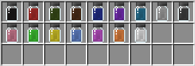
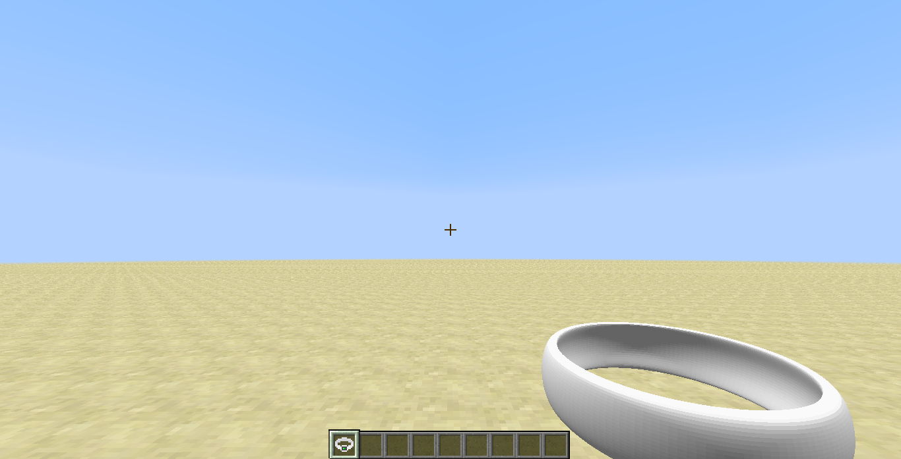

description: Создание собственного предмета.

# Создание предмета

## Основа

Чтобы написать свой первый предмет, вам необходимо создать класс и наследоваться от Item.

```java
package ru.mcmodding.tutorial.common.item;

import net.minecraft.item.Item;

public class RingItem extends Item {
    public RingItem() {
        setUnlocalizedName("ring");
        setTextureName(McModding.MOD_ID + ":ring");
        setMaxStackSize(1);
    }
}
```

Вот так просто пишется собственный предмет. Давайте разберёмся, что у нас в конструкторе написано.

* `setUnlocalizedName(String)` - задаёт нелокализованное название предмета(см. статью [Локализация](https://mcmodding.ru/1.7.10/lang/))
* `setTextureName(String)` - задаёт текстуру. Необходимо указывать ModId, чтобы текстура бралась не из ресурсов Minecraft, а именно нашего мода. Пример: `modId:textureName`, можно также указывать путь: 'modId:folder/textureName'
* `setMaxStackSize(Integer)` - задаёт максимальное количество предметов

Остальные сеттеры вы можете самостоятельно просмотреть в классе Item, ко многим из них прилагаются комментарии от MCP и MinecraftForge.

Теперь приступим к регистрации нашего предмета. Чтобы зарегистрировать наше кольцо, необходимо использовать `GameRegistry#registerItem` 
в который передаётся экземпляр класса `Item` и регистрируемое имя предмета. Создадим для большего удобства класс `ModItems` 
в котором будут храниться объекты наших предметов и будет происходить регистрация.

```java
package ru.mcmodding.tutorial.common.handler;

import cpw.mods.fml.common.registry.GameRegistry;
import ru.mcmodding.tutorial.common.item.RingItem;

public class ModItems {
    public static final RingItem RING = new RingItem();
    
    public static void register() {
        GameRegistry.registerItem(RING, "ring");
    }
}
```

Осталось добавить вызов метода `ModItems#register` в `CommonProxy#preInit`

```java
public class CommonProxy {
    public void preInit(FMLPreInitializationEvent event) {
        ModItems.register();
    }
}
```

Запускаем игру и заходим в мир. Чтобы получить только что написанный предмет, введите такую команду:
`/give @p mcmodding:ring`.

Где `mcmodding:ring`:

1. `mcmodding` - это ModId мода
2. `ring` - регистрируемое имя предмета

{: .border }

## Текстура

В прошлой разделе мы рассмотрели базовый принцип создания предмета и указали текстуру с помощью метода `Item#setTextureName`, 
но мы получили отсутствующую текстуру. Для того чтобы это исправить, необходимо поместить свою текстуру предмета в папку с ресурсами(resources) по пути
`assets/modId/textures/items`(вместо `modId` должен быть ваш идентификатор мода! В нашем случае это `mcmodding`).

Возьмём такую текстуру кольца:

{: .border }

> Соотношение сторон должно быть 1:1, т.е если ваша текстура шириной 32 пикселя, то и высота должна быть 32 пикселя, иначе текстура не будет загружена!
> Исключением являются текстуры с KeyFrame анимацией.

Если всё было сделано, как написано в статье, то в результате наш предмет получит текстуру:

{: .border }

{: .border }

### Текстура с анимацией

Вы можете добавить текстуру с KeyFrame анимацией, выглядят такие текстуры примерно так:

{: .border }

Для работы таких текстур необходимо создавать отдельный файл `названиеТекстуры.png.mcmeta`, который содержит такую информацию:

```json
{
  "animation": {
    "frametime": 5,
    "width": 12,
    "height": 12,
    "frames": [
      0, 1, 2, 3, 2, 1, 0
    ]
  }
}
```

* `frametime` - длительность одного кадра в тиках. К примеру, если указать 40, то один кадр будет отображаться две секунды
* `width` - ширина кадра. Необходимо применять, если кадры имеют нестандартный ширину
* `height` - высота кадра. Необходимо применять, если кадры имеют нестандартную высоту
* `frames` - массив кадров. Принимает `Integer`, а также объект `frame`(см. ниже). Кадры начинаются от 0 и до N кадра(зависит от того сколько их в текстуре). Индексы можно менять местами, чтобы изменить порядок отображения кадров

#### Дополнение к `frames`

```json
{
  "animation": {
    "frames": [
      {
        "index": 0,
        "time": 25
      },
      {
        "index": 1,
        "time": 10
      },
      {
        "index": 2,
        "time": 50
      }
    ]
  }
}
```

Вы можете также указать для конкретного кадра(по его индексу) время его воспроизведения. 
Работает аналогично прошлому примеру, только достаточно менять параметр `index` для изменения порядка отображения.

### Наложение текстур

!!! info "Важно!"
    Данный раздел рассчитан на разработчиков, прочитавших статью "Подтипы"!

Возможно вы задумаетесь о том, как добавить не одну, а две и более текстур с наложением слоя или сменой от определённых условий, 
как например это сделано у кожаной брони или у лука при натягивании тетивы.

Создадим предмет `Банка с краской`, имеющий основную текстуру и текстуру слоя, которую в дальнейшем мы окрасим в стандартные цвета Minecraft.

```java
package ru.mcmodding.tutorial.common.item;

import cpw.mods.fml.relauncher.Side;
import cpw.mods.fml.relauncher.SideOnly;
import net.minecraft.client.renderer.texture.IIconRegister;
import net.minecraft.creativetab.CreativeTabs;
import net.minecraft.item.Item;
import net.minecraft.item.ItemDye;
import net.minecraft.item.ItemStack;
import net.minecraft.util.IIcon;
import ru.mcmodding.tutorial.McModding;

import java.util.List;

public class PaintCanItem extends Item {
    @SideOnly(Side.CLIENT)
    private IIcon colorMask;
    
    public PaintCanItem() {
        setUnlocalizedName("paint_can");
        setTextureName(McModding.MOD_ID + ":paint_can");
        setMaxStackSize(1);
        setHasSubtypes(true);
    }
    
    @Override
    @SideOnly(Side.CLIENT)
    public boolean requiresMultipleRenderPasses() {
        return true;
    }

    @Override
    @SideOnly(Side.CLIENT)
    public IIcon getIconFromDamageForRenderPass(int meta, int renderPass) {
        return pass == 1 ? colorMask : super.getIconFromDamageForRenderPass(meta, renderPass);
    }

    @Override
    @SideOnly(Side.CLIENT)
    public void registerIcons(IIconRegister register) {
        super.registerIcons(register);
        colorMask = register.registerIcon(McModding.MOD_ID + ":paint_can_color");
    }

    @Override
    @SideOnly(Side.CLIENT)
    public int getColorFromItemStack(ItemStack stack, int renderPass) {
        return renderPass == 0 ? 0xFFFFFF : ItemDye.field_150922_c[stack.getItemDamage() % ItemDye.field_150922_c.length];
    }

    @Override
    @SideOnly(Side.CLIENT)
    public void getSubItems(Item item, CreativeTabs tab, List items) {
        for (int damage = 0, size = ItemDye.field_150922_c.length; damage < size; damage++) {
            items.add(new ItemStack(item, 1, damage));
        }
    }
}
```

* `requiresMultipleRenderPasses` - требует от игры несколько проходов для отрисовки предмета(см. примечание ниже)

> Minecraft для большинства предметов использует один проход, но при включении `requiresMultipleRenderPasses` == true,
> кол-во проходов становится два. Чтобы изменить кол-во проходов для отрисовки предмета, 
> вы можете посмотреть метод `Item#getRenderPasses(Integer)`

* `getIconFromDamageForRenderPass(Integer, Iteger)` - возвращает иконку предмета в зависимости от меты предмета и текущего прохода рендера.

> Так как наш предмет имеет два прохода для отрисовки банки с краской, то нам необходимо указать, что во втором проходе нужно рисовать маску цвета банки.
> Почему мы начинаем не от 0, а от 1? Это связано с тем, что на 0 проходе находится основная текстура предмета, а уже от
> 1 до N(см. `Item#getRenderPasses(Integer)`) дополнительные.

* `registerIcons(IIconRegister)` - в данном методе проходит регистрация иконок предметов
* `getColorFromItemStack(ItemStack, Integer)` - возвращает цвет предмета. Стандартный цвет предмета: 0xFFFFFF(16777215)

> В `getColorFromItemStack(ItemStack, Integer)` мы проверяем, если текущий проход равен 0, то цвет будет стандартный.
> Если же проход 1 до N(наша маска цвета), то окрашивать маску в цвет красителя по мете предмета.

Нам осталось добавить текстуры и зарегистрировать предмет.


Если вы всё сделали правильно, то в игре вы получите такой результат:


## Модель

!!! info "Важно!"
    Данный раздел рассчитан на более опытных разработчиков!

Текстуру вы научились добавлять к своему предмету, но вы скорее всего захотите добавить модель к своему предмету.
Для это необходимо реализовать интерфейс `IItemRenderer`.

```java
package ru.mcmodding.tutorial.client.render.item;

import net.minecraft.item.ItemStack;
import net.minecraftforge.client.IItemRenderer;

public class RingItemRender implements IItemRenderer {
    @Override
    public boolean handleRenderType(ItemStack item, ItemRenderType type) {
        return false;
    }

    @Override
    public boolean shouldUseRenderHelper(ItemRenderType type, ItemStack item, ItemRendererHelper helper) {
        return false;
    }

    @Override
    public void renderItem(ItemRenderType type, ItemStack item, Object... data) {

    }
}
```

* `handleRenderType(ItemStack, ItemRenderType)` - обрабатывает текущий тип рендера, а именно:

1. `ItemRenderType#ENTITY` - предмет лежит на земле или вставлен в рамку
2. `ItemRenderType#EQUIPPED` - предмет находится в руке
3. `ItemRenderType#EQUIPPED_FIRST_PERSON` - предмет находится в руке от первого лица
4. `ItemRenderType#INVENTORY` - предмет находится в инвентаре
5. `ItemRenderType#FIRST_PERSON_MAP` - предмет рисуется как карта в обеих руках

* `shouldUseRenderHelper(ItemRenderType, ItemStack, ItemRendererHelper)` - нужно ли использовать вспомогательные обработки рендера(см. пояснение)

#### Дополнение к `shouldUseRenderHelper`

Если вернуть true, то к нашему рендеру предмету будет применена вспомогательная обработка:

1. `ItemRendererHelper#ENTITY_ROTATION` - предмет будучи на земле вращается на 360
2. `ItemRendererHelper#ENTITY_BOBBING` - предмет будет двигать при ходьбе вверх-вниз
3. `ItemRendererHelper#EQUIPPED_BLOCK` - предмет будет отрисовываться 3D моделью, либо 2D текстурой
4. `ItemRendererHelper#BLOCK_3D` - приравнивает предмет к блоку имеющий RenderBlocks#renderItemIn3d
5. `ItemRendererHelper#INVENTORY_BLOCK` - предмет будет отрисовываться 3D модель, либо 2D текстурой в инвентаре

* `renderItem(ItemRenderType, ItemStack, Object[])` - в данном методе происходит сама отрисовка нашего предмета. Параметр `data` принимает особые данные, которые передаются в зависимости от типа отрисовки. Подробнее смотрите `ItemRenderType` для получения подобной информации о данных передаваемых на каждый тип!

Помимо реализации `IItemRenderer`, необходимо загрузить модель. Можно использовать любую модель, главное чтобы её загрузку 
поддерживал MinecraftForge, иначе вам придётся реализовывать загрузку нужной вам модели самостоятельно! В данном случае
мы воспользуемся готовым решением и будет использовать Wavefront(.obj) формат с [дополнительной обёрткой от Dahaka](https://forum.mcmodding.ru/threads/uskorenie-rendera-modelej.10481/)

!!! tip "Совет" 
    Если вы будете использовать Wavefront как основной формат моделей, то не забудьте сделать триангуляцию модели, чтобы не получить исключение при загрузке!

```java
package ru.mcmodding.tutorial.client.render.item;

import cpw.mods.fml.relauncher.Side;
import cpw.mods.fml.relauncher.SideOnly;
import net.minecraft.item.ItemStack;
import net.minecraft.util.ResourceLocation;
import net.minecraftforge.client.IItemRenderer;
import net.minecraftforge.client.model.AdvancedModelLoader;
import net.minecraftforge.client.model.IModelCustom;
import net.minecraftforge.client.model.obj.WavefrontObject;
import ru.mcmodding.tutorial.McModding;
import ru.mcmodding.tutorial.client.render.ModelWrapperDisplayList;

import static org.lwjgl.opengl.GL11.*;

@SideOnly(Side.CLIENT)
public class RingItemRender implements IItemRenderer {
    private final ResourceLocation modelPath = new ResourceLocation(McModding.MOD_ID, "models/ring.obj");
    private final IModelCustom ringModel = new ModelWrapperDisplayList((WavefrontObject) AdvancedModelLoader.loadModel(modelPath));

    @Override
    public boolean handleRenderType(ItemStack item, ItemRenderType type) {
        return type == ItemRenderType.EQUIPPED_FIRST_PERSON;
    }

    @Override
    public boolean shouldUseRenderHelper(ItemRenderType type, ItemStack item, ItemRendererHelper helper) {
        return true;
    }

    @Override
    public void renderItem(ItemRenderType type, ItemStack item, Object... data) {
        glPushMatrix();
        glDisable(GL_TEXTURE_2D);// Отключаем текстурирование, так как у нас её нет для данной модели
        glTranslatef(2F, 0F, 0F);// Смещаем по X модель, чтобы было хорошо видно модель
        ringModel.renderAll();
        glEnable(GL_TEXTURE_2D);// Включаем текстурирование
        glPopMatrix();
    }
}
```

!!! tip "Совет"
    Если вы хотите использовать текстуру, то вам необходимо сделать перед отрисовкой привязку текстуры

Пример привязки текстуры к модели:

```java
public class RingItemRender implements IItemRenderer {
    private final ResourceLocation ringTexturePath = new ResourceLocation(McModding.MOD_ID, "textures/models/ring.png");
    
    @Override
    public void renderItem(ItemRenderType type, ItemStack item, Object... data) {
        Minecraft.getMinecraft().renderEngine.bindTexture(ringTexturePath);
        glPushMatrix();
        glTranslatef(2F, 0F, 0F);
        ringModel.renderAll();
        glPopMatrix();
    }
}
```

Нам необходимо зарегистрировать рендер для кольца, чтобы это сделать, создадим в `ModItems` метод `registerRender`.

```java
public class ModItems {
    @SideOnly(Side.CLIENT)
    public static void registerRender() {
        
    }
}
```

В методе необходимо вызывать `MinecraftForgeClient#registerItemRenderer(Item, IItemRenderer)`.
Первый параметр метода отвечает за предмет к которому будет привязан новый рендер. Второй параметр отвечает за
получение объекта класса рендера предмета.

```java
public class ModItems {
    @SideOnly(Side.CLIENT)
    public static void registerRender() {
        MinecraftForgeClient.registerItemRenderer(RING, new RingItemRender());
    }
}
```

Осталось добавить вызов метода `ModItems#registerRender` в `ClientProxy#init`

```java
public class ClientProxy {
    public void init(FMLInitializationEvent e) {
        super.init(e);
        ModItems.registerRender();
    }
}
```

Загружаем модель по указанному нами пути в ресурсах нашего мода и запускаем игру!

[Ссылка на модель](https://disk.yandex.ru/d/OkP_eFs4G8F0QQ)

