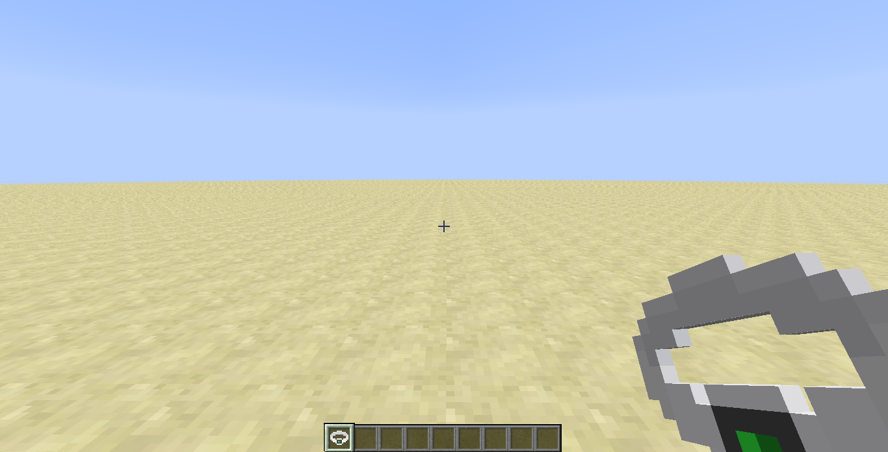

description: Создание собственного предмета.

# Создание предмета

## Основа
Чтобы написать свой первый предмет, вам необходимо создать класс и наследоваться от Item.
```java
package ru.mcmodding.tutorial.common.item;

import net.minecraft.item.Item;

public class RingItem extends Item {
    public RingItem() {
        setUnlocalizedName("ring");
        setTextureName(McModding.MOD_ID + ":ring");
        setMaxStackSize(1);
    }
}
```
Вот так просто пишется собственный предмет. Давайте разберёмся, что у нас в конструкторе написано.
* setUnlocalizedName(String) - задаёт нелокализованное название предмета(см. статью [Локализация](https://mcmodding.ru/1.7.10/lang/))
* setTextureName(String) - задаёт текстуру. Необходимо указывать ModId, чтобы текстура бралась не из ресурсов Minecraft, а именно нашего мода. Пример: `modId:textureName`, можно также указывать путь: 'modId:folder/textureName'
* setMaxStackSize(Integer) - задаёт максимальное количество предметов

Остальные сеттеры вы можете самостоятельно просмотреть в классе Item, ко многим из них прилагаются комментарии от MCP и MinecraftForge.

Теперь приступим к регистрации нашего предмета. Чтобы зарегистрировать наше кольцо, необходимо использовать `GameRegistry#registerItem` 
в который передаётся экземпляр класса `Item` и регистрируемое имя предмета. Создадим для большего удобства класс `ModItems` 
в котором будут храниться объекты наших предметов и будет происходить регистрация.
```java
package ru.mcmodding.tutorial.common.handler;

import cpw.mods.fml.common.registry.GameRegistry;
import ru.mcmodding.tutorial.common.item.RingItem;

public class ModItems {
    public static final RingItem RING = new RingItem();
    
    public static void register() {
        GameRegistry.registerItem(RING, "ring");
    }
}
```

Осталось добавить вызов метода `ModItems#register` в `CommonProxy#pre`
```java
public class CommonProxy {
    public void pre(FMLPreInitializationEvent e) {
        ModItems.register();
    }
}
```

Запускаем игру и заходим в мир. Чтобы получить только что написанный предмет, введите такую команду:
`/give @p mcmodding:ring`.

Где `mcmodding:ring`:
1. mcmodding - это ModId мода
2. ring - регистрируемое имя предмета

{: .border }

## Текстура
В прошлой разделе мы рассмотрели базовый принцип создания предмета и указали текстуру с помощью метода `Item#setTextureName`, 
но мы получили отсутствующую текстуру. Для того чтобы это исправить, необходимо поместить свою текстуру предмета в папку с ресурсами(resources) по пути
`assets/modId/textures/items`(вместо `modId` должен быть ваш идентификатор мода! В нашем случае это `mcmodding`).

Возьмём такую текстуру кольца:
{: .border }

> Соотношение сторон должно быть 1:1, т.е если ваша текстура шириной 32 пикселя, то и высота должна быть 32 пикселя, иначе текстура не будет загружена!
> Исключением являются текстуры с KeyFrame анимацией.

Если всё было сделано, как написано в статье, то в результате наш предмет получит текстуру:
{: .border }
{: .border }

### Текстура с анимацией
Вы можете добавить текстуру с KeyFrame анимацией, выглядят такие текстуры примерно так:
{: .border }

Для работы таких текстур необходимо создавать отдельный файл `названиеТекстуры.png.mcmeta`, который содержит такую информацию:
```json
{
  "animation": {
    "frametime": 5,
    "width": 12,
    "height": 12,
    "frames": [
      0, 1, 2, 3, 2, 1, 0
    ]
  }
}
```
* frametime - длительность одного кадра в тиках. К примеру, если указать 40, то один кадр будет отображаться две секунды
* width - ширина кадра. Необходимо применять, если кадры имеют нестандартный ширину
* height - высота кадра. Необходимо применять, если кадры имеют нестандартную высоту
* frames - массив кадров. Принимает `Integer`, а также объект `frame`(см. ниже). Кадры начинаются от 0 и до N кадра(зависит от того сколько их в текстуре). Индексы можно менять местами, чтобы изменить порядок отображения кадров

#### Дополнение к `frames`
```json
{
  "animation": {
    "frames": [
      {
        "index": 0,
        "time": 25
      },
      {
        "index": 1,
        "time": 10
      },
      {
        "index": 2,
        "time": 50
      }
    ]
  }
}
```
Вы можете также указать для конкретного кадра(по его индексу) время его воспроизведения. 
Работает аналогично прошлому примеру, только достаточно менять параметр `index` для изменения порядка отображения.

### Наложение текстур
Возможно вы задумаетесь о том, как добавить не одну, а две и более текстур с наложением слоя или сменой от определённых условий, 
как например это сделано у кожаной брони или у лука при натягивании тетивы.

```java
// TODO в разработке
```

## Модель
> Данный раздел рассчитан на более опытных разработчиков!

Текстуру вы научились добавлять к своему предмету, но вы скорее всего захотите добавить модель к своему предмету.
Для это необходимо реализовать интерфейс `IItemRenderer`.

```java
// TODO в разработке
```

Помимо реализации `IItemRenderer`, необходимо загрузить модель. Можно использовать любую модель, главное чтобы её загрузку 
поддерживал MinecraftForge, иначе вам придётся реализовывать загрузку нужной вам модели самостоятельно! В данном случае
мы воспользуемся готовым решением и будет использовать Wavefront(.obj) формат с [дополнительной обёрткой от Dahaka](https://forum.mcmodding.ru/threads/uskorenie-rendera-modelej.10481/)

> Если вы будете использовать Wavefront как основной формат моделей, то не забудьте сделать триангуляцию модели, чтобы не получить исключение при загрузке!

Реализация без обёртки:
```java
// TODO в разработке
```

Реализация с обёрткой:
```java
// TODO в разработке
```

Как видите, особо код не меняется, лишь добавляется уже готовый класс обёртки над IModelCustom и рендер модели становится в разы быстрее с обёрткой, нежели без неё.
Остаётся загрузить модели по указанным нами путям в ресурсах нашего мода и запустить игру!