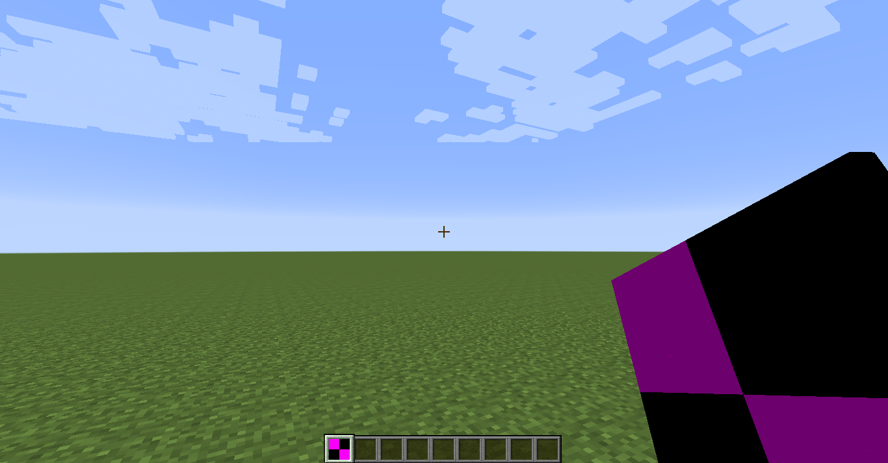
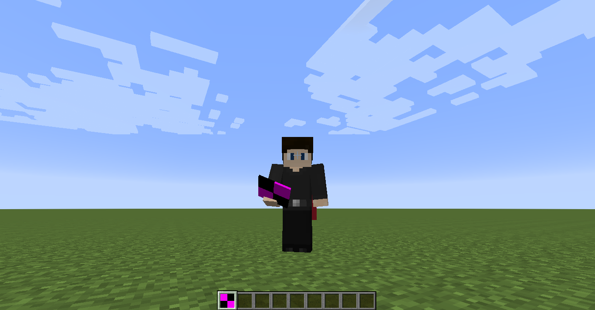
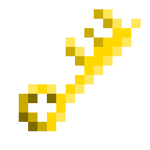
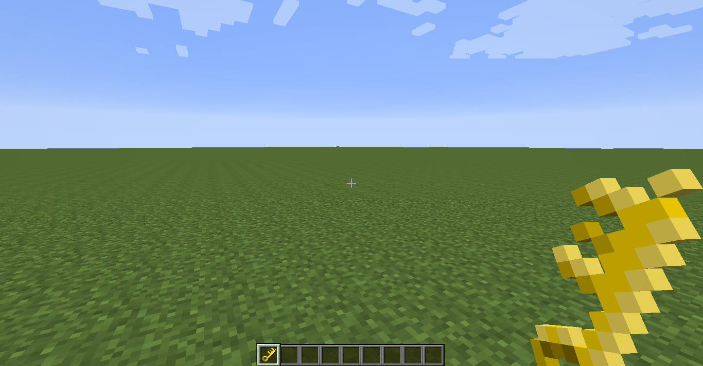
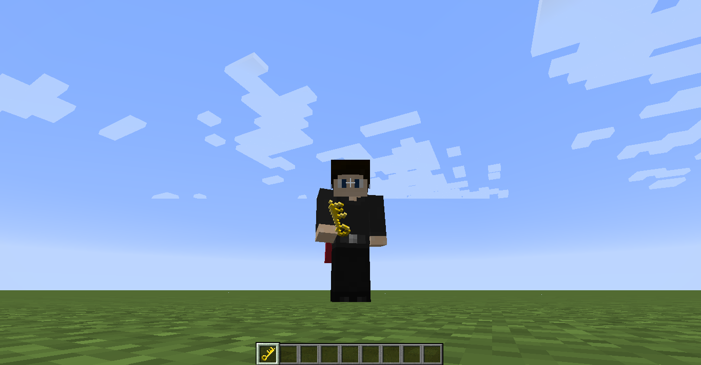
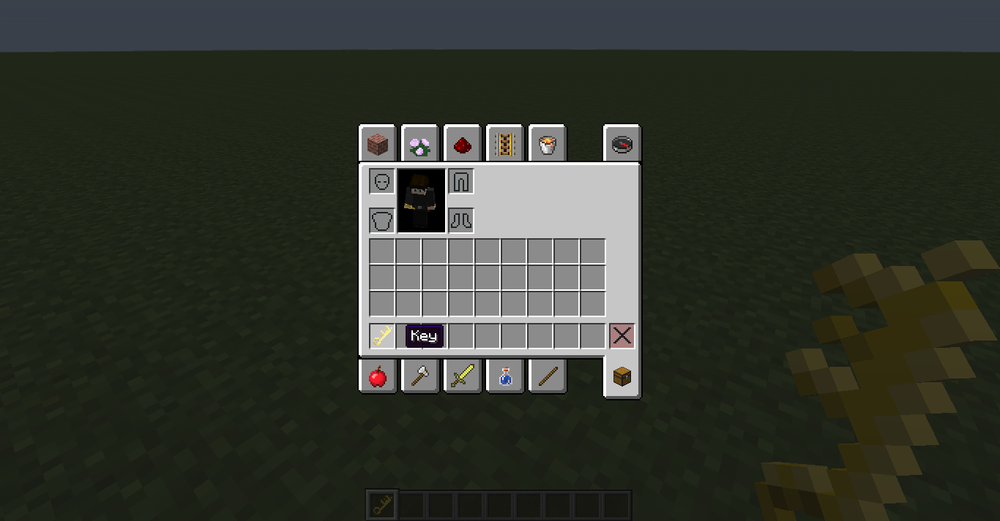

description: Создание собственного предмета.

# Создание предмета

## Основа

Создадим класс для нашего предмета.

```java
package ru.mcmodding.tutorial.common.item;

import net.minecraft.item.Item;

public class ItemKey extends Item {
    public ItemKey() {
        setTextureName("mcmodding:key");
        setUnlocalizedName("key");
    }
}
```

* `setTextureName(name)` - задаёт имя текстуры предмета в формате `modid:name`, т.е. стандартная реализация
предмета будет искать, регистрировать и применять текстуру по следующему пути: 
`assets/*modid*/textures/items/*name*.png`, если не указать `modid`, то используемый путь будет следющим: 
`assets/minecraft/textures/items/*name*.png`, но так делать не рекомендуется, так как каждый мод должен
использовать свой домен ресурсов во избежание конфликтов и путаницы.
* `setUnlocalizedName(name)` - задаёт локализованное имя для нашего предмета, т.е. чтобы нам сделать перевод
имени для предмета мы задаём имя, которое будет в конечном итоге выглядеть вот так `item.*item_name*.name`.

## Регистрация

Создадим класс ModItems.

```java
package ru.mcmodding.tutorial.common.item;

import cpw.mods.fml.common.registry.GameRegistry;
import net.minecraft.item.Item;

public class ModItems {
	// Статическое поле нужно для обращений к данному экземпляру предмета
	// в других метстах, например, для создания ItemStack'ов.
	public static Item itemKey;

	public static void register() {
		// Создаём экземпляр нашего предмета.
		itemKey = new ItemKey();
		// Регистрируем экземпляр нашего предмета, используя текстовый
		// ID "key" (modid подставляется автоматически). ID должен быть
		// уникальным среди всех предметов и блоков нашего мода.
		GameRegistry.registerItem(itemKey, "key");
		// ID нашего предмета после регистрации "mcmodding:key".
		// Его можно выдать командой give
	}
}
```

Теперь нужно вызвать метод `register()` на этапе преинициализации мода в CommonProxy.

```java
package ru.mcmodding.tutorial.common;

import cpw.mods.fml.common.event.FMLInitializationEvent;
import cpw.mods.fml.common.event.FMLPostInitializationEvent;
import cpw.mods.fml.common.event.FMLPreInitializationEvent;
import ru.mcmodding.tutorial.common.item.ModItems;

public class CommonProxy {
    public void pre(FMLPreInitializationEvent e) {
        ModItems.register();
    }

    public void init(FMLInitializationEvent e) {
    }

    public void post(FMLPostInitializationEvent e) {
    }
}
```

Теперь можете запустить Minecraft и посмотреть свой предмет в живую. Для получения предмета пропишите `/give @p mcmodding:key`.
Вместо `mcmodding` у вас должен быть `modid` мода! Вместо `key` у вас должно быть регистрируемое имя вашего предмета.

[](images/face_first.png)

[](images/face_three.png)

## Текстура и локализация

Мы создали предмет, но сейчас у него нет тектуры и названия. Давайте назовём его "Ключ" и дадим следующую текстуру:

[](images/texture_preview.png)

Переместим текстуру в ресурсы проекта по пути `assets/*modid*/textures/items/*name*.png`.
В нашем примере это будет `assets/mcmodding/textures/items/key.png`.

Для добавления названия предмету создадим или откроем файл локализации для русского (`ru_RU.lang`) и
английского языков (`en_US.lang`), затем добавим в них данную строку:

```md
item.key.name=Ключ 
```

* Для английской локализации напишем `Key`.

Подробнее локализация разбирается в соответствующей статье (ещё не написана).

Структура мода к этому моменту должна быть примерно такой:

```md
└── src    
    └── main
        ├── java
        │   ├── ru.mcmodding.tutorial
        │   │   └── McModding.java
        │   ├── ru.mcmodding.tutorial.common
        │   │   └── CommonProxy.java
        │   ├── ru.mcmodding.tutorial.common.item
        │   │   ├── ItemKey.java
        │   │   └── ModItems.java
        │   └── ru.mcmodding.tutorial.client
        │       └── ClientProxy.java
        └── resources
            ├── assets.mcmodding.tutorial.textures.items
            │   └── key.png
            ├── assets.mcmodding.tutorial.lang
            │   ├── en_US.lang
            │   └── ru_RU.lang
            └── mcmod.info
```

Запускаем игру и видим, что у нас получилось (на скриншотах видна текстура и название предмета):

[](images/texture_face_first.png)

[](images/texture_face_three.png)

[](images/item_name.png)