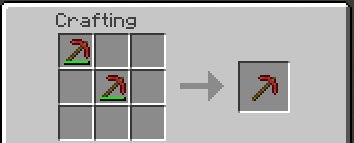
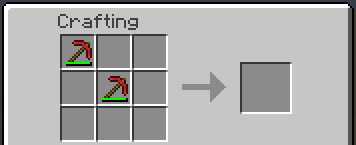

description: Починка предметов с прочностью.

# Починка предмета

Как мы знаем в Minecraft можно чинить предметы с прочностью двумя способами:

1. Объединение одинаковых предметов в сетке крафта
2. С помощью наковальни и предмета для починки

## Таблицы предметов применяемых при починке

ToolMaterial:

| Материал | Название предмета | Предмет            |
|----------|-------------------|--------------------|
| WOOD     | Доски             | Blocks.planks      |
| STONE    | Булыжник          | Blocks.cobblestone |
| GOLD     | Золотой слиток    | Items.gold_ingot   |
| IRON     | Железный слиток   | Items.iron_ingot   |
| EMERALD  | Алмаз             | Items.diamond      |

ArmorMaterial:

| Материал | Название предмета | Предмет          |
|----------|-------------------|------------------|
| CLOTH    | Кожа              | Items.leather    |
| CHAIN    | Железный слиток   | Items.iron_ingot |
| IRON     | Железный слиток   | Items.iron_ingot |
| GOLD     | Золотой слиток    | Items.gold_ingot |
| DIAMOND  | Алмаз             | Items.diamond    |

!!! warning "Внимание!"
    Заменять предмет починки для материалов Minecraft не разрешено, при попытке заменить вы получите исключение.
Добавить можно только один предмет для починки!

Приступим к добавлению своего предмета для починки наших инструментов и брони. Создайте предмет, который будет использоваться для
починки. Затем перейдите в класс `ModItems` и вызовете метод `ToolMaterial#setRepairItem(ItemStack)`. К сожалению,
у `ArmorMaterial` нет метода `setRepairItem(ItemStack)` поэтому, чтобы добавить предмет для починки, необходимо
передать в переменную `customCraftingMaterial` предмет. Чтобы добавить блок, воспользуйтесь методом `Item#getItemFromBlock(Block)`.

```java
public class ModItems {
    public static final Item.ToolMaterial RUBY_TOOL_MATERIAL = EnumHelper.addToolMaterial("mcmodding:ruby", 4, 1800, 16F, 5F, 30);
    public static final ItemArmor.ArmorMaterial RUBY_ARMOR_MATERIAL = EnumHelper.addArmorMaterial("mcmodding:ruby", 66, new int[]{5, 5, 5, 5}, 30);
    
    static {
        RUBY_TOOL_MATERIAL.setRepairItem(new ItemStack(RUBY));
        RUBY_ARMOR_MATERIAL.customCraftingMaterial = RUBY;
    }
}
```

Метод `ToolMaterial#setRepairItem(ItemStack)` принимает стэк предметов.

!!! info "ItemStack"
    Первым параметром в `ItemStack` выступает класс `Item` или `Block`(см. статью "Создание блока"), вторым параметром идёт количество предметов в стэке, максимум
может быть 64 предмета(в зависимости от предмета это кол-во может меняться: 1 - лодка, 16 - снежки, 64 - камень и др.)
Третий параметр это damage. Стандартное значение последних двух параметров: размер - 1, damage - 0. Мы будем использовать 
стандартные значения, поэтому достаточно в `ItemStack` передать только предмет.

Запускаем игру и пробуем починить наш инструмент в наковальне(аналогично для брони).


## Починка в сетке крафта

Разработчики Minecraft заранее позаботились о том, что большинство предметов имеющих прочность должны чиниться за счёт
объединения одинаковых по мете и типу предмета, но что если мы хотим чинить наш предмет только через наковальню?
Для этого предусмотрено состояние `canRepair`, чтобы отключить починку через сетку крафта, добавьте в конструктор своего
предмета вызов метода `Item#setNoRepair`.

До добавления `Item#setNoRepair`:



После добавления `Item#setNoRepair`:

