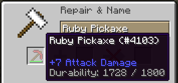
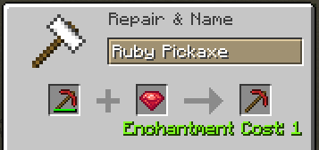

description: Починка предметов с прочностью.

# Починка предмета

Как мы знаем в Minecraft можно чинить предметы с прочностью двумя способами:

1. Объединение одинаковых предметов в сетке крафта
2. С помощью наковальни и предмета для починки

Таблица предметов применяемых при починке:

| Материал | Название предмета | Предмет            |
|----------|-------------------|--------------------|
| WOOD     | Доски             | Blocks.planks      |
| STONE    | Булыжник          | Blocks.cobblestone |
| GOLD     | Золотой слиток    | Items.gold_ingot   |
| IRON     | Железный слиток   | Items.iron_ingot   |
| EMERALD  | Алмаз             | Items.diamond      |

!!! tip "Внимание!"
    Заменять предмет починки для материалов Minecraft не разрешено, при попытке заменить вы получите исключение!

Приступим к добавлению своего предмета для починки наших инструментов. Создайте предмет, который будет использоваться для
починки. Затем перейдите в класс `ModItems` и вызовете метод `ToolMaterial#setRepairItem(ItemStack)`

```java
public class ModItems {
    public static final Item.ToolMaterial RUBY_MATERIAL = EnumHelper.addToolMaterial("mcmodding:ruby", 4, 1800, 16F, 5F, 30);

    static {
        RUBY_MATERIAL.setRepairItem(new ItemStack(RUBY));
    }
}
```

Метод `ToolMaterial#setRepairItem(ItemStack)` принимает стэк предметов. Первым параметром в `ItemStack` выступает
класс `Item` или `Block`(см. статью "Создание блока"), вторым параметром идёт количество предметов в стэке, максимум
может быть 64 предмета(в зависимости от предмета это кол-во может меняться: 1 - лодка, 16 - снежки, 64 - камень и др.)
Третий параметр это мета. Стандартное значение последних двух параметров: размер - 1, мета - 0. Мы будем использовать
стандартные значения, поэтому достаточно в `ItemStack` передать только предмет.

Запускаем игру и пробуем починить наш инструмент в наковальне.





## Починка в сетке крафта

Разработчики Minecraft заранее позаботились о том, что большинство предметов имеющих прочность должны чиниться за счёт
объединения одинаковых по мете и типу предмета, но что если мы хотим чинить наш предмет только через наковальню?
Для этого предусмотрено состояние `canRepair`, чтобы отключить починку через сетку крафта, добавьте в конструктор своего
предмета вызов метода `Item#setNoRepair`.

До добавления `Item#setNoRepair`:


После добавления `Item#setNoRepair`:

