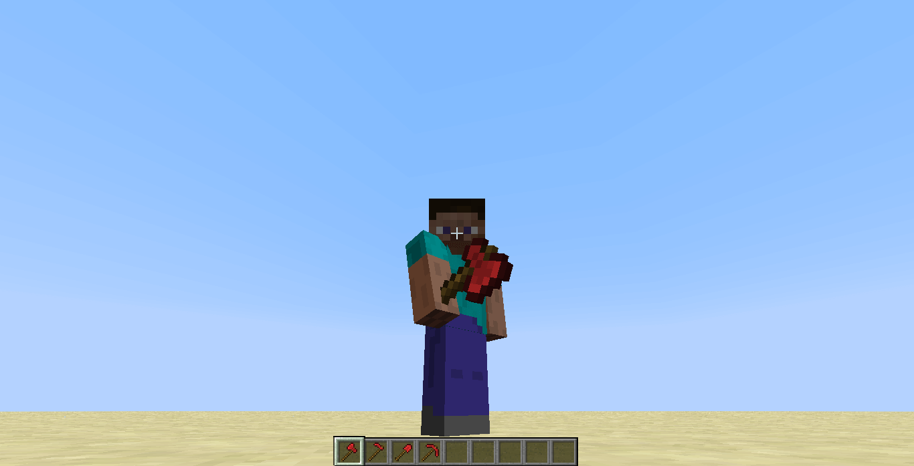
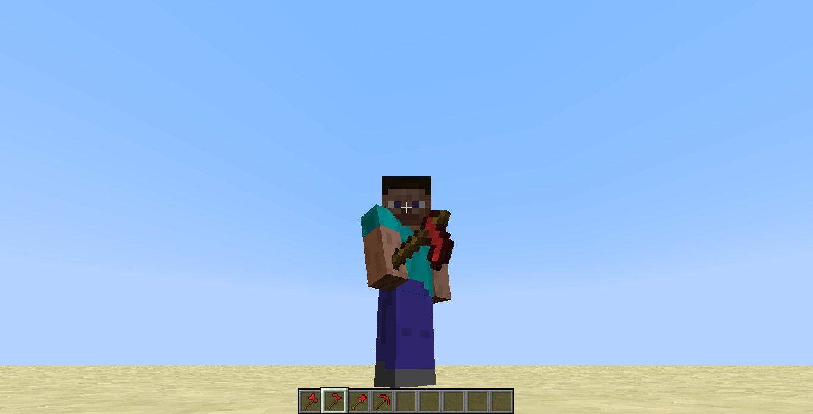
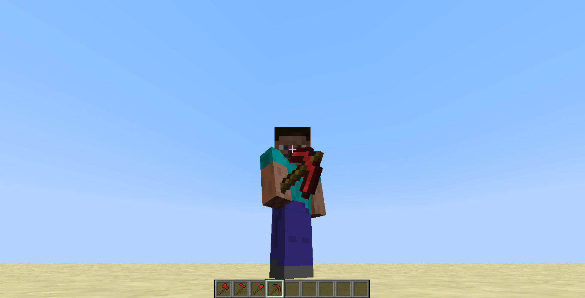
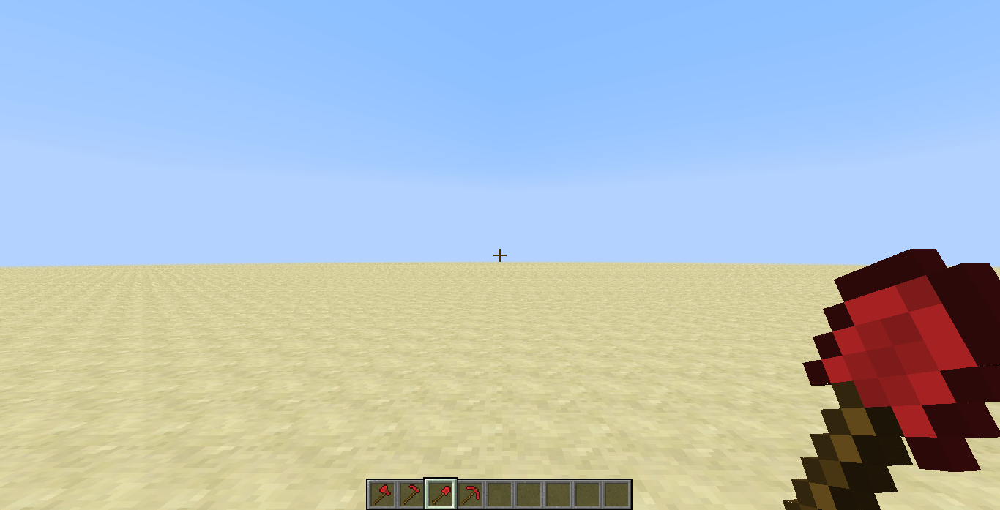
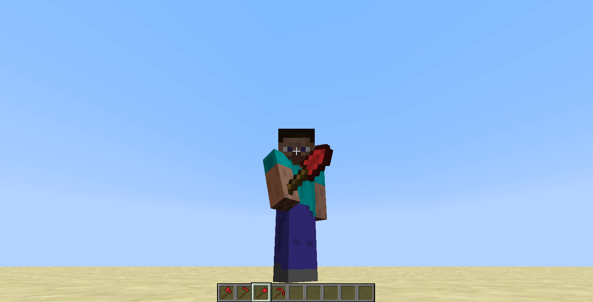
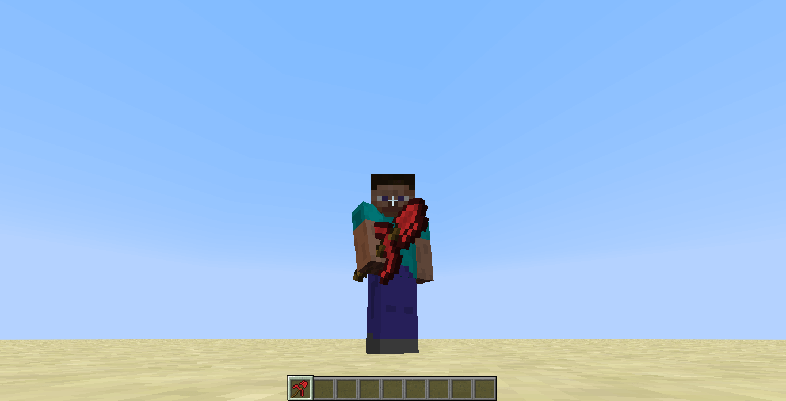

description: Создание собственных инструментов

# Собственные инструменты

Стандартный предмет создать было легко, как и еду, но как насчёт создания инструментов? Давайте создадим свои собственные
инструменты, такие как: меч, кирка, топор, мотыга и лопата, а также мультиинструмент, имеющий некоторые свойства других
инструментов.

## Материал инструментов

Создадим материал для наших инструментов. Для удобства, создадим его в `ModItems`.

```java
public class ModItems {
    public static final Item.ToolMaterial RUBY_TOOL_MATERIAL = EnumHelper.addToolMaterial("mcmodding:ruby", 4, 1800, 16F, 5F, 30);
}
```

Теперь ознакомимся с параметрами метода `EnumHelper#addToolMaterial(String, Integer, Integer, Float, Float, Integer)`

1. Название материала, в нашем случае будет `mcmodding:ruby`. Рекомендуется добавлять `ModId` перед названием, чтобы случайно не заменить материалы из других модов!
2. Уровень добычи, чем выше уровень, тем больше видов блоков сможет уничтожать наш инструмент.
3. Кол-во использований или проще говоря - прочность инструмента.
4. Эффективность, чем выше значение, тем быстрее блок будет ломаться.
5. Урон наносимый инструментом. Данное значение суммируется дополнительным значением урона в зависимости от типа инструмента. Для лопаты +1, кирки +2, топора +3 и меча +4.
6. Коэффициент зачаровывания. Чем больше значение, тем лучше будут чары при зачаровывание.

!!! info "Уровень добычи для некоторых блоков"
    Обсидиан уровень 3, алмазная, изумрудная, золотая и редстоун руды 2, железная и лазуритовая 1, уголь, камень и все остальное 0

Таблица материалов `Item$ToolMaterial`:

| Материал | Уровень добычи | Прочность | Эффективность | Урон | Зачаровываемость |
|----------|----------------|-----------|---------------|------|------------------|
| WOOD     | 0              | 59        | 2             | 0    | 15               |
| STONE    | 1              | 131       | 4             | 1    | 5                |
| IRON     | 2              | 250       | 6             | 2    | 14               |
| EMERALD  | 3              | 1561      | 8             | 3    | 10               |
| GOLD     | 0              | 32        | 12            | 0    | 22               |

## Меч

Для создания меча необходимо наследоваться от `ItemSword` и передать в супер-класс материал.

!!! info "Подсказка"
    Вы можете брать уже готовые материалы, которые находятся в `Item$ToolMaterial`

```java
package ru.mcmodding.tutorial.common.item.tool;

import net.minecraft.item.ItemSword;
import ru.mcmodding.tutorial.McModding;
import ru.mcmodding.tutorial.common.handler.ModItems;
import ru.mcmodding.tutorial.common.handler.ModTab;

public class RubySword extends ItemSword {
    public RubySword() {
        super(ModItems.RUBY_TOOL_MATERIAL);
        setUnlocalizedName("ruby_sword");
        setTextureName(McModding.MOD_ID + ":ruby_sword");
        setCreativeTab(ModTab.INSTANCE);
    }
}
```

Добавим текстуру меча


Регистрируем наш меч и запускаем игру.


## Топор

Для создания топора необходимо наследоваться от `ItemTool`.

!!! tip "Примечание к наследованию"
    Возможно у вас возникнет вопрос, почему мы сразу не можем наследоваться от `ItemAxe`, `ItemPickaxe`, `ItemSpade`. 
Связано это с тем, что Minecraft и MinecraftForge не предоставляют возможности изменять списки добываемых блоков и добавочный урон к инструментам.
Если вам необходим инструмент только со своим материалом, то вы можете наследоваться сразу от `ItemAxe`, `ItemPickaxe`, `ItemSpade`

```java
package ru.mcmodding.tutorial.common.item.tool;

import com.google.common.collect.Sets;
import net.minecraft.block.Block;
import net.minecraft.block.material.Material;
import net.minecraft.init.Blocks;
import net.minecraft.item.ItemStack;
import net.minecraft.item.ItemTool;
import ru.mcmodding.tutorial.McModding;
import ru.mcmodding.tutorial.common.handler.ModItems;
import ru.mcmodding.tutorial.common.handler.ModTab;

import java.util.Set;

public class RubyAxe extends ItemTool {
    public static final Set<Block> HARVEST_BLOCKS = Sets.newHashSet(
            Blocks.planks, Blocks.bookshelf, Blocks.log, Blocks.log2, Blocks.chest, Blocks.pumpkin, Blocks.lit_pumpkin
    );

    public RubyAxe() {
        super(3F, ModItems.RUBY_TOOL_MATERIAL, HARVEST_BLOCKS);
        setUnlocalizedName("ruby_axe");
        setTextureName(McModding.MOD_ID + ":ruby_axe");
        setCreativeTab(ModTab.INSTANCE);

        setHarvestLevel("axe", ModItems.RUBY_TOOL_MATERIAL.getHarvestLevel());
    }

    @Override
    public float func_150893_a(ItemStack toolStack, Block block) {
        if (block.getMaterial() != Material.wood && block.getMaterial() != Material.plants && block.getMaterial() != Material.vine)
            return super.func_150893_a(toolStack, block);
        return efficiencyOnProperMaterial;
    }
}
```

В отличие от меча помимо материала нам необходимо передать в супер-класс доп. значение урона и список добываемых блоков.
Мы будем использовать стандартный список.

Для корректной работы инструмента необходимо указать `setHarvestLevel(String, Integer)`, так как мы не используем
наследование от `ItemAxe`. Первым параметром выступает название инструмента, в данном случае `axe`, а вторым
параметром выступает уровень инструмента.

| Инструмент | Название класса |
|------------|-----------------|
| Топор      | axe             |
| Кирка      | pickaxe         |
| Лопата     | shovel          |

Добавился метод `func_150893_a(ItemStack, Block)`, данный метод возвращает эффективность инструмента, а также
дополнительно регулирует эффективность инструмента для некоторых материалы блоков.

Добавим текстуру топора


Регистрируем наш топор и запускаем игру.




## Мотыга

Для создания мотыги необходимо наследоваться от `ItemHoe`. Почему мы не наследуемся от `ItemTool`? Связано это с тем,
что разработчики Minecraft не предусмотрели такой функционал в `ItemTool`. В `ItemHoe` происходит дополнительная
обработка через событие `UseHoeEvent`, что обеспечивает совместимость с другими модами, использующие `UseHoeEvent` событие.

```java
package ru.mcmodding.tutorial.common.item.tool;

import net.minecraft.item.ItemHoe;
import ru.mcmodding.tutorial.McModding;
import ru.mcmodding.tutorial.common.handler.ModItems;
import ru.mcmodding.tutorial.common.handler.ModTab;

public class RubyHoe extends ItemHoe {
    public RubyHoe() {
        super(ModItems.RUBY_TOOL_MATERIAL);
        setUnlocalizedName("ruby_hoe");
        setTextureName(McModding.MOD_ID + ":ruby_hoe");
        setCreativeTab(ModTab.INSTANCE);
    }
}
```

Добавим текстуру мотыги


Регистрируем нашу мотыгу и запускаем игру.




## Кирка

Для создания кирки необходимо наследоваться от `ItemTool`.

```java
package ru.mcmodding.tutorial.common.item.tool;

import com.google.common.collect.Sets;
import net.minecraft.block.Block;
import net.minecraft.block.material.Material;
import net.minecraft.init.Blocks;
import net.minecraft.item.ItemStack;
import net.minecraft.item.ItemTool;
import ru.mcmodding.tutorial.McModding;
import ru.mcmodding.tutorial.common.handler.ModItems;
import ru.mcmodding.tutorial.common.handler.ModTab;

import java.util.Set;

public class RubyPickaxe extends ItemTool {
    public static final Set<Block> HARVEST_BLOCKS = Sets.newHashSet(
            Blocks.cobblestone, Blocks.double_stone_slab, Blocks.stone_slab, Blocks.stone, Blocks.sandstone,
            Blocks.mossy_cobblestone, Blocks.iron_ore, Blocks.iron_block, Blocks.coal_ore, Blocks.gold_block,
            Blocks.gold_ore, Blocks.diamond_ore, Blocks.diamond_block, Blocks.ice, Blocks.netherrack, Blocks.lapis_ore,
            Blocks.lapis_block, Blocks.redstone_ore, Blocks.lit_redstone_ore, Blocks.rail, Blocks.detector_rail,
            Blocks.golden_rail, Blocks.activator_rail
    );

    public RubyPickaxe() {
        super(2F, ModItems.RUBY_TOOL_MATERIAL, HARVEST_BLOCKS);
        setUnlocalizedName("ruby_pickaxe");
        setTextureName(McModding.MOD_ID + ":ruby_pickaxe");
        setCreativeTab(ModTab.INSTANCE);

        setHarvestLevel("pickaxe", ModItems.RUBY_TOOL_MATERIAL.getHarvestLevel());
    }

    @Override
    public boolean func_150897_b(Block block) {
        if (block == Blocks.obsidian)
            return toolMaterial.getHarvestLevel() == 3;
        return block != Blocks.diamond_block && block != Blocks.diamond_ore ? block != Blocks.emerald_ore && block != Blocks.emerald_block ? block != Blocks.gold_block && block != Blocks.gold_ore ? block != Blocks.iron_block && block != Blocks.iron_ore ? block != Blocks.lapis_block && block != Blocks.lapis_ore ? block != Blocks.redstone_ore && block != Blocks.lit_redstone_ore ? block.getMaterial() == Material.rock || block.getMaterial() == Material.iron || block.getMaterial() == Material.anvil : toolMaterial.getHarvestLevel() >= 2 : toolMaterial.getHarvestLevel() >= 1 : toolMaterial.getHarvestLevel() >= 1 : toolMaterial.getHarvestLevel() >= 2 : toolMaterial.getHarvestLevel() >= 2 : toolMaterial.getHarvestLevel() >= 2;
    }

    @Override
    public float func_150893_a(ItemStack toolStack, Block block) {
        if (block.getMaterial() != Material.iron && block.getMaterial() != Material.anvil && block.getMaterial() != Material.rock)
            return super.func_150893_a(toolStack, block);
        return efficiencyOnProperMaterial;
    }
}
```

Добавился метод `func_150897_b(Block)` данный метод возвращает логическое значение отвечающее условию 
"может ли инструмент добывать переданный блок". В случае нашего метода, используются стандартные условия.

Добавим текстуру кирки


Регистрируем нашу кирку и запускаем игру.




## Лопата

Для создания лопаты необходимо наследоваться от `ItemTool`.

```java
package ru.mcmodding.tutorial.common.item.tool;

import com.google.common.collect.Sets;
import net.minecraft.block.Block;
import net.minecraft.init.Blocks;
import net.minecraft.item.ItemTool;
import ru.mcmodding.tutorial.McModding;
import ru.mcmodding.tutorial.common.handler.ModItems;
import ru.mcmodding.tutorial.common.handler.ModTab;

import java.util.Set;

public class RubySpade extends ItemTool {
    public static final Set<Block> HARVEST_BLOCKS = Sets.newHashSet(
            Blocks.grass, Blocks.dirt, Blocks.sand, Blocks.gravel, Blocks.snow_layer,
            Blocks.snow, Blocks.clay, Blocks.farmland, Blocks.soul_sand, Blocks.mycelium
    );

    public RubySpade() {
        super(1F, ModItems.RUBY_TOOL_MATERIAL, HARVEST_BLOCKS);
        setUnlocalizedName("ruby_spade");
        setTextureName(McModding.MOD_ID + ":ruby_spade");
        setCreativeTab(ModTab.INSTANCE);

        setHarvestLevel("shovel", ModItems.RUBY_TOOL_MATERIAL.getHarvestLevel());
    }
}
```

Добавим текстуру лопаты


Регистрируем нашу лопату и запускаем игру.





## Мультиинструмент

Ранее мы создали топор, мотыгу, кирку и лопату, но как же их объединить в один мощный инструмент? Всё очень просто,
делаем аналогичное наследование от `ItemTool`.

```java
package ru.mcmodding.tutorial.common.item.tool;

import com.google.common.collect.Sets;
import cpw.mods.fml.common.eventhandler.Event;
import net.minecraft.block.Block;
import net.minecraft.entity.player.EntityPlayer;
import net.minecraft.init.Blocks;
import net.minecraft.item.ItemStack;
import net.minecraft.item.ItemTool;
import net.minecraft.world.World;
import net.minecraftforge.common.MinecraftForge;
import net.minecraftforge.event.entity.player.UseHoeEvent;
import ru.mcmodding.tutorial.McModding;
import ru.mcmodding.tutorial.common.handler.ModItems;
import ru.mcmodding.tutorial.common.handler.ModTab;

import java.util.Set;

public class RubyMultiTool extends ItemTool {
    public static final Set<Block> HARVEST_BLOCKS = Sets.newHashSet();

    public RubyMultiTool() {
        super(5F, ModItems.RUBY_TOOL_MATERIAL, HARVEST_BLOCKS);
        setUnlocalizedName("ruby_multi_tool");
        setTextureName(McModding.MOD_ID + ":ruby_multi_tool");
        setCreativeTab(ModTab.INSTANCE);

        final int harvestLvl = ModItems.RUBY_TOOL_MATERIAL.getHarvestLevel();
        setHarvestLevel("axe", harvestLvl);
        setHarvestLevel("pickaxe", harvestLvl);
        setHarvestLevel("shovel", harvestLvl);
    }

    @Override
    public boolean onItemUse(ItemStack heldStack, EntityPlayer player, World world, int posX, int posY, int posZ, int side, float hitX, float hitY, float hitZ) {
        if (player.canPlayerEdit(posX, posY, posZ, side, heldStack)) {
            final UseHoeEvent event = new UseHoeEvent(player, heldStack, world, posX, posY, posZ);
            if (MinecraftForge.EVENT_BUS.post(event)) {
                return false;
            }

            if (event.getResult() == Event.Result.ALLOW) {
                heldStack.damageItem(1, player);
                return true;
            }

            final Block blockAtPos = world.getBlock(posX, posY, posZ);

            if (side != 0 && world.getBlock(posX, posY + 1, posZ).isAir(world, posX, posY + 1, posZ) && (blockAtPos == Blocks.grass || blockAtPos == Blocks.dirt)) {
                final Block farmland = Blocks.farmland;
                world.playSoundEffect((float) posX + 0.5F, (float) posY + 0.5F, (float) posZ + 0.5F, farmland.stepSound.getStepResourcePath(), (farmland.stepSound.getVolume() + 1.0F) / 2.0F, farmland.stepSound.getPitch() * 0.8F);

                if (!world.isRemote) {
                    world.setBlock(posX, posY, posZ, farmland);
                    heldStack.damageItem(1, player);
                }
                return true;
            }
        }
        return false;
    }

    @Override
    public boolean func_150897_b(Block block) {
        return true;
    }

    static {
        HARVEST_BLOCKS.add(Blocks.obsidian);
        HARVEST_BLOCKS.add(Blocks.emerald_ore);
        HARVEST_BLOCKS.add(Blocks.emerald_block);

        HARVEST_BLOCKS.addAll(RubyAxe.HARVEST_BLOCKS);
        HARVEST_BLOCKS.addAll(RubyPickaxe.HARVEST_BLOCKS);
        HARVEST_BLOCKS.addAll(RubySpade.HARVEST_BLOCKS);
    }
}
```

Создаём собственный список с добываемыми блоками и добавляем туда обсидиант, изумрудную руду и изумрудный блок, чтобы
они правильно обрабатывались, а также добавляем все ранее созданные списки блоков из других инструментов.

Указываем уровень добычи для каждого типа: топор, кирка и лопата. Не забывайте, что все значения вы можете редактировать
на своё усмотрение!

Вы могли заметить, что добавился метод `onItemUse(ItemStack, EntityPlayer, World, Integer, Integer, Integer, Integer, Float, Float, Float)`,
в данном методе обрабатывается нажатие ПКМ по блоку. В нашем случае обрабатывается поведение как у мотыги, так как она
при нажатии на ПКМ вспахивает землю.

1. `heldStack` - текущий стэк предмета в руке.
2. `player` - игрок, держащий инструмент.
3. `world` - мир в котором используется инструмент.
4. `posX`, `posY`, `posZ` - позиция блока с которым произошло взаимодействие.
5. `side` - сторона блока с которой произошло взаимодействие. Низ 0, верх 1, восток 2, запад 3, север 4, юг = 5.
6. `hitX`, `hitY`, `hitZ` - положение курсора игрока на стороне блока.

Добавим текстуру мультиинструменту


Регистрируем наш мультиинструмент и запускаем игру.


