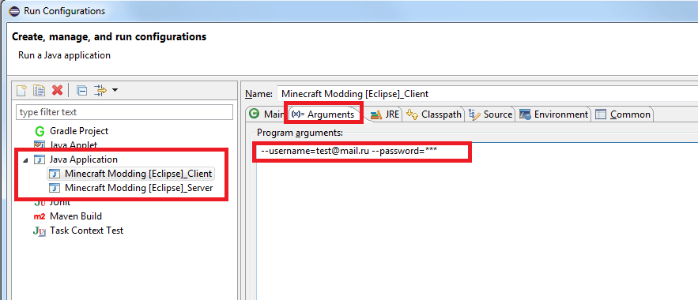

description: Авторизация для отображения скина или никнейма

# Авторизация официального аккаунта

!!! warning "Внимание!"
    После миграции аккаунта с Mojang на Microsoft, авторизации данным способом из статьи не будет работать!

Если у вас есть купленная лицензия Minecraft, то вы можете указать в параметрах
запуска свою почту и пароль, чтобы авторизоваться. В этом случае ваш никнейм + скин автоматически загрузятся
при запуске.

## Настройка в Idea

Откройте меню "Run" и выберите пункт "Edit Configurations...".

В левой части открывшегося окна выберите пункт "Minecraft Client" и введите в поле "Program arguments" следующую строку:

`--username=test@mail.ru --password=***`

В строке выше укажите почту на которую была куплена копия Minecraft и пароль вместо звездочек.

[{: .border }](images/auth_idea.png)

## Настройка в Eclipse

Отройте меню "Run" и выберите пункт "Run Configurations...". В левой части появившегося окна откройте вкладку
"Java Application". Выберите пункт "[название папки с файлами]_Client". В правой части окна откройте вкладку "Arguments" и
в поле "Program arguments" вставьте строку:

`--username=test@mail.ru --password=***`

В строке выше укажите почту на которую была куплена копия Minecraft и пароль вместо звездочек.

[{: .border }](images/auth_eclipse.png)

# Послесловие

Вы можете указать только `--username=Ваш никнейм`, чтобы вместо Player отображался никнейм, который вы укажете и/или 
если у вас нет официального аккаунта Minecraft.

Вам также доступны такие аргументы:

* --uuid - указывает UUID игрока 
* --accessToken - указывает токен авторизации
* --nogui - чтобы отключить отображения графического меню при запуске сервера