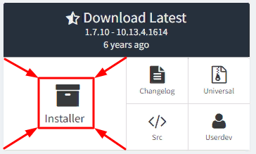
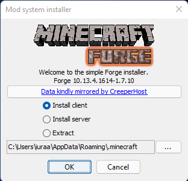
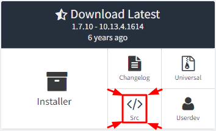

description: Установка необходимых программ, которые необходимы для разработки Minecraft модов.

# Установка программ

Minecraft написана на языке [Java](https://ru.wikipedia.org/wiki/Java). Программы на этом языке могут выполняться только если у вас установлена виртуальная машина Java.

## Java Development Kit

Для запуска Minecraft необходима лишь среда выполнения Java (JRE).

Но для разработки собственных модов нам потребуется писать программный код и пользоваться разными инструментами. Это не входит в стандартный Java пакет,
поэтому нам нужно установить JDK (Набор инструментов разработчика Java).

!!! note ""
    **Minecraft 1.7.10** работает только с **Java 8** (1.8). Более новые выпуски Java данной версией игры не поддерживаются.

Скачайте [последнюю версию Oracle JDK](https://www.oracle.com/technetwork/java/javase/downloads/jdk8-downloads-2133151.html) и следуйте инструкциям по установке. Ничего в настройках установки менять не надо.

??? warning "Принятые ограничения корпорацией Oracle"
    * **С апреля 2019 г.** для скачивания файлов нужна регистрация на сайте. Это бесплатно и подтверждать ничего, кроме E-mail не потребуется.
    * **С марта 2022 г.** скачивание файлов недоступно для пользователей из РФ. 
      Потребуется использовать прокси/VPN. При регистрации следует указывать любую другую страну и использовать иностранный почтовый сервис (напр. GMail, Outlook).

!!! success "Альтернативная JDK"
    В качестве альтернативы можно использовать JDK от другого производителя, например BellSoft.
    Здесь не придётся регистрироваться и искать обходные пути.
    **[Скачать Liberica JDK](https://bell-sw.com/pages/downloads/#/java-8-lts)**

## Forge

Установка Forge для конечных пользователей вашего мода и для вас, как разработчика различается.

### Forge для пользователей

Чтобы люди смогли играть с вашим модом, на их Minecraft должен быть установлен загрузчик модов MinecraftForge.

Скачайте установщик (Installer) с [официального сайта MinecraftForge](https://files.minecraftforge.net/net/minecraftforge/forge/index_1.7.10.html):

Запустите скачанный файл. Выберите пункт "Install client", укажите путь к Minecraft (если он не указан) и нажмите
"OK".

Как понять, куда установлен Minecraft? По умолчанию он устанавливается по следующему пути:
`C:\Users\*ПОЛЬЗОВАТЕЛЬ*\AppData\Roaming\.minecraft`, где `*ПОЛЬЗОВАТЕЛЬ*` имя текущего пользователя компьютера.

### Forge для разработки

Скачайте набор инструментов для разработки модификаций (SRC, для новых версий MDK) с [официального сайта Forge](https://files.minecraftforge.net/net/minecraftforge/forge/index_1.7.10.html):

Создайте в любом удобном для вас месте папку и распакуйте туда скачанный архив. Вы увидите много файлов.
Не все из них вам нужны. Чтобы не захламлять рабочее пространство, удалите все файлы, кроме:

* build.gradle
* gradlew.bat
* папки gradle

## Среда разработки

Моды можно писать и в блокноте, но это очень неудобно. Нам нужна специализированная программа, которая
умеет подсвечивать код, выполнять авто-импорт и делать много других полезных вещей.

Наиболее популярными IDE на данный момент являются [Eclipse](https://www.eclipse.org/downloads/) и [Intellij Idea](https://www.jetbrains.com/idea/#chooseYourEdition).

Eclipse бесплатен. У Intellij Idea есть бесплатная Community версия. Мы рекомендуем использовать Intellij Idea, чтобы избежать большинства проблем при написании модификации.
Никаких платных функций в этом учебнике нам не потребуется. Выберите наиболее подходящую для вас IDE основываясь на характеристиках вашего компьютера.
