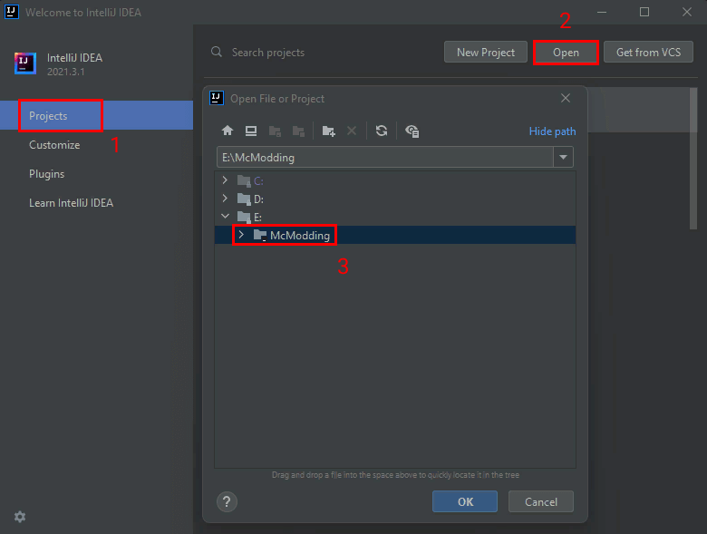
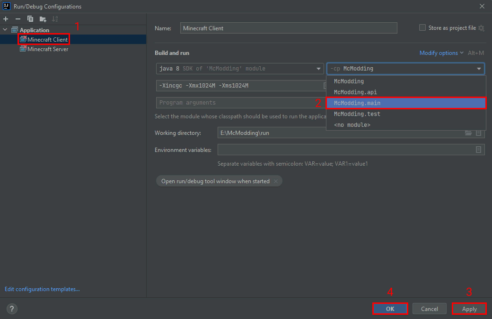
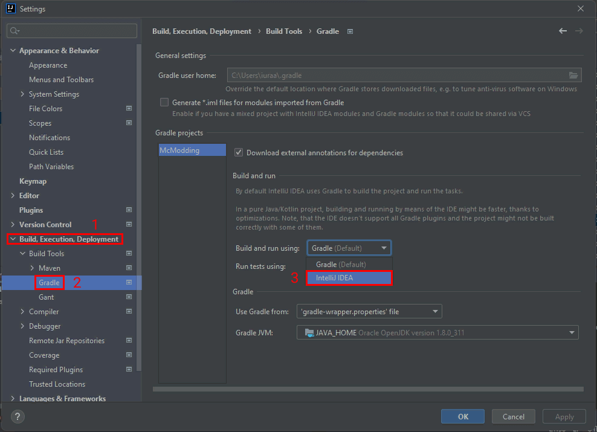

description: Настройка рабочего пространства для разработки модов с помощью Intellij Idea.

# Использование Idea

Итак, у нас есть папка со следующими файлами внутри:

* build.gradle
* gradlew (.bat и .sh)
* папка gradle

Запустите Idea и в стартовом окне кликните по кнопке "Projects", затем "Open" и найди место расположения вашего проекта, как показано ниже. Нажимайте "ОК", чтобы открыть проект.

[{: .border }](images/open_project.png)

Потребуется подождать около минуты, пока среда разработки полностью загрузит необходимые библиотеки Gradle и подготовит проект к работе.
За процессом открытия проекта можно следить в правом нижнем углу среды разработки.

Теперь откройте меню "View" в верхней части экрана и выберите пункты "Tools Windows > Gradle".

У вас откроется окно с Gradle задачами. Gradle — популярная система автоматической сборки, которая из исходников
собирает готовые программы и делает еще много других необходимых, но **рутинных** дел. Эти самые дела называются
задачами/заданиями/тасками — **tasks**.

Выглядит оно примерно так:

[{: .border }](images/gradle_tasks_idea.png)

Выполните задачу `setupDecompWorkspace` из группы `forgegradle`. Тем самым мы произведём загрузку необходимых библиотек
для написания мода и работы с исходным кодом Minecraft и Minecraft Forge.

## Решение проблем

К сожалению, на старых версиях Forge Gradle профили запуска проекта для Intellij Idea не создаются автоматически и приходится производить 
дополнительные манипуляции для исправления этого. Либо вы можете открыть папку с проектом через консоль и выполнить установку так
`.\gradlew setupDecompWorkspace idea`.

Чтобы не выходя из Idea произвести установку профилей, в том же самом окне с задачами найдите "other" и запустите задачу "genIntellijRuns".
Если по какой-то причине вам выдаёт ошибку вида "NullPointerException", то найдите "build setup" и запустите задачу "init".

В новых версиях Intellij Idea вы можете столкнуться с красным крестиком на кнопке запуска вашего проекта

[{: .border }](images/run_error_idea.png)

Откройте список и выберите "Edit Configurations..."

[{: .border }](images/edit_config_idea.png)

В открывшемся окне выберите "Minecraft Client", затем в выпадающем меню classPath выберите "McModding.main"

[{: .border }](images/fix_config_idea.png)

Повторите аналогичную процедуру для "Minecraft Server", нажмите "Apply" и "OK".

### В игре нет текстур/переводов/звуков из мода

Возможно вы столкнётесь с проблемой, что не загружаются ресурсы мода, чтобы это исправить, необходимо открыть настройки Intellij Idea
и проделать такие манипуляции:

[{: .border }](images/build_run_using_idea.png)

Нажмите "OK" и ваш проект полностью готов к разработке мода в Intellij Idea!