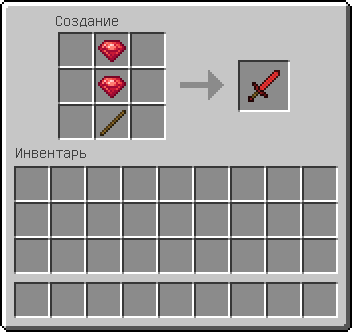
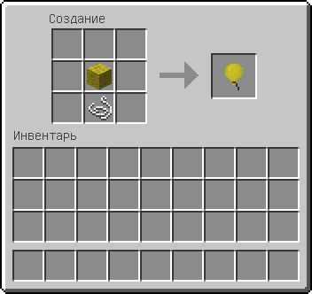
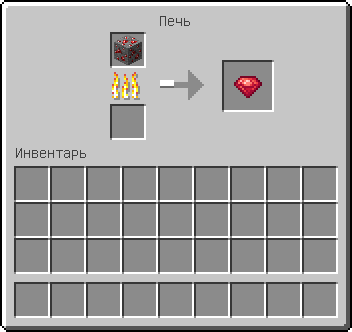

title: Добавление рецепта крафта предмета/блока в Minecraft 1.7.10

# Добавление рецепта

Существует три основных вида рецептов: форменный, бесформенный и рецепт плавки. В данной статье вы
научитесь добавлять все три типа рецептов. Если вас интересует рецепт для варочной стойки, то мы рекомендуем вам
использовать событие `PotionBrewEvent`.

!!! warning "Важно"
    Добавлять рецепты необходимо после регистрации предметов/блоков, а если вы хотите добавить рецепт с предметами
    из других модов, то необходимо указывать зависимость в аннотации `@Mod` и проводить регистрацию рецепта в
    методе с `FMLPostInitializationEvent` или `FMLLoadCompleteEvent` параметром.

## Форменный рецепт

Форменный рецепт – это рецепт в котором учитывается положение предметов в сетке крафта. Такими рецептами являются:
стол зачарований, кирка, меч и т.п. Для добавления такого рецепта воспользуемся методом
`GameRegistry#addShapedRecipe()`.

Схема аргументов данного метода выглядит следующим образом:

```java
GameRegistry.addShapedRecipe(<R>, "ABC", "DEF", "GHI", <ingredients...>);
```


```java title="Пример форменного рецепта"
package ru.mcmodding.tutorial.common.handler;

import cpw.mods.fml.common.registry.GameRegistry;
import net.minecraft.init.Items;
import net.minecraft.item.ItemStack;

public class ModRecipes {
    public static void registerRecipes() {
        GameRegistry.addShapedRecipe(new ItemStack(ModItems.RUBY_SWORD),
                " R ", " R ", " S ",
                'R', ModItems.RUBY,
                'S', Items.stick);
    }
}
```

1. Первым параметром идёт результат крафта, в нашем случае это `ItemStack` предмета «Рубиновый меч»,
2. Далее идёт массив объектов, где три первых строковых элемента описывают схему расположения предметов в сетке крафта.
   Вы можете использовать какие-угодно символы, например, первую букву названия предмета.
   Универсальным вариантом будет использование букв латинского алфавита. Пустые слоты обозначаются пробелом.  
3. Самыми последними параметрами следует описание буквенных обозначений: буква, затем предмет, ассоциируемый с ней.

В качестве ингредиентов для рецепта крафта можно передавать `Block`, `Item` и `ItemStack`.
Первые два варианта удобны, если нужно разрешить использовать в крафте предметы с любым значением meta/damage,
а `ItemStack` когда нужно задать определённое значение **damage**.

!!! tip "Магия wildcard damage"
    Аргументы `Block` и `Item` переданные в рецепт автоматически конвертируются в `ItemStack` с указанием магического значения damage – **32767** (или `Short.MAX_VALUE`).
    Потому что в сетке крафта ничего другого как `ItemStack` быть не может.

!!! note "Ограничение верстака"
    При крафте ресурсы в сетке расходуются **строго по одной единице за раз** и это поведение никак не изменить.
    Поэтому задавание количества `ItemStack`, являющегося ингредиентом, не даст результата.
    Количество и различные атрибуты можно задать только результату крафта.   
    По этой причине, для создания ресурсозатратных рецептов, разработчики модификаций прибегают с созданию «бесполезных предметов», 
    используемых исключительно в рецептах крафта.

Зарегистрируем наш рецепт.

```java hl_lines="11"
package ru.mcmodding.tutorial.common;

import cpw.mods.fml.common.event.FMLPostInitializationEvent;
import ru.mcmodding.tutorial.common.handler.*;

public class CommonProxy {
    
    public void postInit(FMLPostInitializationEvent event) {
        // ...
        
        ModRecipes.registerRecipes();
    }
}
```

Теперь можете зайти в игру и проверить добавленный рецепт.



## Бесформенный рецепт

Бесформенный рецепт – это рецепт в котором не учитывается расположение предметов в сетке крафта. Проще говоря, это рецепт смешивания предметов.
Такими рецептами являются: огниво, око эндера, книга и т.п. Для добавления такого рецепта воспользуемся методом `GameRegistry#addShapelessRecipe()`.
Этот метод намного проще в использовании, чем форменный рецепт – здесь указывается только результат и перечисление ингредиентов.
Здесь всё также можно передавать `Block`, `Item` и `ItemStack` в качестве них.
Добавим рецепт воздушным шарикам, а их у нас 16 видов, поэтому добавление рецепта осуществляем внутри цикла с указанием `itemDamage`.

```java title="Пример бесформенного рецепта"
package ru.mcmodding.tutorial.common.handler;

import cpw.mods.fml.common.registry.GameRegistry;
import net.minecraft.init.Blocks;
import net.minecraft.init.Items;
import net.minecraft.item.ItemStack;

public class ModRecipes {
    public static void registerRecipes() {
        // ...

        for (int damage = 0; damage < 15; damage++) {
            GameRegistry.addShapelessRecipe(new ItemStack(ModItems.BALLOON, 1, damage), new ItemStack(Blocks.wool, 1, ~damage & 15), Items.string);
        }
    }
}
```

!!! tip "Подсказка"
    Чтобы правильно получить блок шерсти по `itemDamage` от 0 до 15, 
    необходимо `itemDamage` (в нашем случае **damage**) инвертировать, как показано в примере.



## Плавление в печи

Для добавления рецепта в печь используется три метода:

1. `GameRegistry#addSmelting(Block, ItemStack, float)`
2. `GameRegistry#addSmelting(Item, ItemStack, float)`
3. `GameRegistry#addSmelting(ItemStack, ItemStack, float)`

Первым параметром является исходный предмет/блок для плавки, вторым результат плавки, а третьим кол-во опыта получаемого при
плавлении предмета/блок. Первые два метода предназначены для упрощённого добавления рецепта `ItemStack` с указанием **wildcard damage**. 

Добавим возможность плавить рубиновую руду в рубины:

```java title="Пример рецепта плавления"
package ru.mcmodding.tutorial.common.handler;

import cpw.mods.fml.common.registry.GameRegistry;
import net.minecraft.init.Blocks;
import net.minecraft.item.ItemStack;

public class ModRecipes {
    public static void registerRecipes() {
        // ...

        GameRegistry.addSmelting(ModBlocks.RUBY_ORE, new ItemStack(ModItems.RUBY), 5F);
    }
}
```



## Рецепты с использованием словаря руд

Ранее мы создавали форменные и бесформенные рецепты стандартным методом с жёсткой привязкой к используемым ингредиентам.
Это может доставлять неудобства игроку, когда в сборке присутствует несколько видов руды, красителей, древесины и прочего,
требуя от игрока строго определённый вид той же древесины (пример).

[Словарь руд](ore-dictionary.md) решает эту проблему, позволяя игроку использовать взаимозаменяемые ингредиенты в крафте.
Например, использовать краситель из мода вместо «ванильного». **Мы настоятельно рекомендуем использовать данный метод добавления рецептов.**

Для добавления рецепта с поддержкой словаря руд существуют обёртки: `ShapedOreRecipe` и `ShapelessOreRecipe`.
Регистрируются они с помощью метода `GameRegistry#addRecipe(IRecipe)`.
В целом, все их параметры полностью аналогичны стандартным методам добавления рецептов и единственным улучшением помимо указания `Block`, `Item`, `ItemStack` в ингредиентах,
появилась возможность указывать стоковое значение, являющееся [именем группы предметов](oredict-table.md) словаря руд.
Это значит, что любой в качестве ингредиента в рецепте можно будет использовать любой предмет входящий в группу.

О том как работать с группами, описано в статье «[Словарь руд](ore-dictionary.md)». 

```java title="Пример рецепта с предметами из словаря руд"
package ru.mcmodding.tutorial.common.handler;

import cpw.mods.fml.common.registry.GameRegistry;
import net.minecraft.item.ItemStack;
import net.minecraftforge.oredict.ShapedOreRecipe;
import net.minecraftforge.oredict.ShapelessOreRecipe;

public class ModRecipes {
    public static void registerRecipes() {
        // ...

        GameRegistry.addRecipe(new ShapedOreRecipe(new ItemStack(ModItems.RUBY_SWORD),
                " R ", " R ", " S ",
                'R', "gemRuby",
                'S', "stickWood"));
        GameRegistry.addRecipe(new ShapelessOreRecipe(new ItemStack(ModItems.RING), "gemRuby", "ingotGold"));
    }
}
```

!!! warning "Важно"
    Регистрацию рецептов, использующих словарь руд, необходимо производить после регистрации предметов
    в словаре руд.
