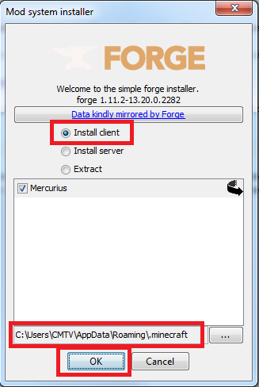
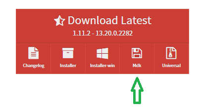

description: Установка необходимых программ, которые необходимы для разработки Minecraft модов.

# Установка программ

Minecraft написан на языке Java. Программы на этом языке могут выполняться только если у вас установлена виртуальная машина Java, которая больше известна под абривеатурой JRE (Java Runtime Environment).

Если вы хоть раз запускали Minecraft на данном компьютере, то Java у вас уже установлена. В противном случае, скачайте и установите [последнюю версию Java](https://java.com/ru/download/).

## JDK

Для запуска Minecraft необходима лишь среда выполнения Java, которую вы установили выше.

Но для разработки собственных модов нам потребуется писать программный код и пользоваться разными библиотеками. Это не входит в стандартный Java пакет,
поэтому нам нужно установить JDK (Java Development Kit) (Комплект инструментов для разработки на Java).

Скачайте [последнюю версию JDK](http://www.oracle.com/technetwork/java/javase/downloads/jdk8-downloads-2133151.html) и следуйте инструкциям по установке. Ничего в настройках установки менять не надо.

## Forge

Установка Forge для конечных пользователей вашего мода и для вас, как разработчика различается.

### Forge для пользователей

Чтобы люди смогли играть с вашим модом, на их Minecraft должен быть установлен движок Forge.

Скачайте установщик (Installer) с [официального сайта Forge](https://files.minecraftforge.net/):

Запустите скачанный файл. Выберите пункт "Install client", укажите путь к Minecraft (если он не указан) и нажмите
OK.

Как понять, куда установлен Minecraft? По умолчанию он устанавливается по следующему пути:
`C:\Users\*ПОЛЬЗОВАТЕЛЬ*\AppData\Roaming\.minecraft`, где `*ПОЛЬЗОВАТЕЛЬ*` имя текущего пользователя компьютера.

> Некоторые лаунчеры позволяют установить Minecraft и Forge просто выбрав их в списке версий. В качестве альтернативы инструкции выше вы можете попробовать [TLauncher](https://tlauncher.org/).

### Forge для разработки

Скачайте набор инструментов для разработки модификаций (MDK) с [официального сайта Forge](https://files.minecraftforge.net/):

Создайте в любом удобном для вас месте папку, и распакуйте туда скачанный архив. Дайте вашей папке англоязычное назвение (без пробелов).

!!! danger "Внимание!"
    Настоятельно рекомендуется выбирать для проекта папку, путь к которой состоит только из символов латиницы. Путь вида `С:\Users\username\Documents\MyMod` будет гораздо предпочтительнее, чем `С:\Users\Василий\Всякие файлы\мой мод`. Несоблюдение этой рекомендации может привести к трудноанализируемым ошибкам при сборке и запуске вашего мода.

Вы увидите много файлов. При желании вы можете удалить txt-файлы, т.к. они несут исключительно справочную функцию.

??? "Подробное описание каждого файла"
    | Файл/папка            | Назначение                                                                                                                                                                    |
    |-----------------------|-------------------------------------------------------------------------------------------------------------------------------------------------------------------------------|
    | gradle                | Содержит дистрибутив сборщика Gradle, который будет отвечать за сборку и компоновку нашего мода                                                                               |
    | src                   | Тут мы будем хранить код мода и ресурсы (текстуры, модели, файлы перевода и т.п.)                                                                                             |
    | build.gradle          | Сценарий сборки мода. В этом файле содержится версия игры, для которой мы пишем мод, маппинг обфусцированных полей и методов, сторонние библиотеки и много другое.            |
    | changelog.txt         | Список изменений для разных версий Forge                                                                                                                                      |
    | CREDITS.txt           | Список благодарностей тем, кто вносит наиболее значимый вклад в развитие Forge                                                                                                |
    | gradle.properties     | Различные настройка работы Gradle (Может отсутствовать в ранних версиях MDK)                                                                                                  |
    | gradlew и gradlew.bat | Обертки Gradle для различных операционных систем. Берут на себя задачи загрузки, установки и настройки Gradle, что гарантирует одинаковый результат сборки на разных машинах. |
    | LICENSE.txt           | Информация о лицензиях Forge и смежных программ                                                                                                                               |
    | README.txt            | Различная полезная информация и инструкции по установке                                                                                                                       |

## Среда разработки

Моды можно писать и в блокноте, но это очень неудобно. Нам нужна специализированная программа, которая
умеет подсвечивать код, выполнять авто-импорт и делать много других полезных вещей.

Наиболее популярными IDE на данный момент являются [Eclipse](https://www.eclipse.org/downloads/) и [Intellij Idea](https://www.jetbrains.com/idea/#chooseYourEdition).

Eclipse бесплатен. У Intellij Idea есть бесплатная Community версия. Никаких платных функций в этом учебнике нам
не потребуется.

Достаточно часто моды пишут на Eclipse, так как и сам Minecraft был написан с помощью этой IDE.
С другой стороны, Idea выглядит посовременнее и пофункциональнее, но принципиальной разницы между ними нет.

Выбирайте то, что нравится вам.
