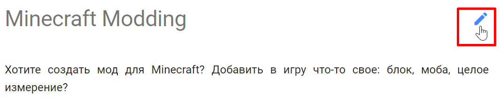
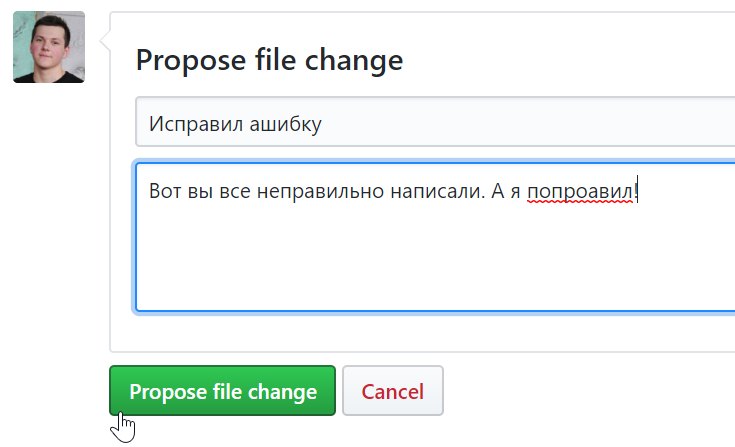

title: Редактирование учебника
description: 

# Редактирование учебника

Учебник расположен на GitHub, поэтому для предложения любых изменений надо иметь там аккаунт. Все статьи пишутся с использованием [Markdown разметки](https://guides.hexlet.io/markdown/).

## Опечатка

Если вы нашли какую-то ошибку, которую можно быстро поправить, нажмите на иконку редактирования рядом с названием статьи.

{: .w8 .border }

Если вы вошли в свой GitHub аккаунт, то откроется визуальный редактор, в которым вы можете изменить текст статьи и сразу же посмотреть на результат изменений (вкладка "Preview changes").

[{: .border }](images/github-visual-editor.png)

После внесения необходимых изменений в статью, кратко опишите их и нажмите на кнопку "Propose file change".

{: .w5 .border }

В этот момент GitHub создает копию учебнику для вашего аккаунта и вносит в нее предложенные изменения. Остается последний шаг — предложить изменения:

[{: .border }](images/file-change-pr.png)

На этом все! В ближайшее время редактор учебника проверит ваши изменения. Возможные исходы:

* Изменения принимаются
* Изменения отправляются на доработку (с указаниями)
* Изменения не принимаются