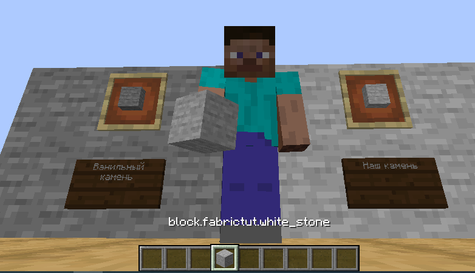

# Создание блока
## Основа

Создаём класс для нашего блока в пакете `ru.mcmodding.fabrictut.block` и наследуем `Block`:
```java
package ru.mcmodding.fabrictut.block;

import net.minecraft.block.Block;

public class WhiteStoneBlock extends Block {
    public WhiteStoneBlock(Settings settings) {
        super(settings);
    }

    @Override
    public float getBlastResistance() {
        return 4.0F;			// взрывоустойчивость
    }
}
```
## Регистрация
Создадим класс для блоков и импортируем туда статичный метод из класса для работы с реестром, а так же зарегистрируем сам блок:
```java
package ru.mcmodding.fabrictut.block;

import net.fabricmc.fabric.api.object.builder.v1.block.FabricBlockSettings;
import net.minecraft.block.Block;
import net.minecraft.block.Material;

import static ru.mcmodding.fabrictut.util.FabricTutRegistry.registerBlock;

public class FTutBlocks {

    public static final Block WHITE_STONE = registerBlock("white_stone", new WhiteStoneBlock(FabricBlockSettings.of(Material.STONE)));

    public static void init() {}
}
```
`Material.STONE` означает материал блока.
Теперь нам необходимо зарегистрировать предмет для блока. Вернемся в класс наших предметов и добавим эту строку:
```java
    public static final Item WHITE_STONE = registerItem("white_stone", new BlockItem(FTutBlocks.WHITE_STONE, new FabricItemSettings()));
```
Где `FTutBlocks.WHITE_STONE` - наш блок.

Не забываем про `FTutBlocks.init();` в главном классе мода.
## Отображение в игре
Если мы сейчас зайдем в игру, наш блок не будет иметь модели и текстуры. Поэтому нам необходимо создать блокстейт (`blockstate`), модель и текстуру.

По пути `assets/<mod_id>/blockstates` создаем `white_stone.json` с таким содержимым:
```json
{
  "variants": {
    "": {
      "model": "fabrictut:block/white_stone"
    }
  }
}
```
Затем создаем `white_stone.json` по пути `assets/<mod_id>/models/block`:
```json
{
  "parent": "minecraft:block/cube_all",
  "textures": {
    "all": "fabrictut:block/white_stone"
  }
}
```
Текстуру надо положить в `assets/<mod_id>/textures/block`.

К слову, для блоков в руках нужно создавать модель отдельно, иначе отображаться блок будет нормально только когда он поставлен. Для этого нужно просто создать там же где и остальные модели предметов файл с ID нашего блока (`white_stone.json`) и заполнить вот так:
```json
{
  "parent": "fabrictut:block/white_stone"
}
```

Теперь игру можно запустить.
