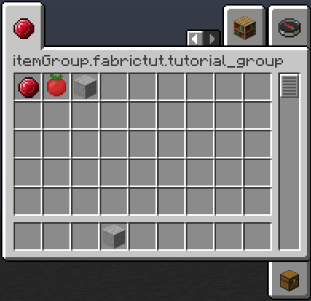

#Вкладки в креативе
В нашем главном классе пишем:
```java
public static final ItemGroup TUTORIAL_GROUP = FabricItemGroupBuilder.create(new Identifier(MOD_ID, "tutorial_group")).icon(() -> new ItemStack(FTutItems.RUBY_ITEM)).build();
```
`"tutorial_group"` - ID нашей вкладки, `() -> new ItemStack(FTutItems.RUBY_ITEM)` - ItemStack, который будет отображаться в качестве иконки вкладки.

Установим нашим предметам вкладку с помощью `FabricItemSettings().group(FabricTutorial.TUTORIAL_GROUP)`.

