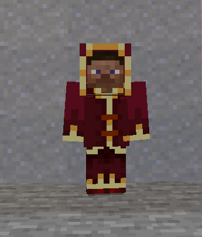

# Создание брони

Для создания брони нам потребуется свой `ArmorMaterial`, а затем простая регистрация предметов брони.

## Материал брони

```java
package ru.mcmodding.fabrictut.item;

import net.minecraft.entity.EquipmentSlot;
import net.minecraft.item.ArmorMaterial;
import net.minecraft.item.ItemStack;
import net.minecraft.item.Items;
import net.minecraft.recipe.Ingredient;
import net.minecraft.sound.SoundEvent;
import net.minecraft.sound.SoundEvents;

public class MageArmorMaterial implements ArmorMaterial {
    private static final int[] BASE_DURABILITY = new int[] {13, 16, 14, 11};
    private static final int[] PROTECTION_VALUES = new int[] {1, 3, 2, 1};

    /*
     * Прочность предмета.
     * В нашем случае зависит от слота
     */
    @Override
    public int getDurability(EquipmentSlot slot) {
        return BASE_DURABILITY[slot.getEntitySlotId()] * 10;
    }

    /*
     * Количество защиты.
     * Зависит напрямую от слота
     */
    @Override
    public int getProtectionAmount(EquipmentSlot slot) {
        return PROTECTION_VALUES[slot.getEntitySlotId()];
    }

    /*
     * Уровень опыта, необходимый для следующего уровня зачарования
     */
    @Override
    public int getEnchantability() {
        return 10;
    }

    /*
     * Звук надевания брони.
     * Рекомендуется использовать свои звуки
     */
    @Override
    public SoundEvent getEquipSound() {
        return SoundEvents.BLOCK_RESPAWN_ANCHOR_CHARGE;
    }

    /*
     * Предмет, необходимый для починки брони.
     * Здесь указано 16 блоков красной шерсти
     */
    @Override
    public Ingredient getRepairIngredient() {
        return Ingredient.ofStacks(new ItemStack(Items.RED_WOOL, 16));
    }

    /*
     * Имя брони
     */
    @Override
    public String getName() {
        return "red_mage_mantle";
    }

    /*
     * Стойкость
     */
    @Override
    public float getToughness() {
        return 0;
    }

    /*
     * Сопротивление отбрасыванию
     */
    @Override
    public float getKnockbackResistance() {
        return 0;
    }
}

```

## Регистрация брони

Создаем ArmorMaterial и регистрируем предметы:

```java
    private static final ArmorMaterial RED_MAGE_ARMOR = new MageArmorMaterial();

    public static final Item RED_MAGE_HELMET = registerItem("red_mage_helmet", new ArmorItem(RED_MAGE_ARMOR, EquipmentSlot.HEAD, new FabricItemSettings().group(FabricTutorial.TUTORIAL_GROUP)));
    public static final Item RED_MAGE_CHEST = registerItem("red_mage_chest", new ArmorItem(RED_MAGE_ARMOR, EquipmentSlot.CHEST, new FabricItemSettings().group(FabricTutorial.TUTORIAL_GROUP)));
    public static final Item RED_MAGE_LEGGINGS = registerItem("red_mage_leggings", new ArmorItem(RED_MAGE_ARMOR, EquipmentSlot.LEGS, new FabricItemSettings().group(FabricTutorial.TUTORIAL_GROUP)));
    public static final Item RED_MAGE_BOOTS = registerItem("red_mage_boots", new ArmorItem(RED_MAGE_ARMOR, EquipmentSlot.FEET, new FabricItemSettings().group(FabricTutorial.TUTORIAL_GROUP)));
```

* `RED_MAGE_ARMOR` - наш ArmorMaterial
* `EquipmentSlot` - слот, в который можно надеть броню

## Текстура

Нам нужны текстуры предметов брони и текстуры самой брони.
Текстуры и модели предметов создаем, как обычно, текстуры брони должны быть две, и они будут находиться по пути `assets/minecraft/textures/models/armor`. Название текстуры должно соответствовать *имя_armor_material*_layer_2.png (штаны) и *имя_armor_material*_layer_1.png (всё остальное).

Заходим в игру и смотрим на нашу броню:

