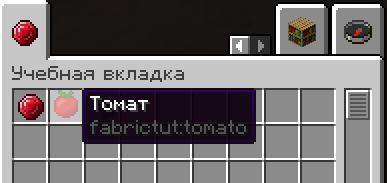

# Локализация
## Основа
Локализация нужна для того, чтобы Вы могли добавить в мод несколько языков.
В данный момент у нас нет совершенно никакого языка в моде, и именно из-за этого все названия предметов, блоков, вкладок и прочего отображаются странно.

В `assets/<mod_id>/lang` создаем json файл с языковым кодом нужного языка, например,`ru_ru.json`.

Каждый объект который имеет локализацию обязательно, имеет свой локализационный ключ:
* `itemGroup.<mod_id>.<group_id>` для вкладок в креативе
* `item.<mod_id>.<item_id>` для предметов
* `block.<mod_id>.<block_id>` для блоков
* `enchantment.<mod_id>.<ench_id>` для зачарований

И так далее, всевозможные ключи можно посмотреть в самой игре.

Конечно, мы можем переопределить ключ, но это не очень правильно и удобно:
```java
@Override
public String getTranslationKey() {
    return "white_stone_block";
}
```
В таком случае ключ будет не `block.fabrictut.white_stone`, а `white_stone_block`. А что если у какого-то блока из другого мода будет такой же ключ?

## Создание локализации
Мы создали файл `ru_ru.json` для русского перевода нашего мода, и теперь нам надо его заполнить, основываясь на раннее приведенном списке:
```json
{
  "item.fabrictut.ruby": "Рубин",
  "item.fabrictut.tomato": "Томат",
  "block.fabrictut.white_stone": "Белый камень",
  "itemGroup.fabrictut.tutorial_group": "Учебная вкладка"
}
```
